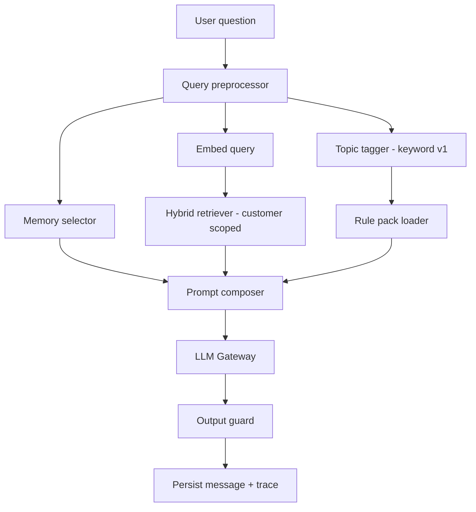

# LIFEGUARD Core — AI & RAG Pipeline

Server-side only. No API keys in the browser.

---

## 1. Pipeline overview



---

## 2. Customer memory in prompts

### 2.1 Snapshot format (structured text)

```
[고객 기억 v{memory_version}]
- 기본: {display_name}, {age}세, {gender}, 직업: {job}
- 건강: 흡연={smoking}, 입원5년={hospital_5y}, ...
- 보험: {insurer}/{product} 외 N건 (요약)
[출처: profile_health, profile_insurance, memory_facts]
```

### 2.2 Selection rules

| Condition | Behavior |
|-----------|----------|
| facts &lt; 2 KB | include full snapshot |
| facts larger | include tier-1 keys always + keyword-matched facts |
| conflicting facts | prefer newest `effective_at`, lower confidence flagged in trace |

### 2.3 Update triggers

Memory rebuild runs on:

- Signup completion
- Profile PATCH
- Document ingest completion (extracted policy fields → new facts with `provenance_type=document`)

Chat does **not** write memory from raw assistant text without human confirm (v1). Optional v2: `suggested_facts` queue.

---

## 3. Document RAG (per-customer)

### 3.1 Ingest pipeline

| Step | Function | Output |
|------|----------|--------|
| 1 | `store_upload` | `customer_documents` row, `storage_path` |
| 2 | `extract_text` | OCR / PDF text per page |
| 3 | `chunk_document` | 400–800 chars, 80 overlap |
| 4 | `embed_chunks` | vectors + `embedding_model` |
| 5 | `index_chunks` | insert `customer_document_chunks` |
| 6 | `extract_policy_facts` | optional → `profile_insurance_policies` + memory facts |

### 3.2 Retrieval

**Input:** `customer_id`, `query_text`, `query_embedding`

**Parameters (defaults):**

| Param | Default | Notes |
|-------|---------|-------|
| match_threshold | 0.5 | tune per embedding model |
| match_count | 8 | |
| fts_count | 4 | parallel branch |

**Merge:**

```
score = 0.7 * vector_score + 0.3 * fts_rank_normalized
dedupe by document_id + near-duplicate content hash
```

### 3.3 Citation format in prompt

```
[D1] {doc_title} > {section} (p.{page})
{content excerpt max 600 chars}
...
```

Assistant must cite `[D#]` and policy names from memory block.

---

## 4. Insurance rules layer

### 4.1 Rule pack selection (v1 keyword)

| Query contains | Load packs |
|----------------|------------|
| 청구, 보험금 | `claim-readiness-kr` |
| 실손, 급여 | `indemnity-kr` |
| 암, 진단 | `critical-illness-kr` |
| (default) | `general-consultation-kr` |

### 4.2 Rules in system prompt

```
[보험 판단 규칙 v{version} — {slug}]
{excerpt max 2000 tokens from body_markdown}
```

Rules are **normative** but subordinate to customer-specific documents when they conflict on facts.

### 4.3 Future: rules engine hook

```typescript
// interface only in v1
evaluateRules(input: {
  customerId: string;
  memory: MemorySnapshot;
  topic: string;
}): RuleEvaluation[]  // structured flags, not natural language
```

LLM receives evaluation summaries as bullet constraints.

---

## 5. System prompt (LIFEGUARD Core — baseline)

```
너는 LIFEGUARD Core 보험 AI 상담 엔진이다.

규칙:
1. [고객 기억]과 [참고문서 D#]와 [보험 판단 규칙]에 있는 내용만 사실로 말한다.
2. 없으면: "등록된 자료에서 확인할 수 없습니다."
3. 답변 말미에 출처: 기억 항목, 문서명(D#), 규칙 팩 버전.
4. 한국어, 친절, 전문용어는 쉬운 설명 병기.
5. 특정 상품 가입·해지 권유는 하지 않고 정보 제공만 한다.
6. 개인정보(주민번호 등)는 요청·반복하지 않는다.
```

(Product-specific tone; separate from INSUX prompts.)

---

## 6. User message assembly

```javascript
const userContent = [
  memoryBlock,
  retrievedBlocks.length
    ? `다음은 이 고객의 보험 관련 참고문서입니다.\n\n${retrievedBlocks.join('\n\n')}`
    : '',
  `질문: ${question}`,
  '위 기억·문서·규칙만 사용해 답하고 출처를 표기하세요.',
].filter(Boolean).join('\n\n');
```

**Do not** pass entire chat history beyond last 2 turns in v1 (token control).

---

## 7. LLM gateway

| Field | Value |
|-------|-------|
| Model | `claude-sonnet-4-6` (config `LIFEGUARD_LLM_MODEL`) |
| max_tokens | 1024–2048 by endpoint |
| temperature | 0.2 consultation |

Proxy: `POST /api/consultations/:id/messages` → internal `llm.complete()`.

---

## 8. Output guard (post-LLM)

| Check | Action |
|-------|--------|
| Empty response | retry once with shorter context |
| No citation when chunks used | append source reminder (template) |
| RRN pattern in text | redact + log |
| Claims "guaranteed payout" | replace with conditional wording |
| Hallucinated insurer name | strip if not in memory/docs |

---

## 9. API surface (AI-relevant, no UI)

| Method | Path | Purpose |
|--------|------|---------|
| POST | `/api/auth/signup` | user + profile shells |
| PATCH | `/api/profile` | health + insurance |
| POST | `/api/documents/upload-url` | signed URL |
| POST | `/api/documents/:id/ingest` | trigger job |
| POST | `/api/consultations` | create thread |
| GET | `/api/consultations` | list (default landing data) |
| POST | `/api/consultations/:id/messages` | **main AI turn** |
| GET | `/api/consultations/:id/messages` | history |

---

## 10. Observability

| Metric | Source |
|--------|--------|
| retrieval_latency_ms | trace |
| chunks_retrieved | trace |
| memory_version | trace |
| llm_input_tokens | estimate |
| guard_flags | trace |

No PII in application logs — use ids only.

---

## 11. Extension hooks (events)

After successful assistant message, emit optional:

```json
{
  "event_type": "consultation.message.completed",
  "customer_id": "...",
  "payload": { "consultation_id", "topics": ["claim"] }
}
```

Consumers (future):

- `notification.worker` — renewal reminders
- `rebalancing.worker` — coverage gap scan
- `agent.router` — high-intent handoff

Core orchestrator remains unaware of delivery channels.

---

## 12. What we intentionally do not import from INSUX

| INSUX artifact | LIFEGUARD approach |
|----------------|-------------------|
| `insurance_chunks` global table | `customer_document_chunks` per tenant |
| `src/insux2/*Engine` | New `memory_builder` + `rules` tables |
| Demo profile presets | Empty profile until customer fills |
| Multi-tab service UI | Consultation-first API |
| `index.html` vanilla RAG | New ingest service |
