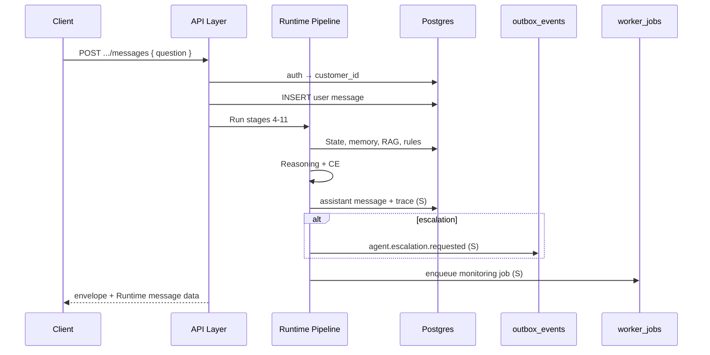

# LIFEGUARD Core — API Finalization

Implementation-ready **HTTP contract** consolidated from [OPENAPI_DRAFT.md](./OPENAPI_DRAFT.md) and [CONSULTATION_RUNTIME_ARCHITECTURE.md](./CONSULTATION_RUNTIME_ARCHITECTURE.md).

**Status:** Final design for v1 — no server, UI, SQL, or INSUX/V2 code in this repo path.

| | |
|---|---|
| **Base path** | `/api` |
| **Auth header** | `Authorization: Bearer <supabase_jwt>` |
| **Content-Type** | `application/json` (unless upload flow notes otherwise) |
| **api_version** | `2026-06-01` (see envelope) |

Related: [CONSENT_ARCHITECTURE.md](./CONSENT_ARCHITECTURE.md), [DATA_MODEL.md](./DATA_MODEL.md), migrations `001`–`012`.

---

## 1. Response envelope (all routes)

Every JSON response uses:

```json
{
  "ok": true,
  "data": {},
  "error": null,
  "trace_id": "opaque-uuid-or-null",
  "request_id": "req-uuid",
  "timestamp": "2026-06-01T12:00:00.000Z",
  "api_version": "2026-06-01"
}
```

| Field | Success | Error |
|-------|---------|-------|
| `ok` | `true` | `false` |
| `data` | Route payload | `null` |
| `error` | `null` | `{ "code", "message", "details?" }` |
| `trace_id` | Set when Runtime produced audit (e.g. message turn) | Optional |
| `request_id` | Server-generated per HTTP request | Same |
| `timestamp` | ISO-8601 UTC response time | Same |
| `api_version` | Contract version string | Same |

**HTTP status** still follows REST (401/403/404/422/429/503). `error.code` is stable for clients.

---

## 2. Error codes

| `error.code` | HTTP | When |
|--------------|------|------|
| `UNAUTHORIZED` | 401 | Missing/invalid JWT |
| `FORBIDDEN` | 403 | Wrong role, not assigned agent, RLS denial |
| `CONSENT_REQUIRED` | 403 | Required consent not granted for feature |
| `CONSENT_REVOKED` | 403 | Consent was revoked; feature blocked until re-consent |
| `NOT_FOUND` | 404 | Resource missing or not visible under tenant |
| `VALIDATION_ERROR` | 422 | Schema/field validation |
| `INSUFFICIENT_EVIDENCE` | 422 | Runtime could not ground answer (optional explicit code) |
| `ESCALATION_REQUIRED` | 200 or 422 | Handoff path; may still return `200` with `escalation_required: true` in data |
| `RATE_LIMITED` | 429 | Throttle |
| `INTERNAL_ERROR` | 500 | Unhandled server failure |

---

## 3. Global security principles

| # | Rule |
|---|------|
| 1 | **`customer_id` path/body/query 직접 수신 금지** — tenant from session only |
| 2 | **`auth.uid()` → `users` → `customer_profiles.id`** — sole customer resolution |
| 3 | **`service_role` secret** — server/worker runtime only; **browser/mobile exposure forbidden** |
| 4 | **Customer JWT must not run workers** — no queue execute endpoints |
| 5 | **`consultation_traces`** — no customer-facing read API |
| 6 | **`worker_jobs`, `outbox_events`, `outbox_processing_*`, `notification_delivery_*`** — **no external HTTP API** (admin audit only where noted) |
| 7 | **Agent** — no raw health, documents, chunks, memory, traces, worker/outbox tables |
| 8 | **No demo/mock/sample/fake** customers, policies, or seeded chat in API examples or fixtures |

---

## 4. API groups — access matrix

Legend: **Y** = allowed (subject to RLS/assignment), **N** = not allowed, **S** = server `service_role` only (not HTTP customer/agent).

| API group | Customer | Agent | Admin | Service Role |
|-----------|----------|-------|-------|--------------|
| **Auth / Me** | Y | Y | Y | S (signup webhooks) |
| **Profile** | Y (own) | Y (assigned, limited fields) | Y (audit) | S |
| **Consent** | Y (own) | N | Y (audit) | S (revoke jobs) |
| **Documents** | Y (own CRUD + ingest trigger) | N | Y (audit) | S (ingest worker) |
| **Consultations** | Y (own threads) | Y (assigned read) | Y (audit) | S (trace/outbox write) |
| **Messages** | Y (own `POST` turn) | N (no LLM on behalf) | Y (audit) | S (orchestrator persist) |
| **Customer State** | Y (own summary views) | Y (assignment + `agent_sharing`) | Y | S (state worker) |
| **Monitoring** | Y (open signals, dismiss) | Y (summary view only) | Y | S (monitoring worker) |
| **Notifications** | Y (events read, preferences) | N | Y | S (delivery worker) |
| **Agent** | N | Y | Y | S |
| **Admin** | N | N | Y | S |

---

## 5. Auth / Me

| Method | Path | Customer | Agent | Admin |
|--------|------|----------|-------|-------|
| GET | `/api/me` | Y | Y | Y |

**`data`:** `{ user, customer_id?, profile_status? }`

---

## 6. Profile

| Method | Path | Customer | Agent | Admin |
|--------|------|----------|-------|-------|
| GET | `/api/customers/me/profile` | Y | N | Y |
| PATCH | `/api/customers/me/profile` | Y | N | Y |
| GET | `/api/customers/me/health` | Y | N | Y |
| PUT | `/api/customers/me/health` | Y | N | Y |
| GET | `/api/customers/me/policies` | Y | N | Y |
| POST | `/api/customers/me/policies` | Y | N | Y |

Agent assigned read via `/api/agent/customers/:customerId/summary` (masked; see Agent group).

---

## 7. Consent

| Method | Path | Customer | Agent | Admin |
|--------|------|----------|-------|-------|
| GET | `/api/consents` | Y | N | Y |
| POST | `/api/consents` | Y | N | Y |
| PATCH | `/api/consents/:id/revoke` | Y | N | Y |

**Body:** `consent_type`, `consent_version` — never `customer_id`.

**Revoke side effect:** async cancel `worker_jobs` / outbox processing per `010`/`011` comments; Runtime returns `CONSENT_REVOKED` on affected features.

---

## 8. Documents

| Method | Path | Customer | Agent | Admin |
|--------|------|----------|-------|-------|
| POST | `/api/documents` | Y | N | Y |
| GET | `/api/documents` | Y | N | Y |
| GET | `/api/documents/:id` | Y | N | Y |
| POST | `/api/documents/:id/ingest` | Y | N | Y |
| DELETE | `/api/documents/:id` | Y | N | Y |

Requires `document_storage` (upload), `document_analysis` (ingest). Ingest runs on **document-ingest-worker** (S).

---

## 9. Consultations & Messages (Runtime core)

| Method | Path | Customer | Agent | Admin |
|--------|------|----------|-------|-------|
| POST | `/api/consultations` | Y | N | Y |
| GET | `/api/consultations` | Y | Y (assigned) | Y |
| GET | `/api/consultations/:id` | Y | Y (assigned) | Y |
| POST | `/api/consultations/:id/messages` | Y | N | Y |

### 9.1 `POST /api/consultations`

**Request `data` body:**

```json
{
  "title": "optional string"
}
```

**Response `data`:** `{ consultation: { id, status, created_at, ... } }`

---

### 9.2 `GET /api/consultations` / `GET /api/consultations/:id`

List/detail own threads (customer). Agent: assigned customers only. Pagination: `limit`, `cursor` (implementation detail).

---

### 9.3 `POST /api/consultations/:id/messages` — Runtime turn

#### Input (request)

| Field | Required | Notes |
|-------|----------|-------|
| `question` | yes | 1–8000 chars |
| `optional_document_ids` | no | Must belong to session customer; `ready` only |
| `requested_category` | no | Hint only; server may override |
| `client_message_id` | no | Idempotency |

**Forbidden:** `customer_id`, embeddings, raw file bytes.

#### Runtime Pipeline (server, synchronous)

```text
1. Resolve customer_id (auth.uid → customer_profiles)
2. Verify consultation ownership + open
3. INSERT user consultation_message
4. Consent Validation → snapshot
5. Customer State (latest snapshot / view)
6. Memory (active facts)
7. RAG (match_customer_document_chunks)
8. Rule Pack (+ agent_escalation_basic)
9. Reasoning (plan, evidence confidence, optional case knowledge secondary)
10. Communication Engine + Output Guard
11. INSERT assistant consultation_message
12. INSERT consultation_traces (service_role) — not client-visible
13. Optional outbox_events (escalation)
14. Optional worker_jobs enqueue (monitoring/state) — NOT inline monitoring
```



#### Output (response `data`)

See §10. `trace_id` in envelope references `consultation_traces.id` (opaque).

---

## 10. Runtime message response schema

Inside envelope `data` for `POST .../messages`:

| Field | Type | Description |
|-------|------|-------------|
| `answer` | string | Customer-facing Korean text (CE-compliant) |
| `category` | string | Final category e.g. `claim`, `disclosure`, `agent_required` |
| `confidence` | number | 0–1, **evidence-based only** (not LLM self-score) |
| `sufficiency` | object | `{ memory, documents, overall }` each `insufficient` \| `partial` \| `sufficient` |
| `sources` | object | `{ memory[], documents[], rule_packs[] }` citation-safe refs |
| `recommended_next_action` | string | Non-coercive next step |
| `escalation_required` | boolean | |
| `escalation_reason` | string[] \| null | `trigger_codes` |
| `created_message_id` | uuid | Assistant `consultation_messages.id` |
| `message` | object | Optional full message row mirror |

**Example success `data` (structural only):**

```json
{
  "answer": "...",
  "category": "claim",
  "confidence": 0.58,
  "sufficiency": {
    "memory": "partial",
    "documents": "insufficient",
    "overall": "partial"
  },
  "sources": {
    "memory": ["health.hospital_5y"],
    "documents": [],
    "rule_packs": [{ "slug": "claim_possibility_basic", "version": "1.0.0" }]
  },
  "recommended_next_action": "관련 서류를 업로드하면 검토에 도움이 됩니다.",
  "escalation_required": false,
  "escalation_reason": null,
  "created_message_id": "uuid",
  "message": { "id": "uuid", "role": "assistant", "content": "...", "created_at": "..." }
}
```

---

## 11. Customer State

| Method | Path | Customer | Agent | Admin |
|--------|------|----------|-------|-------|
| GET | `/api/customers/me/state` | Y | N | Y |
| GET | `/api/customers/me/memory` | Y | N | Y |
| GET | `/api/customers/me/monitoring-signals` | Y | N | Y |
| PATCH | `/api/customers/me/monitoring-signals/:id/dismiss` | Y | N | Y |

**State:** `lifeguard_latest_customer_state` or API-composed summary — no raw `state_json` leak to agent routes.

**Memory:** active facts only; no `fact_key` dump to agents via customer routes.

**Monitoring:** open/notified signals; dismiss sets `status=dismissed` + `dismissed_at` (008).

Agent: `/api/agent/customers/:customerId/monitoring-summary` (high/critical view) — separate Agent route, not in customer path.

---

## 12. Notifications

| Method | Path | Customer | Agent | Admin |
|--------|------|----------|-------|-------|
| GET | `/api/notifications` | Y | N | Y |
| PATCH | `/api/notifications/:id/read` | Y | N | Y |
| GET | `/api/notification-preferences` | Y | N | Y |
| PUT | `/api/notification-preferences` | Y | N | Y |

Maps to `notification_events` (customer SELECT own). **No** access to `notification_delivery_runs` / `attempts`.

`read` maps to client UX on in_app feed; server may set event metadata (implementation).

---

## 13. Agent

| Method | Path | Customer | Agent | Admin |
|--------|------|----------|-------|-------|
| GET | `/api/agent/customers` | N | Y | Y |
| GET | `/api/agent/customers/:customerId/summary` | N | Y | Y |
| GET | `/api/agent/consultations/:consultationId` | N | Y | Y |

Requires active `agent_assignments`. **`agent_sharing`** for memory-derived fields. No documents/chunks/traces.

---

## 14. Admin

| Method | Path | Customer | Agent | Admin |
|--------|------|----------|-------|-------|
| GET | `/api/admin/outbox-events` | N | N | Y |
| GET | `/api/admin/consultation-traces/:consultationId` | N | N | Y |
| GET | `/api/admin/worker-jobs` | N | N | Y |
| GET | `/api/admin/rule-packs` | N | N | Y |
| POST | `/api/admin/rule-packs` | N | N | Y |

Admin reads audit tables customers cannot see. No bulk PII export without policy.

---

## 15. Routes explicitly excluded from public API

| Resource | Reason |
|----------|--------|
| `consultation_traces` | Customer/agent HTTP forbidden; admin only |
| `worker_jobs`, `worker_runs`, `retry_queue`, `dead_letter_jobs` | Worker plane |
| `outbox_events` (customer write) | Server insert only; customer read optional status — admin audit route only |
| `outbox_processing_runs`, `outbox_delivery_attempts` | 011 |
| `notification_delivery_runs`, `notification_delivery_attempts` | 012 |
| `case_extraction_jobs` | Admin/service only |
| `match_case_knowledge` RPC | service_role/orchestrator server wrapper only |

---

## 16. Idempotency & rate limits

| Feature | Key |
|---------|-----|
| Messages | `client_message_id` per consultation |
| Documents | storage `document_id` uniqueness per customer |
| Consultations | optional `Idempotency-Key` header (implementation) |

`RATE_LIMITED` per IP + `customer_id` on `POST .../messages`.

---

## 17. Versioning

- **`api_version`** in envelope: contract breaking changes bump date string.
- OpenAPI YAML export: future artifact; this document is normative for v1.

---

## 18. Deliberate exclusions

- INSUX / insux-v2 / insux-pro-ai route parity.
- Browser `service_role` or Supabase direct write to worker/outbox tables.
- Webhook callbacks to Kakao/SMS providers (012 worker internal).

---

*Finalized v1 — LIFEGUARD Core API contract.*
