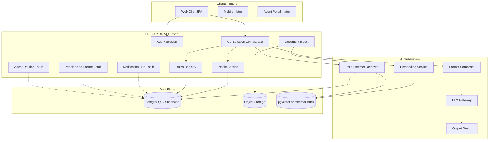
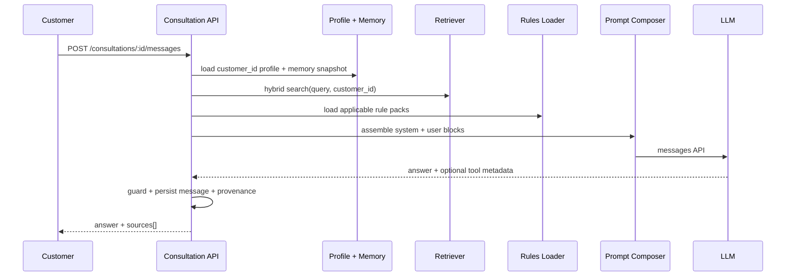
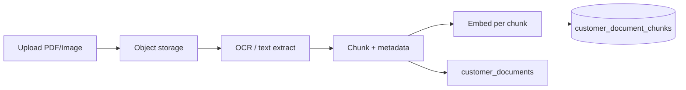
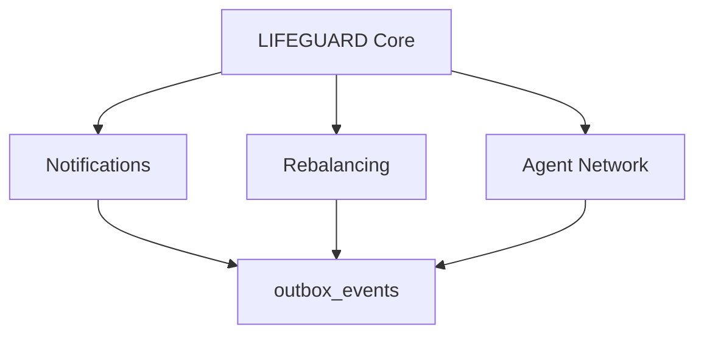

# LIFEGUARD Core — System Architecture

## 1. Product intent

LIFEGUARD Core is a **per-customer memory** insurance AI consultation backend. The default product surface after login is a **chat room**; the engineering priority is **persistent profile + document RAG + rule-grounded answers**, not marketing screens.

| Principle | Meaning |
|-----------|---------|
| Memory-first | Every answer is conditioned on **this customer's** stored facts and uploaded docs |
| Isolation | Customer A never sees B's profile, chunks, or chat memory |
| Grounded | Insurance **rules** are versioned artifacts; LLM cites profile + chunks + rule refs |
| Extensible | Notifications, rebalancing, agent handoff attach via **events + workflow IDs**, not UI refactors |

**Explicit non-goals (v1 design):** Reuse INSUX2 engines, INSUX screens, or `insux-pro-ai` repos.

---

## 2. Logical architecture



---

## 3. Core domains

| Domain | Responsibility |
|--------|----------------|
| **Identity** | Signup, login, session, consent flags |
| **Customer profile** | Demographics, health disclosures, policy summaries (structured) |
| **Customer memory** | Canonical facts derived from profile + confirmed extractions (not raw chat) |
| **Document corpus** | Per-customer uploads (PDF/image), OCR text, chunks, embeddings |
| **Consultation** | Threads, messages, orchestration trace (what was retrieved) |
| **Rules** | Global/versioned insurance judgment rules (JSON or markdown + metadata) |
| **Extensions** | `outbox_events` for alerts, rebalancing jobs, agent assignments |

---

## 4. Request flow: chat answer (v1)



**Latency budget (design targets):**

| Stage | Target |
|-------|--------|
| Profile + memory read | &lt; 50 ms (cached) |
| Retrieval (k≤8) | &lt; 300 ms |
| Rules slice | &lt; 20 ms |
| LLM | dominant; cap context size |
| Total (excl. LLM) | &lt; 500 ms |

---

## 5. Signup → profile → memory

1. **Signup** creates `users` + `customer_profiles` (empty shells).
2. **Onboarding steps** (can be API-only, no fancy UI) fill:
   - `profile_demographics`
   - `profile_health`
   - `profile_insurance` (0..n policies)
3. **Profile commit** runs `memory_builder` job:
   - Normalizes fields → `customer_memory_facts` (typed key/value + provenance).
4. Chat never reads raw signup forms directly; it reads **memory snapshot** (versioned).

---

## 6. Document ingest → per-customer RAG



| Step | Notes |
|------|-------|
| Upload | Signed URL; virus scan hook (future) |
| OCR | Pluggable provider (CLOVA, Textract, etc.) — **server-only keys** |
| Chunking | By section/page; store `doc_title`, `page`, `section` |
| Embedding | Model id stored per chunk for re-embed migrations |
| Isolation | **Every row** has `customer_id`; RLS enforced |

---

## 7. Retrieval strategy (per customer)

**Hybrid retrieval** on `customer_document_chunks`:

1. Vector similarity (`embedding <=> query_vec`) with `match_threshold`, `match_count`.
2. Keyword / FTS fallback on `content_tsv` (Korean-aware if possible).
3. Merge with RRF or weighted score; dedupe by `(document_id, chunk_index)`.

**Also inject (non-vector):**

- `customer_memory_facts` (top relevant by keyword match or full snapshot if small).
- `profile_insurance` active policies summary.
- **Rules**: filter by `product_line`, `topic` tags from query classifier (lightweight, v1 can be keyword).

---

## 8. Prompt composition (AI structure)

### 8.1 Layers (fixed order)

```
[SYSTEM] LIFEGUARD persona + safety + Korean + citation rules
[SYSTEM] Insurance rules pack (version id + excerpts)
[SYSTEM] Customer memory block (structured, PII-redacted for logs)
[USER]   Retrieved document excerpts (numbered [D1]..[Dn])
[USER]   Current question
```

### 8.2 Hard rules (enforced in system text + guard)

- Answer only from **memory + retrieved chunks + rules**.
- If missing: explicit Korean phrase (e.g. "등록된 자료에서 확인할 수 없습니다").
- End with **출처**: memory keys, document titles, rule pack version.
- Never invent policy numbers, premiums, or diagnosis outcomes.

### 8.3 Context budget

| Block | Max share of context |
|-------|----------------------|
| Rules | 25% |
| Memory + profile | 25% |
| Retrieved chunks | 45% |
| Chat history (last N) | 5% |

Truncate by score; never send full PDF text.

---

## 9. Tech stack (recommended, decoupled from INSUX)

| Layer | Choice | Rationale |
|-------|--------|-----------|
| API | Node 22 + **Next.js App Router** *or* standalone Fastify | `pages/api` or `/app/api` — greenfield |
| DB | **Supabase Postgres** + RLS | Auth + storage + pgvector |
| Vectors | pgvector in same DB | Per-customer partition via `customer_id` |
| Object storage | Supabase Storage or S3 | PDF/images |
| LLM | Anthropic Messages API | Server proxy only |
| Embeddings | OpenAI / Voyage / local — **config-driven** | Store `embedding_model` on chunks |
| Jobs | `pg_cron` / Inngest / Vercel background | Ingest + memory rebuild |

Repo name suggestion: `lifeguard-core` (not `insux-*`).

---

## 10. Extension points (8 — future modules)

| Module | Attachment | v1 stub |
|--------|------------|---------|
| Notifications | `outbox_events` + `notification_preferences` | Table + no-op worker |
| Rebalancing | `rebalancing_recommendations` + scheduler | Schema only |
| Agent connect | `agent_assignments` + `handoff_packets` | API returns `agent_status: unassigned` |
| Underwriting API | `rules_engine` external call | Interface in orchestrator |
| Consent | `consents` table gates ingest | Required before upload |
| Audit | `consultation_traces` | Store retrieval ids + scores |
| Billing | `usage_meters` per customer | Optional |
| Multi-tenant org | `org_id` on all tables | Nullable for v1 B2C |



---

## 11. Security & compliance (design)

| Topic | Approach |
|-------|----------|
| Tenant isolation | RLS: `customer_id = auth.uid()` mapping |
| PII | Separate `profile_sensitive`; mask in traces |
| API keys | Server env only; never in client |
| Upload | Size/type limits; per-customer quota |
| Retention | Soft-delete documents; hard-delete job |
| Consent | Versioned consent records before health ingest |

---

## 12. Deployment (independent)

- **New** Vercel project: `lifeguard-core` (or self-hosted).
- **New** Supabase project: `lifeguard-prod` — no shared tables with INSUX.
- **New** GitHub repo: `sofia113-kim0203/lifeguard-core` (recommended).

---

## 13. INSUX separation checklist

| Item | LIFEGUARD | INSUX family |
|------|-----------|--------------|
| Git repo | `lifeguard-core` | `insux-pro-ai`, local `insux-v2` |
| Database | Dedicated Supabase | Existing `insurance_chunks` etc. |
| Customer memory | `customer_memory_facts` | Demo profiles / engines |
| Rules | `rule_packs` | `src/insux2/knowledge/*.md` |
| UI priority | Chat API contract | Multi-tab dashboards |

---

## 14. Implementation phases (engineering, not calendar)

| Phase | Deliverable |
|-------|-------------|
| P0 | Schema + RLS + auth signup/login |
| P1 | Profile APIs + memory builder |
| P2 | Upload + ingest job + per-customer index |
| P3 | Consultation API + prompt composer + LLM proxy |
| P4 | Rules registry + trace logging |
| P5 | Extension tables + outbox (stubs) |
| P6 | Minimal chat SPA (thin client) |

---

## 15. Related documents

- [DATA_MODEL.md](./DATA_MODEL.md) — table-level design
- [AI_PIPELINE.md](./AI_PIPELINE.md) — retrieval scoring, prompt templates, guards
