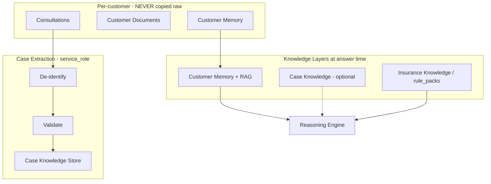

# LIFEGUARD Core — Case Knowledge Engine

Design-only system for accumulating **de-identified, non-re-identifiable** insurance consultation patterns as **Case Knowledge** — separate from per-customer memory and global insurance reference content.

**Not in scope:** INSUX, INSUX2, insux-pro-ai, UI, server code, demo/mock/sample/fake case libraries, storing identifiable customer rows in the case store.

Related: [KNOWLEDGE_GOVERNANCE.md](./KNOWLEDGE_GOVERNANCE.md), [MEMORY_BUILDER.md](./MEMORY_BUILDER.md), [CONSENT_ARCHITECTURE.md](./CONSENT_ARCHITECTURE.md), [CUSTOMER_STATE_ENGINE.md](./CUSTOMER_STATE_ENGINE.md), [LIFEGUARD_REASONING_ENGINE.md](./LIFEGUARD_REASONING_ENGINE.md), [LIFEGUARD_MONITORING_ENGINE.md](./LIFEGUARD_MONITORING_ENGINE.md).

---

## 1. Purpose

| Objective | Description |
|-----------|-------------|
| **Pattern library** | Capture *how similar situations were handled* (labels, document types, outcomes phrased as possibilities) without tying to a person |
| **Never replace customer truth** | Live answers still use **Customer Memory + customer RAG + rule packs** only |
| **Privacy by design** | Case records must be **non-re-identifiable** before persistence |
| **Governed lifecycle** | Publish, review, retire cases under Knowledge Governance — not ad-hoc LLM memory |
| **No training dump** | Case Knowledge is **not** a cross-customer model-training corpus unless separate legal basis exists |

Case Knowledge answers: “In *similar anonymized situations*, what review steps or wording patterns applied?” — not “what should *this named customer* do?”



---

## 2. Knowledge layers

| Layer | What it is | Identifiable? | Primary use |
|-------|------------|---------------|-------------|
| **Customer Memory** | `customer_memory_facts`, profile, **customer** documents/chunks | Yes — single `customer_id` | Personal accurate answers |
| **Case Knowledge** | `case_knowledge_items` (`006_case_knowledge.sql`) — anonymized templates | **No** — no `customer_id` on published case | Secondary patterns via `match_case_knowledge` (service_role) |
| **Insurance Knowledge** | `rule_packs` / `rule_pack_versions`, future static insurer-agnostic references | N/A — regulatory/product reference | Normative guardrails in every answer |

**Precedence at answer time:**

1. Customer Memory + customer RAG (mandatory when consented)  
2. Insurance Knowledge (rule packs)  
3. Case Knowledge (optional, **never overrides** 1–2 on facts)

---

## 3. De-identification principles

Applied **before** any field is written to Case Knowledge. Automated redaction + human review gate (Governance).

| Data class | Rule |
|------------|------|
| **Name** | Remove; replace with role tokens only if needed (`{ROLE_1}` not real names) |
| **주민등록번호** | Detect and drop; block publish if pattern remains |
| **Phone** | Remove |
| **Address** | Remove street-level; region bucket forbidden in v1 (too re-identifying) |
| **Bank account / card** | Remove |
| **Email / account ids** | Remove |
| **Exact dates** | Generalize to year-quarter or “recent” bucket |
| **Exact amounts** | Bucket or ratio bands only if needed (e.g. “premium_band: high”) |
| **Employer / rare combo** | Suppress if k-anonymity risk (future governance rule) |
| **customer_id, document_id, message_id** | **Never** stored on published case |
| **Free text** | Must pass re-identification scanner |

**Target state:** reasonable expert cannot link case row to a known individual without external data.

**Source linkage (internal only):** `case_extraction_jobs` may hold `source_customer_id` encrypted / access-controlled for **audit and erasure** — not exposed to Reasoning or agents. Erasure request deletes job + any draft case derived from that customer.

---

## 4. Case types

| `case_type` | Description | Typical anonymized fields |
|-------------|-------------|---------------------------|
| `claim_case` | 청구 검토 흐름 | doc_types_present, rule_labels, missing_doc_pattern |
| `disclosure_case` | 고지 검토 | health_flags_generic, review_label |
| `coverage_case` | 보장 공백 검토 | coverage_axes, policy_count_band |
| `rebalancing_case` | 리밸런싱 검토 | renewal_count_band, premium_stress_flag |
| `underwriting_case` | 인수/심사 맥락 (비확정) | disclosure_flags, no legal outcome |
| `consultation_case` | 일반 상담 패턴 | category, escalation_trigger, resolution_type |

Each case includes `case_type`, `case_version`, `status` (draft | published | retired), `confidence`, `evidence_class` (synthetic summary only).

---

## 5. Case extraction pipeline

Triggered only when **legal basis + consent** allow case contribution (future: `case_knowledge_contribution` consent separate from `memory_retention`).

| Phase | Action |
|-------|--------|
| **E0 — Eligibility** | Consultation `archived` + contribution consent + no active erasure hold |
| **E1 — Source bundle** | Load message labels, rule_pack outputs, `sources_json` structure — **not** raw chunk text by default |
| **E2 — De-identify** | Run redaction pipeline §3 on any text snippets |
| **E3 — Structuring** | Map to `case_type` schema (enums, bands, lists) |
| **E4 — Confidence** | §6 — reject if below publish threshold |
| **E5 — Governance** | Submit `draft` → reviewer approval (Knowledge Governance) |
| **E6 — Publish** | Insert `case_knowledge_items` (`status = active`, `deidentification_passed = true`) — no customer keys |
| **E7 — Erasure hook** | On customer DSR, purge drafts and retire cases linked via extraction job |

```text
FUNCTION extractCaseFromConsultation(consultationId):
  job = loadExtractionJobEligibility(consultationId)
  IF NOT job.eligible: RETURN

  bundle = {
    category,
    rule_labels,
    document_types_only,   -- no filenames with PII
    memory_fact_keys_only, -- keys not values if values are sensitive
    outcome_labels: possibility enums only
  }

  textSnippets = selectMinimalRedactedPhrases(bundle)
  IF NOT passesDeidentificationScanner(textSnippets): RETURN fail

  caseDraft = buildCaseRecord(bundle, case_type)
  caseDraft.confidence = scoreCaseConfidence(caseDraft)
  IF caseDraft.confidence < PUBLISH_MIN: saveDraftOnly(caseDraft); RETURN

  submitForGovernanceReview(caseDraft)
```

**No extraction** from customers who revoked contribution consent or required consents for the underlying data class.

---

## 6. Case confidence rules

| Factor | Effect |
|--------|--------|
| Rule-pack label present (enum) | +0.2 |
| Multiple doc **types** (not content) | +0.15 |
| Human governance approval | required for `published` |
| Only LLM paraphrase without structured labels | cap 0.35 — stay `draft` |
| De-id scanner warnings | block publish |
| Conflicting labels | cap 0.5 |

Published cases: confidence 0.5–0.85. Never 1.0 (not individual truth).

Reasoning may cite case only if `status = published` and `confidence ≥ 0.55`.

---

## 7. Knowledge Governance integration

See [KNOWLEDGE_GOVERNANCE.md](./KNOWLEDGE_GOVERNANCE.md) for full lifecycle, trust tiers (Case = **Tier C**), and approval workflow.

| Governance action | Case Knowledge |
|-------------------|----------------|
| **Draft → review → active** | Mandatory before publish |
| **De-id review** | Legal/compliance checklist |
| **Versioning** | `knowledge_version`, `effective_from` / `effective_to`, `replaced_by` |
| **Retire** | `retired` — excluded from retrieval |
| **INSUX separation** | No import of INSUX global KB |

Governance queue is **not** customer-facing. Operators use admin role; no agent access to draft cases with `source_customer_id`.

---

## 8. Reasoning Engine integration

| Rule | Detail |
|------|--------|
| Stage order unchanged | Customer state → memory → customer RAG → rules **first** |
| Optional Stage 5b | If customer sufficiency low, **do not** fill gap from Case Knowledge |
| Retrieval | Separate index `match_case_knowledge(query, case_types[])` — **no** `customer_id` parameter |
| Prompt block | “유사 익명 사례 (참고)” — max 2 cases, labeled non-binding |
| Labels | Case cannot change `primary_label` from rule packs |
| Communication | CE must say cases are “다른 고객 상황과 유사한 익명 사례” not “당신과 동일” |

If customer data insufficient → **자료 부족**; case library must not invent customer-specific facts.

---

## 9. Monitoring Engine integration

| Use | Limit |
|-----|-------|
| Aggregate trends | Count published `claim_case` patterns by doc_type mix — no customer ids |
| **Not used** | Per-customer monitoring detectors read **Customer State**, not Case Knowledge |
| Feedback loop | High-frequency published pattern may inform **new rule pack** draft (Insurance Knowledge), not auto-case from one customer |

Monitoring signals remain tied to identifiable customer pipeline (MONITORING_ENGINE).

---

## 10. Audit

| Artifact | Contents |
|----------|----------|
| `case_knowledge_items` | Published anonymized record; `effective_at`, `confidence`, `trust_tier` (default C) |
| `case_extraction_jobs` | `source_consultation_id`, `source_customer_id` (restricted), redaction log hash |
| `case_governance_reviews` | reviewer id, decision, checklist |
| Reasoning trace | `case_knowledge_ids[]` if cited — optional |
| Erasure | Job links support delete/retire on DSR |

Admin audit: who published; no bulk export of extraction job customer ids without policy.

---

## 11. Prohibitions

| # | Prohibition |
|---|-------------|
| 1 | Storing names, RRN, phone, address, account numbers in `case_knowledge_entries` |
| 2 | Storing `customer_id` on published case rows |
| 3 | Copying `customer_document_chunks.content` into case store |
| 4 | Using Case Knowledge to answer without customer-layer evidence when customer question is individual-specific |
| 5 | Cross-using data beyond contribution / memory / analysis consent |
| 6 | Re-identification testing failures → publish blocked |
| 7 | INSUX / insux-pro-ai shared case tables |
| 8 | demo/mock/sample/fake case JSON in repository |
| 9 | Global model training from case store without separate legal basis |
| 10 | Agents browsing extraction jobs with customer ids |

---

## 12. Database (`006_case_knowledge.sql`)

| Table / object | Notes |
|----------------|-------|
| `case_knowledge_items` | No `customer_id`; `deidentification_passed` required for `active` |
| `case_extraction_jobs` | `source_customer_id` audit/DSR only |
| `lifeguard_active_case_knowledge` | View: active, non-retired, summary fields only |
| `match_case_knowledge(...)` | No `p_customer_id`; EXECUTE revoked for `authenticated` |

---

## 13. Test scenarios

| # | Test | Expected |
|---|------|----------|
| K1 | Publish pipeline with name in text | Blocked by scanner |
| K2 | Published case row | No `customer_id` column populated |
| K3 | Reasoning with empty customer memory | No case fill-in for individual payout claim |
| K4 | Customer erasure | Extraction jobs removed; linked drafts retired |
| K5 | Contribution consent revoked | No new extraction |
| K6 | `match_case_knowledge` | No `p_customer_id` arg; returns only published |
| K7 | Repo scan | No sample/fake case files |
| K8 | Agent role | Cannot SELECT `case_extraction_jobs` |

---

## 14. Deliberate exclusions

- INSUX `insurance_chunks` or V2 knowledge bases.
- Synthetic “example customers” for case seeding.
- Case Knowledge as replacement for `customer_memory_facts`.

---

*Draft v0.1 — LIFEGUARD Core Case Knowledge Engine.*
