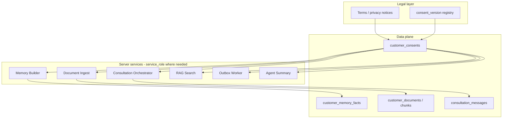
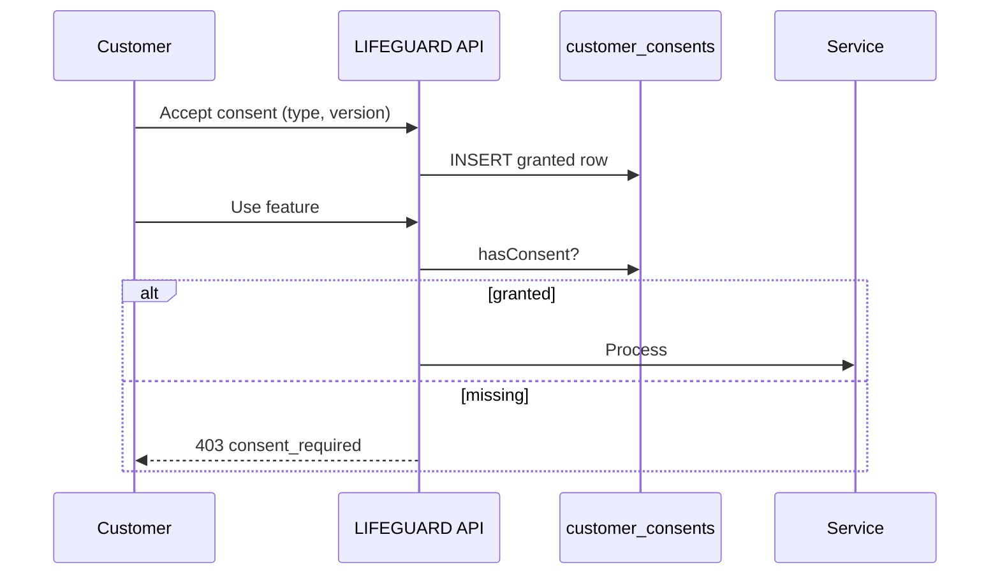

# LIFEGUARD Core — Consent Architecture

Legal and technical design for **when** LIFEGUARD may collect, store, analyze, remember, and share customer data.

**Design-only.** No UI, no server code, no demo/mock/sample data, no INSUX / INSUX2 / insux-pro-ai.

Related: [MEMORY_BUILDER.md](./MEMORY_BUILDER.md) (Consent Gate), [NOTIFICATION_SERVICE.md](./NOTIFICATION_SERVICE.md), [CONSULTATION_ORCHESTRATOR.md](./CONSULTATION_ORCHESTRATOR.md), [OPENAPI_DRAFT.md](./OPENAPI_DRAFT.md), `004_customer_consents.sql`, `009_notification_service.sql`, `002_rls_service_policies.sql`.

**Canonical `consent_type` values** are defined in this document. Older docs may use shorthand aliases (see §11).

---

## 1. Purpose

| Objective | Description |
|-----------|-------------|
| **Legal basis** | Every processing purpose (개인정보, 민감정보, 보험정보, 문서, 상담기록, AI 기억) maps to an explicit customer consent record |
| **Purpose limitation** | Memory, RAG, consultation, ingest, and agent summary run **only** within granted scope |
| **Withdrawal** | Customer may revoke; system stops **new** use immediately and runs downstream deactivation jobs |
| **Accountability** | Versioned consent text, grant/revoke timestamps, hashed client context, audit on facts and traces |
| **Customer control** | Optional consents are truly optional; required consents are limited to service delivery |

LIFEGUARD is **not** a general-purpose data lake. Absent consent → treat as **자료 부족** at product layer, not silent inference.



---

## 2. Consent types (`consent_type`)

Stable enum stored in `customer_consents.consent_type`. Legal copy lives in a separate **consent version registry** (not customer-specific).

| `consent_type` | Korean purpose (summary) | Typical processing |
|----------------|--------------------------|-------------------|
| `service_terms` | 서비스 이용약관 | Account, basic service access |
| `privacy_collection` | 개인정보 수집·이용 | Profile demographics, identifiers (non-sensitive) |
| `sensitive_health_processing` | 민감정보 처리 | Health disclosures, medication, hospitalization, surgery |
| `insurance_data_processing` | 보험정보 처리 | Policies, premiums, coverage summaries |
| `document_storage` | 문서 보관 | Upload storage, retention |
| `document_analysis` | 문서 분석 | OCR, chunking, embedding, structured extract, RAG |
| `ai_consultation` | AI 상담 이용 | LLM turns, rule packs, safety guard |
| `memory_retention` | AI 기억·상담기록 보관 | `customer_memory_facts`, archived message extract |
| `agent_sharing` | 설계사 요약 공유 | Agent summary card — **not** full memory/documents |
| `notification_delivery` | 알림 수신 | Outbox-driven push/email/SMS |
| `marketing_optional` | 마케팅·광고 (선택) | Promotional messages only |

**Not a consent type:** “global model training” — **never offered**; prohibited in §8.

---

## 3. `customer_consents` table

**Migration:** `supabase/migrations/004_customer_consents.sql` (apply after 001, 002).

One row per `(customer_id, consent_type, consent_version)` grant record (unique constraint). **Active** grant for a type = any row with `granted = true` and `revoked_at IS NULL` (checked via `lifeguard_has_consent(customer_id, consent_type)`).

| Column | Type | Required | Description |
|--------|------|----------|-------------|
| `id` | uuid PK | yes | |
| `customer_id` | uuid FK → `customer_profiles` | yes | Never from client body for auth |
| `consent_type` | text | yes | Enum §2 |
| `consent_version` | text | yes | Legal text version id (e.g. `2026-01-15-ko`) |
| `consent_scope` | jsonb | yes | Purpose scope: `{ "purposes": ["memory"], "tables": ["profile_health"] }` |
| `granted` | boolean | yes | `true` = affirmative grant; `false` = explicit deny log (optional) |
| `granted_at` | timestamptz | yes if granted | Server time at capture |
| `revoked_at` | timestamptz | no | Set on withdrawal |
| `source` | text | yes | `signup` \| `profile` \| `document_upload` \| `consultation_start` \| `agent_connect` \| `settings` \| `admin` |
| `ip_address_hash` | text | no | SHA-256 of IP + salt; no raw IP retention |
| `user_agent_hash` | text | no | SHA-256 of UA + salt |
| `created_at` | timestamptz | yes | |
| `updated_at` | timestamptz | yes | |

### 3.1 Constraints and indexes (004)

| Rule | Implementation |
|------|----------------|
| `consent_type` | `CHECK (consent_type = ANY (lifeguard_consent_types()))` |
| Grant timestamp | `granted = true` ⇒ `granted_at` NOT NULL |
| Revoke order | `revoked_at >= granted_at` when both set |
| Duplicate version | `UNIQUE (customer_id, consent_type, consent_version)` |
| Active lookup | Partial index `WHERE granted AND revoked_at IS NULL` |

Extra columns in 004: `purpose`, `required` (audit UX flags).

### 3.2 RLS (sketch)

| Role | Policy |
|------|--------|
| Customer | SELECT own rows; INSERT grant/revoke via API (server validates) |
| Agent | No access |
| Admin | SELECT audit (masked hashes) |
| service_role | INSERT on behalf of signup webhook / batch revoke jobs |

### 3.3 Consent version registry (companion, future)

`consent_text_versions(consent_type, version, locale, body_url, effective_from)` — immutable legal documents. `customer_consents.consent_version` references this id.

---

## 4. Required vs optional

| Category | `consent_type` | Required to use feature? |
|----------|----------------|---------------------------|
| **서비스 필수** | `service_terms` | Yes — account |
| **서비스 필수** | `privacy_collection` | Yes — profile / identity processing |
| **기능 필수 (해당 기능 사용 시)** | `sensitive_health_processing` | Required only if customer enters health data or health memory is built |
| **기능 필수 (해당 기능 사용 시)** | `insurance_data_processing` | Required for policy memory / insurance answers |
| **기능 필수 (해당 기능 사용 시)** | `document_storage` | Required to upload |
| **기능 필수 (해당 기능 사용 시)** | `document_analysis` | Required for ingest + RAG on uploads |
| **기능 필수 (해당 기능 사용 시)** | `ai_consultation` | Required to send AI messages |
| **기능 필수 (해당 기능 사용 시)** | `memory_retention` | Required to retain memory facts / extract from chat |
| **선택** | `agent_sharing` | Optional — default off; agent sees summary only if granted |
| **선택** | `notification_delivery` | Optional — alerts without marketing |
| **선택** | `marketing_optional` | Optional — promotional only; independent from service notifications |

**Rule:** Denying optional consents must not block core signup if `service_terms` + `privacy_collection` are granted. Denying `ai_consultation` blocks AI chat but may still allow read-only profile.

---

## 5. Consent capture flows

### 5.1 Signup

| Step | Consents | `source` |
|------|----------|----------|
| Account created | `service_terms`, `privacy_collection` | `signup` |
| Optional toggles | `notification_delivery`, `marketing_optional` | `signup` |

Health / insurance / document / AI consents are **not** bundled as pre-checked required at signup unless jurisdiction mandates separate screens.

### 5.2 Document upload

| Step | Consents | `source` |
|------|----------|----------|
| Before `POST /api/documents` | `document_storage` | `document_upload` |
| Before `POST .../ingest` | `document_analysis` (if not already active) | `document_upload` |

If `document_analysis` denied: store file only if `document_storage` granted; **no** chunking, embedding, or extract.

### 5.3 AI consultation start

| Step | Consents | `source` |
|------|----------|----------|
| First `POST .../messages` or explicit “start AI” | `ai_consultation`, `memory_retention` | `consultation_start` |

Orchestrator calls `hasConsent` before LLM. Missing → `403` with code `consent_required` (API contract future).

### 5.4 Agent connection

| Step | Consents | `source` |
|------|----------|----------|
| Escalation / assignment UX | `agent_sharing` | `agent_connect` |

Without grant: escalation outbox may still queue internal handoff, but **Agent Summary** excludes memory-derived fields.

### 5.5 Notifications

| Step | Consents | `source` |
|------|----------|----------|
| Enable alerts | `notification_delivery` | `settings` |
| Marketing opt-in | `marketing_optional` | `settings` |

outbox-worker enqueues `notification_events` per [NOTIFICATION_SERVICE.md](./NOTIFICATION_SERVICE.md) (`009_notification_service.sql`). Requires `notification_delivery` for customer channels; `marketing_optional` for `marketing_promotional`. Internal `agent.escalation.requested` routing does not require customer notification consent unless a customer push is planned.



---

## 6. Consent withdrawal flows

| Trigger | System actions |
|---------|----------------|
| Customer revokes in settings | `UPDATE customer_consents SET revoked_at = now()` for type |
| Type-specific jobs | See table below |
| Erasure request (DSR) | Separate erasure pipeline; links to document delete + anonymize profile |

| Revoked `consent_type` | Immediate effects |
|------------------------|-------------------|
| `sensitive_health_processing` | `revokeMemoryFactsByConsent`; block health PUT memory rebuild; orchestrator excludes health facts |
| `insurance_data_processing` | Revoke insurance facts; policy UI may remain stored but not used in AI |
| `document_analysis` | Stop ingest jobs; RAG RPC returns no chunks; revoke document-derived facts |
| `document_storage` | No new uploads; schedule deletion per retention policy |
| `memory_retention` | Revoke conversation-derived facts; stop `extractFactsFromConversation` |
| `ai_consultation` | Block new LLM messages; existing messages read-only |
| `agent_sharing` | Agent summary API returns assignment-only metadata |
| `notification_delivery` | New `notification_events` → `blocked_by_consent`; cancel queued customer sends |
| `marketing_optional` | Block `marketing_promotional` events only |
| `privacy_collection` | **Service withdrawal** — account deactivation flow (not silent partial AI) |

### 6.1 Cross-component revocation

```text
FUNCTION onConsentRevoked(customerId, consentType):
  UPDATE customer_consents SET revoked_at = now() WHERE ...

  IF consentType IN health/insurance/memory types:
    revokeMemoryFactsByConsent(customerId, consentType)

  IF consentType = 'document_analysis':
    markDocumentsRagDisabled(customerId)
    cancelPendingIngestJobs(customerId)

  IF consentType = 'agent_sharing':
    invalidateAgentSummaryCache(customerId)

  IF consentType IN ('notification_delivery', 'marketing_optional'):
    tagOutboxSubscriptions(customerId, consentType, disabled=true)

  incrementMemoryVersion(customerId)
  EMIT outbox 'consent.revoked' for audit workers
```

**New answers:** Orchestrator and RAG **must not** load revoked-scope data. **Past** `consultation_traces` may retain historical ids for compliance audit; labels in trace should include `consent_snapshot` (§9).

**Deletion/anonymization:** Customer-initiated erasure references legal retention exceptions (insurance law, dispute hold). Design: freeze processing, queue erasure job, supersede all facts, soft-delete documents.

---

## 7. Service → consent mapping

| Service | Runs as | Required consents (minimum) | On revoke |
|---------|---------|----------------------------|-----------|
| **Memory Builder** | service_role | Per source: §7.1 | `revokeMemoryFactsByConsent`, bump `memory_version` |
| **Document Ingest** | service_role | `document_storage`; for OCR/embed: `document_analysis` | Cancel jobs; no new chunks |
| **Consultation Orchestrator** | service_role for trace/outbox | `ai_consultation`; memory load: `memory_retention`; health/policy facts need respective types | Block LLM; escalation template only if legally allowed |
| **RAG Search** (`match_customer_document_chunks`) | DB RPC + API wrapper | `document_analysis` (+ `document_storage` for doc existence) | Return empty set |
| **Outbox Worker** | service_role | `notification_delivery` / `marketing_optional` per event | INSERT `notification_events` or `blocked_by_consent` |
| **Notification Worker** | service_role | Same + `notification_preferences` | UPDATE `sent` / `failed`; no customer JWT |
| **Agent Summary** | service_role or agent API | `agent_sharing` | Summary without memory fields |

### 7.1 Memory Builder source matrix (canonical)

| Source | Required `consent_type` |
|--------|-------------------------|
| `customer_profiles` | `privacy_collection` |
| `profile_health` | `sensitive_health_processing` |
| `profile_insurance_policies` | `insurance_data_processing` |
| `consultation_messages` | `ai_consultation`, `memory_retention` |
| `customer_documents` | `document_storage` |
| `customer_document_chunks` / extract | `document_storage`, `document_analysis` |
| Agent summary | `agent_sharing` |

---

## 8. Prohibitions

| # | Prohibition |
|---|-------------|
| 1 | Processing sensitive health without `sensitive_health_processing` |
| 2 | Using customer content for **cross-tenant** or **global** AI model training |
| 3 | Sharing full document text or full `customer_memory_facts` with agents |
| 4 | Using revoked-scope data in **new** consultation answers or RAG |
| 5 | Purpose creep (e.g. marketing using health memory without separate basis) |
| 6 | Trusting client-sent `customer_id` or consent flags without server ledger |
| 7 | Storing raw IP / full user agent in `customer_consents` (hashes only) |
| 8 | Pre-checked optional consents without clear affirmative action |

---

## 9. Audit and traceability

| Artifact | What to record |
|----------|----------------|
| `customer_consents` | `consent_version`, `granted_at`, `revoked_at`, `source`, hashes |
| `customer_memory_facts.metadata_json` | `consent_type`, `consent_version`, `consent_granted_at`, `consent_scope`, `consent_required: true` (see MEMORY_BUILDER §2.4) |
| `consultation_traces.retrieval_scores` | Extend with `consent_snapshot`: array of `{ consent_type, consent_version, active_at_answer_time }` used for memory + RAG |
| Admin | `GET` consent history + trace consent_snapshot; no bulk export without policy |

### 9.1 Trace example (logical)

```json
{
  "consent_snapshot": [
    { "consent_type": "ai_consultation", "consent_version": "2026-01-15-ko", "granted": true },
    { "consent_type": "document_analysis", "consent_version": "2026-01-15-ko", "granted": true },
    { "consent_type": "memory_retention", "consent_version": "2026-01-15-ko", "granted": true }
  ],
  "memory_version": 4,
  "chunk_ids": ["..."],
  "prompt_hash": "sha256:..."
}
```

### 9.2 API surface (future, design)

| Method | Path | Purpose |
|--------|------|---------|
| GET | `/api/customers/me/consents` | List active + history summary |
| POST | `/api/customers/me/consents` | Grant with `consent_type`, `consent_version` |
| POST | `/api/customers/me/consents/:type/revoke` | Withdraw |

Server resolves `customer_id` from JWT only.

---

## 10. Consent check API (server pseudocode)

```text
FUNCTION hasConsent(customerId, consentType):
  RETURN lifeguard_has_consent(customerId, consentType)   -- DB function from 004

FUNCTION requireConsents(customerId, consentTypes[]):
  FOR t IN consentTypes:
    IF NOT hasConsent(customerId, t):
      RAISE HTTP 403 { code: 'consent_required', consent_type: t }

FUNCTION recordConsentGrant(customerId, consentType, version, scope, source, clientMeta):
  INSERT customer_consents (
    customer_id, consent_type, consent_version, consent_scope,
    granted, granted_at, source,
    ip_address_hash, user_agent_hash
  ) VALUES (...)
```

---

## 11. Alignment with MEMORY_BUILDER (alias map)

**DB:** `004_customer_consents.sql` enforces canonical types. Memory Builder calls `lifeguard_has_consent`.

Legacy aliases in older notes map to §2:

| Legacy alias (MEMORY_BUILDER v0.2) | Canonical (`CONSENT_ARCHITECTURE`) |
|-----------------------------------|----------------------------------|
| `personal_data` | `privacy_collection` |
| `sensitive_health` | `sensitive_health_processing` |
| `insurance_data` | `insurance_data_processing` |

Other types (`document_storage`, `document_analysis`, `ai_consultation`, `memory_retention`, `agent_sharing`) are unchanged.

---

## 12. Open questions (legal/product)

| Topic | Decision needed |
|-------|-----------------|
| Retention period per consent type | Legal review per jurisdiction |
| Re-consent on `consent_version` bump | Force re-grant vs grandfather |
| Minors / representatives | Out of v1 scope |
| Insurance record statutory hold | Erasure job exceptions |

---

## 13. Deliberate exclusions

- INSUX consent flows or shared tables.
- Demo consent fixtures in repo.
- Implementing UI screens or Edge Functions in this phase.
- Seed rows in `004_customer_consents.sql` (grants are created at runtime via signup/API only).

---

*Draft v0.1 — LIFEGUARD Core Consent Architecture.*
