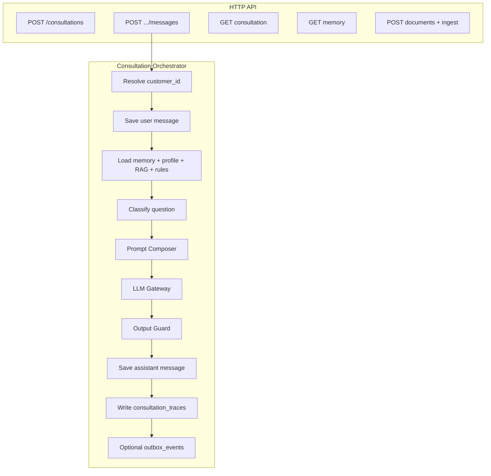
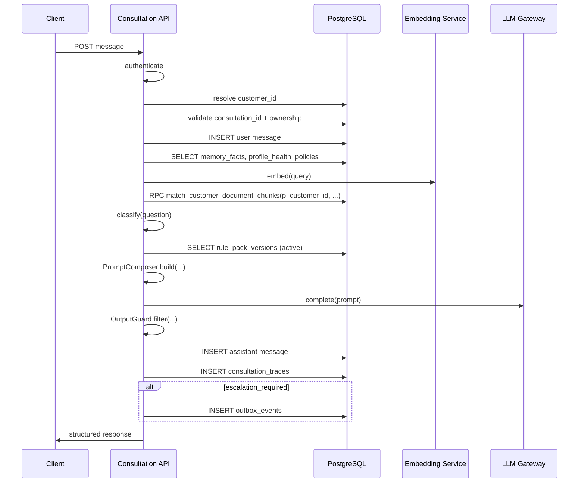
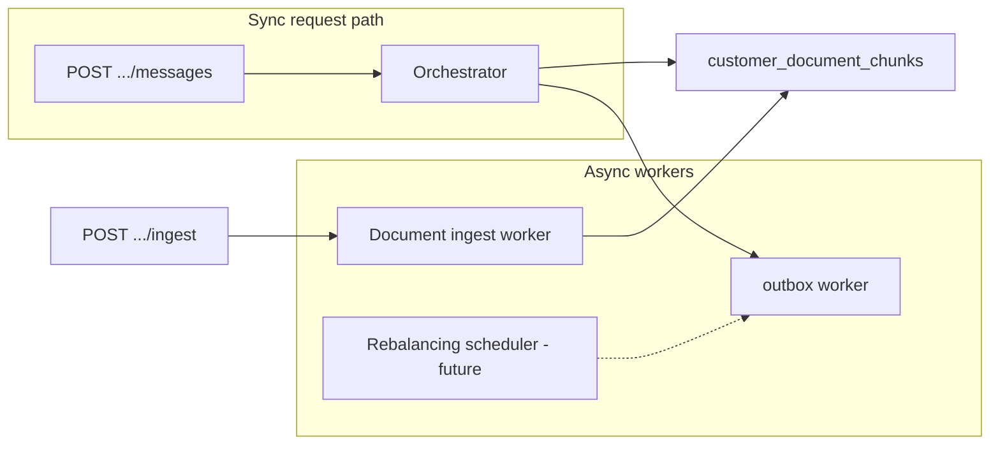

# LIFEGUARD Core — Consultation API Orchestrator

Design-only document. **No UI, no app implementation, no LLM SDK code.**

Scope: how a customer question flows through **memory + per-customer document RAG + rule packs + safety** into a stored answer, trace, and optional outbox event.

Related: [ARCHITECTURE.md](./ARCHITECTURE.md), [DATA_MODEL.md](./DATA_MODEL.md), [AI_PIPELINE.md](./AI_PIPELINE.md), migrations `001_initial_schema.sql`, `003_seed_rule_packs.sql`.

**Not in scope:** INSUX, INSUX2, insux-pro-ai, V2 `pages/api/*`.

---

## 1. Orchestrator role

| Responsibility | Owner |
|----------------|--------|
| Auth → `customer_id` | API middleware |
| Persist user/assistant turns | `consultation_messages` |
| Load memory, profile, chunks, rules | Orchestrator services |
| Classify question → rule packs | `QuestionClassifier` (v1: keywords + escalation pre-check) |
| Build prompt | `PromptComposer` |
| Call LLM | `LlmGateway` (interface only here) |
| Post-process | `OutputGuard` |
| Audit | `consultation_traces` |
| Human handoff | `outbox_events` when `agent_escalation_basic` triggers |



---

## 2. API contracts

Base path: `/api`. All customer routes require **Bearer session** (Supabase JWT) or equivalent. Server resolves `customer_id` via `lifeguard_auth_customer_id()` — never accept `customer_id` from the client body for authorization.

### 2.1 `POST /api/consultations`

Create a new consultation thread.

**Request**

```json
{
  "title": "실손 청구 문의"
}
```

| Field | Type | Required | Notes |
|-------|------|----------|-------|
| title | string | no | Default: null → server sets from first message later |

**Response `201`**

```json
{
  "consultation": {
    "id": "uuid",
    "customer_id": "uuid",
    "title": "실손 청구 문의",
    "status": "open",
    "created_at": "2026-06-01T12:00:00Z"
  }
}
```

**Errors:** `401` unauthenticated, `403` no profile, `422` validation.

---

### 2.2 `POST /api/consultations/:consultationId/messages`

**Primary orchestration endpoint** — user sends a question; server runs full pipeline and returns structured assistant payload.

**Request**

```json
{
  "content": "지난달 입원했는데 실손 청구 가능한가요?",
  "client_message_id": "optional-uuid-for-idempotency"
}
```

| Field | Type | Required | Notes |
|-------|------|----------|-------|
| content | string | yes | 1–8000 chars |
| client_message_id | string | no | Dedup retries |

**Response `200`** (see §6 for full JSON shape)

**Errors:** `401`, `403` consultation not owned, `404` consultation, `409` duplicate `client_message_id`, `422`, `503` LLM unavailable (user message may already be stored — see idempotency).

**Sync behavior:** Returns after assistant message is persisted (or escalation-only template without full LLM when hard-blocked).

---

### 2.3 `GET /api/consultations/:consultationId`

Load thread metadata and recent messages.

**Query**

| Param | Default | Notes |
|-------|---------|-------|
| `include_messages` | true | |
| `message_limit` | 50 | Max 100 |
| `before` | — | Cursor: message `created_at` |

**Response `200`**

```json
{
  "consultation": {
    "id": "uuid",
    "customer_id": "uuid",
    "title": "string | null",
    "status": "open",
    "created_at": "iso",
    "updated_at": "iso"
  },
  "messages": [
    {
      "id": "uuid",
      "role": "user",
      "content": "...",
      "sources_json": {},
      "created_at": "iso"
    },
    {
      "id": "uuid",
      "role": "assistant",
      "content": "...",
      "sources_json": {
        "category": "claim",
        "used_memory_facts": [],
        "used_document_chunks": [],
        "used_rule_packs": []
      },
      "model": "lifeguard-llm-v1",
      "latency_ms": 3200,
      "created_at": "iso"
    }
  ]
}
```

---

### 2.4 `GET /api/customers/me/memory`

Read-only memory snapshot for debugging/UI later; not a chat turn.

**Response `200`**

```json
{
  "customer_id": "uuid",
  "memory_version": 3,
  "profile_summary": {
    "display_name": "홍길동",
    "birth_date": "1985-01-01",
    "job_category": "office"
  },
  "health": { "smoking": "no", "hospital_5y": "yes" },
  "policies_summary": { "active_count": 2 },
  "facts": [
    {
      "id": "uuid",
      "fact_key": "health.medication",
      "fact_value": "고혈압 약 복용",
      "confidence": 0.9,
      "provenance_type": "profile",
      "effective_at": "iso"
    }
  ],
  "generated_at": "iso"
}
```

---

### 2.5 `POST /api/documents`

Register upload metadata after client puts file in storage (signed URL flow) or multipart (implementation choice).

**Request**

```json
{
  "storage_path": "customers/{customer_id}/docs/{uuid}.pdf",
  "mime_type": "application/pdf",
  "original_filename": "실손약관.pdf",
  "doc_class": "terms"
}
```

**Response `201`**

```json
{
  "document": {
    "id": "uuid",
    "customer_id": "uuid",
    "ingest_status": "pending",
    "doc_class": "terms",
    "created_at": "iso"
  }
}
```

---

### 2.6 `POST /api/documents/:documentId/ingest`

Enqueue or start document processing (OCR → chunk → embed). **May return immediately** (async).

**Request**

```json
{
  "force": false
}
```

**Response `202`**

```json
{
  "document_id": "uuid",
  "ingest_status": "processing",
  "job_id": "uuid"
}
```

**Response `200`** (if sync dev mode)

```json
{
  "document_id": "uuid",
  "ingest_status": "ready",
  "chunk_count": 42
}
```

Orchestrator **does not** block chat on ingest; if `ingest_status != ready`, RAG simply returns fewer chunks and answer may label **자료 부족**.

---

## 3. Message processing flow

Applies to `POST /api/consultations/:consultationId/messages`.



### 3.1 Step-by-step

| Step | Action | Failure mode |
|------|--------|--------------|
| 1 | **Authenticate** — JWT → `auth.uid()` | 401 |
| 2 | **Resolve `customer_id`** — `customer_profiles` where `user_id = auth.uid()` | 403 |
| 3 | **Validate `consultation_id`** — exists, `customer_id` match, `deleted_at` null, `status = open` | 404 / 403 |
| 4 | **Idempotency** — if `client_message_id` seen, return prior assistant payload | 200 cached |
| 5 | **Save user message** — `role=user`, trigger sets `customer_id` | — |
| 6 | **Load `customer_memory_facts`** — active (`superseded_at` null), ordered by key | empty OK |
| 7 | **Load `profile_health`** — 1:1 by `customer_id` | empty OK |
| 8 | **Load `profile_insurance_policies`** — `is_active = true` | empty OK |
| 9 | **Embed user question** — same model as chunks (`embedding_model` config) | 503 retry |
| 10 | **RAG** — `match_customer_document_chunks(p_customer_id := customer_id, ...)` **mandatory** | never omit `p_customer_id` |
| 11 | **Classify question** — category + escalation pre-scan | see §4 |
| 12 | **Select `rule_pack_versions`** — map category → slugs from seed `003` | always include `agent_escalation_basic` for evaluation |
| 13 | **PromptComposer** — assemble blocks (§5) | token budget trim |
| 14 | **LLM call** — structured or markdown per `output_schema` | retry once on empty |
| 15 | **Output guard** — regex + policy rules (§7) | rewrite or block |
| 16 | **Save assistant message** — `sources_json` = structured provenance | — |
| 17 | **`consultation_traces`** — memory_version, chunk_ids, rule pack ids, prompt_hash | — |
| 18 | **Outbox** — if escalation: `agent.escalation.requested` | server-side INSERT (service role) |
| 19 | **Return** API JSON (§6) | — |

### 3.2 Pseudocode: main handler

```text
FUNCTION handle_consultation_message(consultation_id, body, auth_context):
  customer_id = auth_context.require_customer_id()  // from JWT + profile, NOT body

  consultation = db.consultations.get(consultation_id)
  IF consultation IS NULL OR consultation.customer_id != customer_id:
    RAISE NotFoundOrForbidden

  IF body.client_message_id:
    existing = db.messages.find_by_client_id(consultation_id, body.client_message_id)
    IF existing: RETURN existing.assistant_response_payload

  user_msg = db.consultation_messages.insert(
    consultation_id, role='user', content=body.content
  )

  memory = MemoryService.snapshot(customer_id)          // facts + memory_version
  health = db.profile_health.get(customer_id)
  policies = db.profile_insurance_policies.list_active(customer_id)

  embedding = EmbeddingService.embed(body.content)
  chunks = db.rpc('match_customer_document_chunks', {
    p_customer_id: customer_id,
    p_query_embedding: embedding,
    p_match_threshold: config.RAG_THRESHOLD,
    p_match_count: config.RAG_TOP_K
  })

  classification = QuestionClassifier.classify(
    question: body.content,
    memory: memory,
    chunks: chunks,
    history: db.messages.recent(consultation_id, limit=4)
  )

  rule_versions = RulePackSelector.select(
    category: classification.category,
    escalation_signals: classification.escalation_signals
  )
  // rule_versions always includes evaluation of agent_escalation_basic

  prompt = PromptComposer.build(
    blocks: { ... },  // see §5
    rule_versions: rule_versions,
    classification: classification
  )

  IF classification.hard_block_ai:
    assistant_text = EscalationTemplates.customer_message(classification)
    llm_meta = { skipped: true, reason: classification.hard_block_reason }
  ELSE:
    raw = LlmGateway.complete(prompt)
    assistant_text, llm_meta = OutputGuard.apply(raw, context={ memory, chunks, rule_versions })

  escalation = EscalationEvaluator.run(
    pack: rule_versions.by_slug('agent_escalation_basic'),
    question: body.content,
    answer: assistant_text,
    classification: classification
  )

  assistant_msg = db.consultation_messages.insert(
    consultation_id,
    role='assistant',
    content=assistant_text,
    sources_json=build_sources_json(...),
    model=llm_meta.model,
    latency_ms=llm_meta.latency_ms
  )

  trace = db.consultation_traces.insert(
    customer_id,
    message_id=assistant_msg.id,
    memory_version=memory.memory_version,
    chunk_ids=chunks.map(id),
    rule_pack_version_id=rule_versions.primary.id,
    retrieval_scores={
      chunk_scores: chunks,
      rule_pack_version_ids: rule_versions.all.map(id),
      category: classification.category,
      prompt_hash: sha256(prompt.serialize_for_audit())
    },
    prompt_token_estimate=prompt.token_estimate
  )

  IF escalation.emit_outbox:
    db.outbox_events.insert(
      customer_id,
      event_type='agent.escalation.requested',
      payload={
        consultation_id,
        message_id: assistant_msg.id,
        trigger_codes: escalation.trigger_codes,
        summary: escalation.summary
      }
    )
    // optional: notification.worker picks up later

  RETURN format_api_response(assistant_msg, classification, escalation, trace)
```

---

## 4. Question type classification

v1: **keyword + pattern rules** on current question (and light context from last user turn). v2: small classifier model — same output enum.

### 4.1 Categories

| `category` | Korean label | Typical signals | Primary rule pack (`003` slug) |
|------------|--------------|-----------------|--------------------------------|
| `disclosure` | 고지 | 고지, 병력, 입원, 수술, 약 복용, 인수, 심사 | `disclosure_check_basic` |
| `claim` | 청구 | 청구, 보험금, 지급, 실손, 진단비, 영수증, 진단서 | `claim_possibility_basic` |
| `coverage_gap` | 보장공백 | 부족, 공백, 암, 뇌, 심장, 실손 한도, 가입 필요성(정보) | `coverage_gap_basic` |
| `duplicate_coverage` | 중복보장 | 중복, 겹침, 과다, 보험료 많, 갱신 부담 | `duplicate_coverage_basic` |
| `rebalancing` | 리밸런싱 | 리밸런싱, 정리, 갱신 예정, 보험료 부담, 가족 변화 | `rebalancing_basic` |
| `general` | 일반 보험상담 | default when no strong match | none or lightweight general guidelines only |
| `agent_required` | 설계사 연결 필요 | 해지 확정, 고지 확정, 지급 확정, 소송, 세무 확정, 고액 변경 | `agent_escalation_basic` (may **short-circuit** LLM) |

### 4.2 Classification pseudocode

```text
FUNCTION classify(question, memory, chunks, history):
  q = normalize(question)
  signals = []

  // Escalation pre-check (can override category)
  IF matches_any(q, ['해지해', '해지 환급', '취소 확정', '고지 안 했', '위반 확정']):
    signals.append('cancellation_decision' OR 'disclosure_final')
  IF matches_any(q, ['반드시 지급', '지급 확정', '100% 받']):
    signals.append('claim_payment_final')
  IF matches_any(q, ['세금 확정', '법적으로', '소송 반드시']):
    signals.append('tax_legal_certainty')

  category = 'general'
  IF keyword_score(q, DISCLOSURE_KEYWORDS) >= THRESH: category = 'disclosure'
  IF keyword_score(q, CLAIM_KEYWORDS) >= THRESH: category = 'claim'
  // ... coverage_gap, duplicate, rebalancing similarly
  // If multiple, pick highest score; tie → combine rule packs (max 2 primary + escalation)

  IF len(signals) > 0 AND severity >= HARD:
    RETURN {
      category: 'agent_required',
      escalation_signals: signals,
      hard_block_ai: true,
      hard_block_reason: signals[0]
    }

  RETURN {
    category,
    escalation_signals: signals,
    hard_block_ai: false
  }
```

### 4.3 Rule pack selection

| Input | Selected packs (active `status`, version e.g. `1.0.0`) |
|-------|--------------------------------------------------------|
| Any message | Evaluate **`agent_escalation_basic`** (always) |
| `disclosure` | `disclosure_check_basic` |
| `claim` | `claim_possibility_basic` |
| `coverage_gap` | `coverage_gap_basic` |
| `duplicate_coverage` | `duplicate_coverage_basic` |
| `rebalancing` | `rebalancing_basic` |
| `general` | Optional: shared safety only from escalation pack’s `safety_guidelines` |
| Multi-topic (e.g. 청구 + 중복) | Up to **2** domain packs + escalation |

**Primary pack** (stored in `consultation_traces.rule_pack_version_id`): highest-priority domain pack; secondary IDs in `retrieval_scores.rule_pack_version_ids`.

---

## 5. Prompt Composer structure

Single prompt object composed of **ordered blocks**. Serialization: system blocks first, then user-side context, then question.

### 5.1 Block definitions

| Block key | Source | Max size (guideline) |
|-----------|--------|----------------------|
| `system_identity` | Static LIFEGUARD persona | ~400 tokens |
| `safety_policy` | Global + selected packs’ `safety_guidelines` | ~600 tokens |
| `customer_memory_snapshot` | `customer_memory_facts` + `memory_version` | ~1.5k tokens |
| `customer_profile_summary` | `customer_profiles`, `profile_health`, `profile_insurance_policies` | ~1k tokens |
| `retrieved_customer_documents` | RAG chunks `[D1]…[Dn]` | ~3k tokens |
| `selected_rule_pack_guidelines` | `prompt_guidelines` + excerpt `body_markdown` + `rule_body` labels | ~2k tokens per pack |
| `conversation_history` | Last N turns (v1: N=2 user+assistant pairs) | ~1k tokens |
| `user_question` | Current message | user input |
| `output_schema` | Merged JSON schema from selected packs’ `output_schema` | instruct model to respect labels |

### 5.2 Assembly order (pseudocode)

```text
FUNCTION PromptComposer.build(ctx):
  blocks = []

  blocks.append(system_identity_template())
  blocks.append(concat_safety(
    GLOBAL_SAFETY,
    ctx.rule_versions.map(s => s.safety_guidelines)
  ))

  blocks.append(format_memory_snapshot(
    ctx.memory.facts,
    version=ctx.memory.memory_version
  ))

  blocks.append(format_profile_summary(
    ctx.profile,
    ctx.health,
    ctx.policies
  ))

  IF ctx.chunks.length > 0:
    blocks.append(format_document_chunks(ctx.chunks))  // [D1] title > section
  ELSE:
    blocks.append("[참고문서] 등록된 검색 가능 문서가 없거나 ingest 미완료입니다.")

  FOR pack IN ctx.rule_versions.domain_packs:
    blocks.append(format_rule_pack(
      slug=pack.slug,
      version=pack.version,
      prompt_guidelines=pack.prompt_guidelines,
      body_markdown=truncate(pack.body_markdown, 2000),
      output_labels=pack.rule_body.decision_labels
    ))

  blocks.append(format_history(ctx.history))
  blocks.append("질문: " + ctx.user_question)
  blocks.append(format_output_schema_instruction(
    merge_schemas(ctx.rule_versions.map(output_schema))
  ))

  prompt = join_blocks(blocks)
  RETURN trim_to_token_budget(prompt, MAX_INPUT_TOKENS)
```

### 5.3 Example serialized shape (abbreviated)

```text
=== system_identity ===
You are LIFEGUARD Core insurance consultation AI. Korean. Customer-protective tone.

=== safety_policy ===
- No guaranteed payout, disclosure violation, cancellation advice.
- Use: 가능성, 검토 필요, 담당 설계사 확인.
...

=== customer_memory_snapshot ===
[고객 기억 v3]
- health.medication: 고혈압 약 복용 (confidence 0.9, profile)
...

=== customer_profile_summary ===
나이: 41, 직업: office, 가입 2건 (요약) ...

=== retrieved_customer_documents ===
[D1] 실손약관 > 제4조 보상 (p.12)
{excerpt}

=== selected_rule_pack_guidelines ===
[규칙팩 claim_possibility_basic v1.0.0]
{prompt_guidelines}
대표 라벨: 청구 가능성 높음 | 중간 | 낮음 | 자료 부족

=== conversation_history ===
User: ...
Assistant: ...

=== user_question ===
지난달 입원했는데 실손 청구 가능한가요?

=== output_schema ===
Respond in JSON matching: { primary_label, rationale, sources, ... }
```

---

## 6. Safety principles

Applied in **three layers**: prompt `safety_policy`, rule pack `safety_guidelines`, post-LLM `OutputGuard`.

| # | Principle | Prompt | Guard action |
|---|-----------|--------|--------------|
| 1 | No **insurance payout certainty** | Instruct | Replace “지급 확정/반드시 지급” → “청구 가능성 검토 필요” |
| 2 | No **disclosure violation certainty** | Instruct | Replace definitive 고지 위반 → “고지 가능성·추가 확인” |
| 3 | No **cancel/sign-up coercion** | Instruct | Strip “지금 해지/가입하세요” → “담당 설계사와 검토” |
| 4 | No **tax/legal certainty** | Instruct | Add disclaimer + escalation signal |
| 5 | **Minimize PII** — no RRN, full account numbers | Instruct | Redact patterns; log flag only |
| 6 | No **unsupported product recommendations** | Instruct | Remove product names not in memory/docs |
| 7 | **Insufficient data** — say so explicitly | Instruct | If no chunks/memory match, require “자료 부족” label |
| 8 | **Agent connection** when triggers fire | Escalation pack | Set `escalation_required=true`; outbox event |

**Customer protection & retention:** answers explain process and uncertainty; invite designer review instead of pushing contract changes.

### 6.1 Output guard pseudocode

```text
FUNCTION OutputGuard.apply(raw_text, context):
  text = raw_text
  flags = []

  FOR phrase IN FORBIDDEN_PHRASES:
    IF text contains phrase:
      text = replace_with_soft_wording(text, phrase)
      flags.append('softened:' + phrase)

  IF regex_rrn(text): text = redact_rrn(text); flags.append('rrn_redacted')

  IF context.chunks.empty AND claims_specific_policy_terms(text):
    flags.append('possible_hallucination')
    text = append_disclaimer(text, '등록된 문서에서 확인되지 않은 내용은 검토가 필요합니다.')

  IF NOT text cites sources AND context.chunks.not_empty:
    text = append_source_reminder(text)

  RETURN text, { flags, model: context.model }
```

---

## 7. Response JSON example

Returned from `POST .../messages` (and echoed in `assistant` message metadata).

```json
{
  "message": {
    "id": "550e8400-e29b-41d4-a716-446655440000",
    "consultation_id": "660e8400-e29b-41d4-a716-446655440001",
    "role": "assistant",
    "content": "등록된 자료를 기준으로 실손 의료비 청구 가능성은 **중간** 수준으로 보입니다. 입원 기간·세부내역서·진단서가 추가로 확인되면 판단이 달라질 수 있습니다. 최종 심사는 보험사에서 이루어집니다.\n\n출처: [D1] 실손약관, 기억 health.hospital_5y, 규칙팩 claim_possibility_basic v1.0.0",
    "created_at": "2026-06-01T12:01:05Z"
  },
  "answer": "등록된 자료를 기준으로 실손 의료비 청구 가능성은 **중간** 수준으로 보입니다...",
  "confidence": 0.62,
  "category": "claim",
  "used_memory_facts": [
    { "id": "fact-uuid-1", "fact_key": "health.hospital_5y", "fact_value": "yes" }
  ],
  "used_document_chunks": [
    {
      "id": "chunk-uuid-1",
      "document_id": "doc-uuid-1",
      "doc_title": "실손약관",
      "section": "제4조",
      "page": 12,
      "similarity": 0.78
    }
  ],
  "used_rule_packs": [
    {
      "slug": "claim_possibility_basic",
      "version": "1.0.0",
      "rule_pack_version_id": "rpv-uuid-1",
      "primary_label": "청구 가능성 중간"
    },
    {
      "slug": "agent_escalation_basic",
      "version": "1.0.0",
      "rule_pack_version_id": "rpv-uuid-2",
      "primary_label": "AI 계속 가능 (트리거 없음)"
    }
  ],
  "recommended_next_action": "입원 세부내역서와 진단서를 문서로 업로드하면 청구 가능성 검토 정확도가 높아집니다. 담당 설계사 확인을 권장합니다.",
  "escalation_required": false,
  "escalation_reason": null,
  "trace_id": "trace-uuid-1"
}
```

**Escalation example** (`escalation_required: true`):

```json
{
  "answer": "계약 해지와 해지환급금 확정은 AI가 단독으로 안내할 수 없습니다. 담당 설계사가 확인해 드릴 예정입니다.",
  "confidence": 0.95,
  "category": "agent_required",
  "used_rule_packs": [
    {
      "slug": "agent_escalation_basic",
      "version": "1.0.0",
      "primary_label": "설계사 연결 필요"
    }
  ],
  "recommended_next_action": "담당 설계사 연결 대기",
  "escalation_required": true,
  "escalation_reason": ["cancellation_decision"],
  "message": { "id": "...", "role": "assistant", "content": "..." }
}
```

| Field | Type | Notes |
|-------|------|-------|
| answer | string | Same as `message.content` |
| confidence | number 0–1 | Heuristic: retrieval scores + data completeness, not LLM self-report alone |
| category | enum | §4.1 |
| used_memory_facts | array | Subset actually injected |
| used_document_chunks | array | From RAG RPC |
| used_rule_packs | array | All packs evaluated |
| recommended_next_action | string | Non-coercive next step |
| escalation_required | boolean | |
| escalation_reason | string[] \| null | `trigger_codes` from `agent_escalation_basic` |

Store duplicate provenance in `consultation_messages.sources_json` for client replay.

---

## 8. Persistence & tracing

### 8.1 `consultation_messages`

| When | role | content | sources_json |
|------|------|---------|----------------|
| Step 5 | user | raw question | `{}` or `{ client_message_id }` |
| Step 16 | assistant | guarded answer | category, facts, chunks, rule packs, escalation flags |

### 8.2 `consultation_traces` (per assistant message)

| Column | Content |
|--------|---------|
| `memory_version` | From `customer_profiles.memory_version` at snapshot time |
| `chunk_ids` | UUID[] from RAG |
| `rule_pack_version_id` | **Primary** domain pack version id |
| `retrieval_scores` | `{ chunk_scores: [...], rule_pack_version_ids: [...], category, prompt_hash }` |
| `prompt_token_estimate` | Pre-call estimate |

**`prompt_hash`:** SHA-256 of canonical prompt string (no raw PII in logs; hash only in DB).

### 8.3 `outbox_events`

**Only** side effects that leave the request thread:

| event_type | When | payload keys |
|------------|------|----------------|
| `agent.escalation.requested` | `agent_escalation_basic` → `emit_outbox` | `customer_id`, `consultation_id`, `message_id`, `trigger_codes`, `summary` |
| `notification.*` | Future workers (renewal, ingest done) | Not emitted by orchestrator v1 except optional `document.ingest.completed` from ingest worker |
| `rebalancing.review.suggested` | Future scheduler | Not orchestrator v1 |

Customer-facing API **does not** send push/email — **outbox worker** (service role) processes `pending` rows.

```text
// Outbox insert (server only)
db.outbox_events.insert({
  customer_id,
  event_type: 'agent.escalation.requested',
  status: 'pending',
  payload: { consultation_id, message_id, trigger_codes, summary }
})
```

Do **not** store chat text in outbox; reference ids only.

---

## 9. Async extensions



| Capability | Mode | Notes |
|------------|------|-------|
| Document ingest | **Async** (recommended) | `ingest_status`: pending → processing → ready; chat works with partial data |
| Embedding index | Async inside ingest | Orchestrator only reads ready chunks |
| Notifications | **Outbox worker** | Poll `outbox_events` where `status=pending` |
| Agent assignment | Worker / CRM | Consumes `agent.escalation.requested`; updates `agent_assignments` |
| Rebalancing batch | **Future scheduler** | Cron → coverage analysis → `rebalancing.review.suggested` — not in message path v1 |

---

## 10. Service module map (implementation later)

| Module | Responsibility |
|--------|----------------|
| `AuthMiddleware` | JWT, `customer_id` |
| `ConsultationService` | CRUD consultations/messages |
| `MemoryService` | Snapshot + cache key `mem:{customer_id}:v{version}` |
| `ProfileService` | health + policies |
| `EmbeddingService` | query/document vectors |
| `RagService` | wrapper over `match_customer_document_chunks` |
| `QuestionClassifier` | §4 |
| `RulePackSelector` | load active versions by slug |
| `PromptComposer` | §5 |
| `LlmGateway` | interface `complete(prompt) → text` |
| `OutputGuard` | §6 |
| `EscalationEvaluator` | `agent_escalation_basic` rule_body |
| `TraceWriter` | consultation_traces |
| `OutboxPublisher` | escalation events |

Deploy as one **LIFEGUARD API** service (Node/Bun/Edge) with `service_role` for outbox insert and ingest workers.

---

## 11. Configuration (environment)

| Variable | Purpose |
|----------|---------|
| `LIFEGUARD_LLM_MODEL` | Model id |
| `LIFEGUARD_EMBEDDING_MODEL` | Must match chunk `embedding_model` |
| `LIFEGUARD_RAG_THRESHOLD` | default 0.5 |
| `LIFEGUARD_RAG_TOP_K` | default 8 |
| `LIFEGUARD_MAX_HISTORY_TURNS` | default 2 |
| `LIFEGUARD_MAX_INPUT_TOKENS` | prompt budget |

---

## 12. Error & idempotency summary

| Code | Scenario |
|------|----------|
| 401 | Missing/invalid JWT |
| 403 | No profile or wrong customer |
| 404 | Unknown consultation/document |
| 409 | Duplicate `client_message_id` |
| 422 | Empty content / invalid doc_class |
| 503 | LLM/embedding unavailable |

If LLM fails after user message saved: return `503` with `user_message_id` so client can retry; retry must pass same `client_message_id` to avoid duplicate user rows.

---

## 13. Deliberate exclusions

- No INSUX / insux-pro-ai code paths or tables (`insurance_chunks`, `insux2` engines).
- No UI routes or components.
- No LLM vendor SDK in this repo phase — only contracts and pseudocode above.
- No automatic memory writes from assistant text (v1).

---

## 14. Next implementation steps (reference)

1. Supabase Edge Function or standalone API implementing §2–§3 pseudocode.
2. Ingest worker: storage → OCR → chunk → embed → `ingest_status=ready`.
3. Outbox worker: `agent.escalation.requested` → notification + `agent_assignments.status=pending`.
4. Integration tests: cross-customer RAG isolation (`p_customer_id` enforcement).
