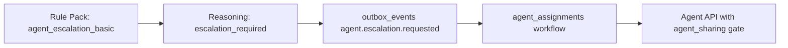
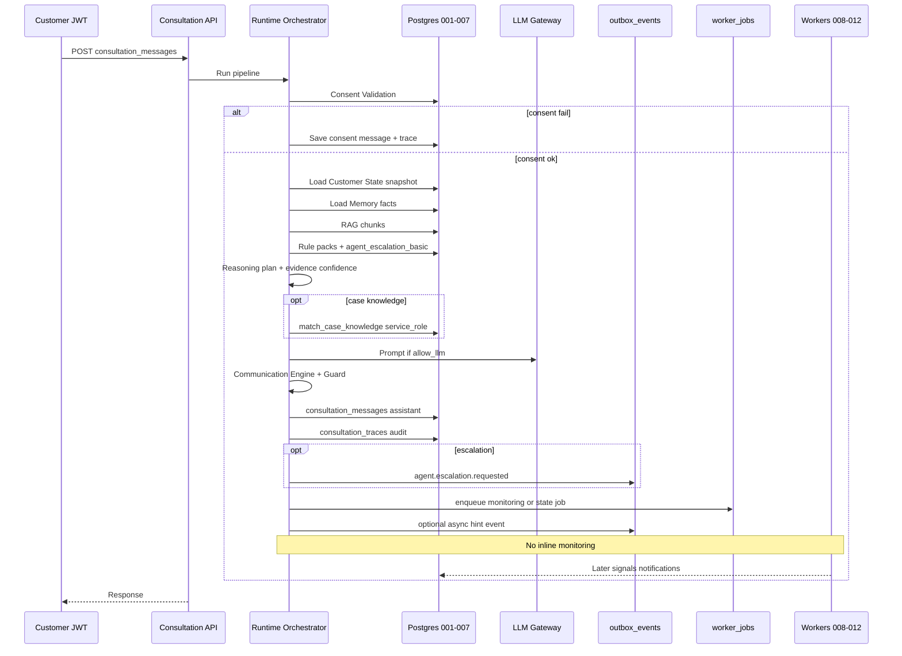

# LIFEGUARD Core — Consultation Runtime Architecture

Final design consolidation for **synchronous consultation (Runtime)** processing, grounded in migrations **001–012** and existing engine documents.

**Runtime** = request-path orchestration (authenticated customer JWT on API; `service_role` for trace/outbox writes). **Not** background monitoring, ingest, or notification delivery.

**Not in scope:** INSUX / INSUX2 / insux-pro-ai, UI, server implementation, SQL changes, demo/mock/sample/fake transcripts.

Related: [CONSULTATION_ORCHESTRATOR.md](./CONSULTATION_ORCHESTRATOR.md), [LIFEGUARD_REASONING_ENGINE.md](./LIFEGUARD_REASONING_ENGINE.md), [CONSENT_ARCHITECTURE.md](./CONSENT_ARCHITECTURE.md), [CUSTOMER_STATE_ENGINE.md](./CUSTOMER_STATE_ENGINE.md), [MEMORY_BUILDER.md](./MEMORY_BUILDER.md), [DOCUMENT_INGEST.md](./DOCUMENT_INGEST.md), [COMMUNICATION_ENGINE.md](./COMMUNICATION_ENGINE.md), [CASE_KNOWLEDGE_ENGINE.md](./CASE_KNOWLEDGE_ENGINE.md), [LIFEGUARD_MONITORING_ENGINE.md](./LIFEGUARD_MONITORING_ENGINE.md), [WORKER_ARCHITECTURE.md](./WORKER_ARCHITECTURE.md).

| Migration | Runtime relevance |
|-----------|-------------------|
| `001` | `consultations`, `consultation_messages`, `consultation_traces`, `outbox_events`, memory, docs, rules |
| `004` | `customer_consents`, `lifeguard_has_consent` |
| `005` | RAG-ready documents, `match_customer_document_chunks` |
| `006` | `case_knowledge_items` (secondary; service_role retrieval) |
| `007` | `customer_state_snapshots`, `lifeguard_latest_customer_state` |
| `008–012` | Async only — enqueue from Runtime; no inline monitoring/delivery |

---

## 1. Consultation request ingress

```text
customer (JWT)
  → customer_profiles (resolve customer_id)
  → consultations (thread)
  → consultation_messages (user turn, then assistant turn)
```

| Step | Actor | Table | Notes |
|------|-------|-------|-------|
| Auth | API | `users`, `customer_profiles` | `lifeguard_auth_customer_id()` — never trust body `customer_id` |
| Open thread | Customer | `consultations` | `POST /api/consultations` |
| User message | Customer | `consultation_messages` | `role = user` before pipeline |
| Assistant message | Orchestrator | `consultation_messages` | `role = assistant` after pipeline |

See [CONSULTATION_ORCHESTRATOR.md](./CONSULTATION_ORCHESTRATOR.md) for HTTP contracts.

---

## 2. Runtime pipeline (synchronous)

Ordered stages for **one** user message. Each stage completes before the next unless hard-block stops the path.

### 2.1 Stage reference table

| Stage | 입력 | 출력 | 동의 확인 | 실패 시 동작 |
|-------|------|------|-----------|--------------|
| **Consent Validation** | `customer_consents`, `lifeguard_required_consents_for_feature('ai_consultation')` | `consent_snapshot[]`, `consent_version` per type, `allow_ai` flag | `ai_consultation` 필수; Stage별 `memory_retention`, `document_analysis`, `sensitive_health_processing`, `insurance_data_processing` | `allow_ai = false` → consent 메시지 저장, **LLM 미호출**, trace만 기록 |
| **Customer State** | `lifeguard_latest_customer_state` / latest `customer_state_snapshots` | `state_version`, domain summaries, per-domain `sufficiency` | 도메인별 consent (state는 이미 consent-gated 빌드) | snapshot 없음 → 빈 context + domain `insufficient`; **추론으로 채우지 않음** |
| **Memory** | `customer_memory_facts` (active), `customer_profiles.memory_version` | `used_memory_facts[]`, `memory_sufficiency` | `memory_retention` + fact-level consent in metadata | 미동의/없음 → `memory_sufficiency = insufficient`, facts 제외 |
| **RAG** | `customer_documents`, `customer_document_chunks`, question embedding | `used_document_chunks[]`, `chunk_ids`, `document_sufficiency` | `document_analysis` + `ingest_status = ready` | 미동의/empty RPC → insufficient; **타 고객 chunk 금지** |
| **Rule Pack** | Question text, category hint, `rule_pack_versions` (active) | `used_rule_packs[]`, `rule_pack_version_id`, labels | N/A (normative packs) | pack 없음 → general/safety only; **항상** `agent_escalation_basic` 평가 |
| **Reasoning** | Stages 1–5 outputs, optional `case_knowledge_items` (secondary) | `response_plan` JSON, `confidence` (evidence), `escalation_required` | Case RAG: governance + server only; no customer PII in case store | insufficient → 자료 부족 plan; hard-block → LLM skip |
| **Communication Engine** | Response plan + sources | Korean `answer` text, guarded phrasing | CE forbidden list | Output Guard fail → safe template retry or handoff |
| **Trace** | All stage artifacts | `consultation_traces` row, assistant `consultation_messages` | snapshot in trace | persist failure → 5xx; no partial customer leak |
| **Monitoring Trigger** | `customer_id`, `consultation_id`, optional change hints | **`outbox_events` INSERT** and/or **`worker_jobs` INSERT** only | N/A at enqueue (workers re-check) | **동기 monitoring 계산 금지** — see §2.2 |

### 2.2 Monitoring Trigger — async only (mandatory)

> **Runtime MUST NOT** run `monitoring-worker` detectors, insert `customer_monitoring_signals`, or compute monitoring confidence inline.

After Trace succeeds, Runtime may **enqueue** only:

| Enqueue target | Example payload / job |
|----------------|----------------------|
| `outbox_events` | `memory.rebuild.completed` (hint), consultation-side events if product adds them |
| `worker_jobs` | `job_type = monitoring`, `source_ref = consultation_id` or `customer_id` batch key |
| `worker_jobs` | `job_type = customer_state`, `source_ref = memory_version` after significant answer |

**Actual processing chain** (background, `service_role`):

```text
worker_jobs / outbox_events
  → monitoring-worker (008, WORKER_ARCHITECTURE)
  → customer_monitoring_signals + outbox monitoring.*
  → outbox-worker (011)
  → notification-worker (012)
```

See [LIFEGUARD_MONITORING_ENGINE.md](./LIFEGUARD_MONITORING_ENGINE.md), [WORKER_ARCHITECTURE.md](./WORKER_ARCHITECTURE.md).

---

## 3. Input sources (canonical tables)

| Source | Table(s) | Runtime use |
|--------|----------|---------------|
| Customer Memory | `customer_memory_facts` | Stage Memory; `superseded_at IS NULL` only |
| Customer State | `customer_state_snapshots`, view `lifeguard_latest_customer_state` | Stage Customer State |
| Documents | `customer_documents` | RAG gate (`ready`) |
| Chunks | `customer_document_chunks` | `match_customer_document_chunks` |
| Rule packs | `rule_packs`, `rule_pack_versions` | Stage Rule Pack (`003` seeds) |
| Case Knowledge | `case_knowledge_items` | Optional secondary; `status = active` only; `match_case_knowledge` (service_role) |
| Consents | `customer_consents` | Stage Consent; `lifeguard_has_consent` |

**Not loaded in Runtime:** `case_extraction_jobs.source_customer_id` rows for prompt; retired/archived case items; INSUX corpora.

---

## 4. Outputs

| Output | Table | Producer |
|--------|-------|----------|
| User / assistant turns | `consultation_messages` | API + Orchestrator |
| Provenance | `consultation_traces` | Orchestrator (`service_role` or trusted server) |
| Escalation / async bus | `outbox_events` | Orchestrator when `agent_escalation_basic` fires |
| Background work | `worker_jobs` (optional) | Runtime enqueue — monitoring / state rebuild hints |

**Not Runtime outputs:** `notification_events`, `customer_monitoring_signals` (workers only).

---

## 5. Confidence calculation

**LLM self-reported confidence is forbidden.** Do not read logprobs or model “확신” for customer-facing scores.

`confidence` (0–1) is computed from **evidence coverage only**:

| Input signal | Effect (guideline) |
|--------------|-------------------|
| `memory_sufficiency = sufficient` + relevant facts | +up to 0.2 |
| `document_sufficiency = sufficient` + retrieval scores | +up to 0.3 |
| Single dominant rule label | +0.1 |
| Low OCR / weak chunks | −0.2 |
| **Both** memory and document insufficient | **cap ≤ 0.35** |
| Escalation hard-block template | confidence describes handoff need, not payout certainty |

Aligns with [LIFEGUARD_REASONING_ENGINE.md](./LIFEGUARD_REASONING_ENGINE.md) §6 and [LIFEGUARD_MONITORING_ENGINE.md](./LIFEGUARD_MONITORING_ENGINE.md) (monitoring uses separate detector confidence — not LLM).

**Never** set Runtime confidence &gt; 0.85 for payout, disclosure violation, or cancellation outcomes.

---

## 6. Sufficiency: insufficient / partial / sufficient

Applied per **domain** (Customer State) and per **class** (Memory / Documents) in Runtime.

| Level | Definition | Runtime behavior |
|-------|------------|------------------|
| **insufficient** | No consented source rows for the question scope, or consent revoked for that class | Do not invent facts; Reasoning uses 자료 부족 plan; confidence capped |
| **partial** | Some evidence (e.g. profile flags without full docs, or low OCR docs) | May answer with explicit limits; labels capped medium/low; cite gaps |
| **sufficient** | Consented sources present with `evidence_refs` resolvable to `source_table` + `source_id` | Normal rule labels allowed within pack bounds; still non-definitive wording via CE |

**Global rule:** If both memory and document classes are **insufficient** for the question category → no high-certainty labels; LLM explains what is missing only.

---

## 7. Escalation

| Mechanism | Detail |
|-----------|--------|
| **Rule** | `agent_escalation_basic` (`003_seed_rule_packs.sql`) — always evaluated in Rule Pack stage |
| **Triggers** | Cancellation finality, disclosure/payment finality, tax/legal, high-value change patterns (orchestrator pre-scan + rule body) |
| **Runtime output** | `escalation_required`, `escalation_reason[]` in plan; `allow_llm` may be false |
| **Outbox** | `INSERT outbox_events` — `event_type = agent.escalation.requested`, payload: `customer_id`, `consultation_id`, `message_id`, `trigger_codes` (no PII blob) |
| **Agent sharing** | Without `agent_sharing`, agent APIs get handoff metadata only — **not** full memory/doc dump ([CONSENT_ARCHITECTURE.md](./CONSENT_ARCHITECTURE.md)) |
| **Delivery** | Customer notification only if policy + `notification_delivery`; processing via 011→012 chain |



---

## 8. Audit (`consultation_traces` + message metadata)

Each assistant answer MUST record provenance. Store in `consultation_traces` columns and/or `retrieval_scores` JSON extension ([CONSENT_ARCHITECTURE.md](./CONSENT_ARCHITECTURE.md) §9).

| Field | Content |
|-------|---------|
| **`consent_version`** | Per active `consent_type` at answer time (inside `consent_snapshot`) |
| **`consent_snapshot`** | Array `{ consent_type, consent_version, granted, evaluated_at }` |
| **`memory_version`** | `customer_profiles.memory_version` at answer time (column on trace) |
| **`state_version`** | `customer_state_snapshots.state_version` used (in `retrieval_scores`) |
| **`rule_pack_version`** | `rule_pack_version_id` + semantic version string |
| **`knowledge_used`** | `{ memory_fact_ids[], chunk_ids[], rule_pack_slugs[], case_knowledge_ids[] }` — case ids only if secondary match used |
| **`prompt_hash`** | SHA-256 of composed prompt (no raw prompt to customer) |
| **`response_hash`** | SHA-256 of assistant `content` after CE / Output Guard |
| **`chunk_ids`** | UUID[] from RAG (001 column) |
| **`retrieval_scores`** | Similarities, sufficiency flags, escalation_reason |

Customers **cannot** SELECT `consultation_traces` (002 RLS). Admins audit; agents see assignment-scoped summaries only.

---

## 9. Prohibitions (Runtime)

| # | Rule |
|---|------|
| 1 | **No promoting Customer Memory to Case Knowledge** during or after a consultation |
| 2 | **No retired knowledge** — `case_knowledge_items.status != 'active'`, superseded memory facts |
| 3 | **No data without consent** for that class |
| 4 | **No demo/mock/sample/fake** customer, policy, or message fixtures in Runtime paths |
| 5 | **No synchronous monitoring** — enqueue only (§2.2) |
| 6 | **No LLM confidence** — evidence-based only (§5) |

---

## 10. Case Knowledge — secondary only

> **CASE KNOWLEDGE CALLOUT**
>
> - `case_knowledge_items` may be used **only as supplementary patterns** at answer time (de-identified, active, governance-approved).
> - Case Knowledge **MUST NOT** replace or override **Customer Memory**, customer RAG chunks, or rule-pack normative labels.
> - When memory or document sufficiency is **insufficient**, Runtime **MUST NOT** fill gaps from Case Knowledge, general insurance lore, or LLM prior.
> - `match_case_knowledge` is **service_role / server** only — never browser JWT ([006_case_knowledge.sql](../supabase/migrations/006_case_knowledge.sql)).
> - Case Extraction from live consultations is **async** ([CASE_KNOWLEDGE_ENGINE.md](./CASE_KNOWLEDGE_ENGINE.md)) — not part of this Runtime path.

Precedence: Customer Memory + customer RAG + rule packs → then optional case hints.

---

## 11. Runtime sequence diagram



```text
Sync path:  Consent → State → Memory → RAG → Rules → Reasoning → CE → Trace → (outbox | worker_jobs enqueue)
Async path: WORKER_ARCHITECTURE chain — NOT in request latency budget
```

---

## 12. Deliberate exclusions

- INSUX / insux-pro-ai orchestrator or tone packs.
- Inline `buildCustomerState` or `runMonitoringForCustomer` on hot path.
- Exposing `consultation_traces` or `service_role` to clients.

---

*Draft v0.1 — LIFEGUARD Core Consultation Runtime Architecture.*
