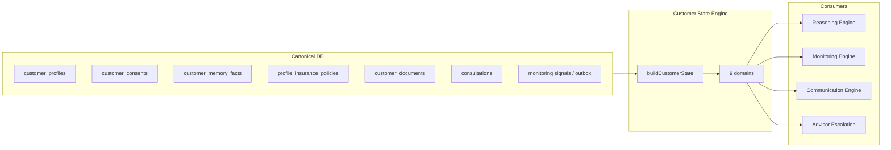

# LIFEGUARD Core — Customer State Engine

Design-only engine that **materializes a unified Customer State** from real per-tenant data: memory, documents, policies, consultations, consents, and monitoring signals.

Used by Reasoning, Monitoring, Communication, and advisor workflows — **not** a second source of truth (DB tables remain canonical).

**Not in scope:** INSUX, INSUX2, insux-pro-ai, UI, server code, demo/mock/sample/fake state fixtures.

Related: [MEMORY_BUILDER.md](./MEMORY_BUILDER.md), [DOCUMENT_INGEST.md](./DOCUMENT_INGEST.md), [CONSENT_ARCHITECTURE.md](./CONSENT_ARCHITECTURE.md), [LIFEGUARD_MONITORING_ENGINE.md](./LIFEGUARD_MONITORING_ENGINE.md), [LIFEGUARD_REASONING_ENGINE.md](./LIFEGUARD_REASONING_ENGINE.md), [COMMUNICATION_ENGINE.md](./COMMUNICATION_ENGINE.md).

---

## 1. Purpose

| Objective | Description |
|-----------|-------------|
| **Single read model** | One structured `CustomerState` per `customer_id` for a point in time |
| **Evidence-only** | Each domain field cites `source_table` + `source_id` or is `unknown` / `insufficient` |
| **No inference** | Do not infer coverage, payout, disclosure outcome, or family events without rows |
| **Freshness** | Stale domains flagged; consumers downgrade confidence or skip detectors |
| **Downstream sync** | Reasoning Stage 2–4, Monitoring detectors, advisor escalation read same snapshot |
| **Rebuildable** | State is computed — never authoritative over raw tables |



**Storage:** `customer_state_snapshots` (`007_customer_state_snapshots.sql`); read via `lifeguard_latest_customer_state`. Optional Redis cache still allowed at API layer.

---

## 2. State domains

Each domain is a JSON object with: `status`, `summary`, `evidence_refs[]`, `sufficiency`, `confidence`, `as_of`.

| Domain | Role |
|--------|------|
| **`identity_state`** | Profile demographics, account status, `memory_version` |
| **`consent_state`** | Active/revoked consents by `consent_type`, version, gaps for enabled features |
| **`health_state`** | Health disclosures availability (not full dump to agents) |
| **`insurance_state`** | Active policy portfolio summary, renewal indicators |
| **`claim_state`** | Claim-related docs + memory flags; **no** payout outcome |
| **`disclosure_state`** | Disclosure-review flags from health/memory — **no** violation certainty |
| **`document_state`** | Upload/ingest counts by type, RAG readiness, OCR quality flags |
| **`monitoring_state`** | Active monitoring signals (from Monitoring Engine) |
| **`advisor_state`** | `agent_assignments`, open escalations, handoff eligibility |

Domains are **independent** for consent: e.g. `health_state` = `unavailable` if `sensitive_health_processing` revoked.

---

## 3. State sources

| Source | Tables / artifacts | Domains fed |
|--------|-------------------|-------------|
| **Memory** | `customer_memory_facts` (active) | health, insurance, disclosure, claim hints, monitoring inputs |
| **Profiles** | `customer_profiles`, `profile_health` | identity, health |
| **Policies** | `profile_insurance_policies` | insurance, claim, disclosure context |
| **Documents** | `customer_documents`, chunk metadata aggregates | document, claim, insurance (extract slots) |
| **Consultations** | `consultations`, `consultation_messages` (recent) | advisor, disclosure/claim context |
| **Monitoring signals** | `customer_monitoring_signals` / `outbox_events` (future) | monitoring, advisor |
| **Consents** | `customer_consents` via `lifeguard_has_consent` | consent_state; gates all other domains |

**Rule:** If source empty for domain → `sufficiency: insufficient` — not guessed defaults.

---

## 4. State calculation rules

### 4.1 `identity_state`

```text
IF customer_profiles row missing: INVALID
ELSE:
  status = profile.status
  summary = { display_name, job_category, memory_version }
  evidence_refs = [{ table: customer_profiles, id }]
  sufficiency = complete
```

### 4.2 `consent_state`

```text
FOR each type IN lifeguard_consent_types():
  active = lifeguard_has_consent(customer_id, type)
  record { type, active, version from latest grant row }

consent_gaps = lifeguard_required_consents_for_feature('ai_consultation')
  .filter(type => NOT active)

sufficiency = complete (always computable from customer_consents)
```

### 4.3 `health_state`

```text
IF NOT lifeguard_has_consent(sensitive_health_processing):
  status = unavailable
  sufficiency = insufficient
  RETURN

IF profile_health row exists with any non-sentinel field:
  summary = categorical flags only (smoking, hospital_5y, medication_present: bool)
  evidence_refs = profile_health + relevant memory fact ids
  sufficiency = partial | complete
ELSE:
  sufficiency = insufficient
```

No diagnosis names unless in memory fact with consent — still minimized in summary.

### 4.4 `insurance_state`

```text
IF NOT lifeguard_has_consent(insurance_data_processing):
  status = unavailable; sufficiency = insufficient; RETURN

policies = active profile_insurance_policies
IF count = 0: sufficiency = insufficient
ELSE:
  summary = { count, types[], renewal_count, indemnity_held: bool }
  evidence_refs = policy ids
  sufficiency = complete
```

### 4.5 `claim_state`

```text
Requires insurance_state.sufficiency != insufficient OR claim-related docs

docs = ready documents where document_type IN claim types
memory_flags = facts with keys health.claim.* or claim.*

IF docs empty AND memory_flags empty:
  sufficiency = insufficient
ELSE:
  summary = { documents_ready: count, review_recommended: bool from memory }
  evidence_refs = document ids + fact ids
  -- NO claim_approved / payout fields
```

### 4.6 `disclosure_state`

```text
IF NOT sensitive_health_processing consent:
  unavailable

Derive from memory facts: health.disclosure.*, health.surgery.*, health.hospitalization.*
IF no facts: insufficient
ELSE:
  summary = { review_recommended: bool, flags[] }
  labels use possibility only (MEMORY_BUILDER / rule packs)
```

### 4.7 `document_state`

```text
IF NOT document_storage: unavailable

summary = {
  total_uploaded,
  ready_count,
  by_type: { diagnosis_certificate: n, ... },
  low_ocr_count
}
IF document_analysis revoked: rag_available = false
ELSE: rag_available = ready_count > 0

evidence_refs = document ids (metadata only in summary)
```

### 4.8 `monitoring_state`

```text
signals = customer_monitoring_signals WHERE status IN ('open', 'notified')
IF none: status = clear; sufficiency = complete (empty is valid)
ELSE:
  summary = { signal_types[], max_confidence, latest_at }
  evidence_refs = signal ids
```

Populated after Monitoring Engine runs — on cold start, read pending outbox `monitoring.signal.detected`.

### 4.9 `advisor_state`

```text
assignment = agent_assignments active/pending for customer
open_escalations = outbox agent.escalation.requested pending (last 30d)

summary = {
  assigned: bool,
  agent_status,
  escalation_pending: bool
}
agent_sharing_consent = lifeguard_has_consent(agent_sharing)
```

---

## 5. State freshness rules

| Domain | `as_of` source | Stale when |
|--------|----------------|------------|
| identity | `customer_profiles.updated_at` | — |
| consent | max(`customer_consents.updated_at`) | any required consent revoked since snapshot |
| health | max(health profile, health facts) | profile PUT &gt; snapshot &gt; 24h |
| insurance | max(policy updated_at) | policy change since snapshot |
| documents | max(document updated_at) | ingest completed after snapshot |
| consultations | max(message created_at) | new message since snapshot |
| monitoring | latest signal `created_at` | new monitoring run after snapshot |
| advisor | assignment `updated_at` | assignment change |

**`state_version`:** hash of domain `as_of` timestamps + `memory_version`.

Consumers: if `stale === true` → recompute or refuse Reasoning with 409 `state_stale`.

Default TTL for cached snapshot: **15 minutes** (config `LIFEGUARD_STATE_CACHE_TTL`).

---

## 6. State confidence rules

Per-domain `confidence` (0–1):

| Rule | Application |
|------|-------------|
| `sufficiency = insufficient` | domain confidence = 0; do not use domain in Monitoring detectors |
| Single weak source | cap 0.5 |
| Policy + memory align on renewal | up to 0.8 |
| Low OCR dominates document_state | cap document domain 0.45 |
| **Global `state_confidence`** | weighted mean of domains with sufficiency ≠ insufficient, excluding `unavailable` |

Global cap 0.85. Reasoning Engine maps global to answer `confidence` (see REASONING §6).

**Forbidden:** confidence from LLM; only from evidence counts and freshness.

---

## 7. Monitoring Engine integration

| Use | How |
|-----|-----|
| **Input** | `buildCustomerState(customerId)` before detector pass |
| **Detectors** | Read `insurance_state`, `document_state`, `health_state` — skip if `sufficiency = insufficient` |
| **Output** | New signals update `monitoring_state` on next rebuild |
| **Trigger** | `state_version` change enqueues selective monitoring (changed domains only) |

No monitoring signal if domain insufficient — aligns with MONITORING §5.

---

## 8. Reasoning Engine integration

| Stage | Customer State use |
|-------|-------------------|
| 1 Consent | `consent_state.consent_gaps` — fast fail |
| 2 Context | `identity_state` |
| 3 Memory | Skip load if `health_state.unavailable` or memory gated |
| 4 Documents | `document_state.rag_available` |
| 5 Rules | Category hints from `claim_state`, `disclosure_state` summaries |
| 6 Escalation | `advisor_state`, `monitoring_state` critical signals |
| 7 Plan | Domain sufficiency → 자료 부족 path |

Orchestrator calls `buildCustomerState` once per message (or uses cache if fresh).

---

## 9. Communication Engine integration

| Rule | Detail |
|------|--------|
| Display name | From `identity_state.summary.display_name` only |
| Do not narrate state JSON | CE paraphrases evidence-backed summaries |
| Insufficient domain | CE Template B for that topic |
| Monitoring | Optional line: “최근 등록된 검토 항목이 있습니다” only if `monitoring_state` has consented notification context |

CE never cites `state_version` or internal domain keys to customer.

---

## 10. Advisor escalation integration

| Field | Use |
|-------|-----|
| `advisor_state.assigned` | Whether to mention named handoff |
| `agent_sharing` consent | If false — escalation outbox only, no memory in agent API |
| `monitoring_state` + escalation outbox | Priority queue for agents |
| Payload | ids from `evidence_refs` — not full CustomerState blob |

Advisor portal (future) reads redacted state: identity + insurance summary + monitoring — no health raw, no chunks.

---

## 11. Audit

| Artifact | Content |
|----------|---------|
| `customer_state_snapshots` | `state_version`, `state_json`, `global_confidence`, `sufficiency`, `consent_snapshot`, `calculated_at`, `stale_at` |
| `lifeguard_latest_customer_state` | Customer/admin latest row (RLS) |
| `lifeguard_agent_customer_state_summary` | Agent assigned + `agent_sharing`; no health/doc raw |
| Reasoning trace | Optional `state_version` in `retrieval_scores` |
| Monitoring run | `input_state_version` |
| Admin | Recompute + diff snapshots for dispute |

Snapshots are **derived** — erasure requests delete source tables then invalidate snapshots.

---

## 12. Pseudocode

```text
FUNCTION buildCustomerState(customerId, forceRefresh=false):
  cached = cacheGet(customerId)
  IF cached AND NOT forceRefresh AND NOT isStale(cached): RETURN cached

  state = {
    customer_id: customerId,
    computed_at: now(),
    domains: {}
  }

  state.domains.consent_state = calcConsentState(customerId)
  state.domains.identity_state = calcIdentityState(customerId)
  state.domains.health_state = calcHealthState(customerId, state.domains.consent_state)
  state.domains.insurance_state = calcInsuranceState(customerId, state.domains.consent_state)
  state.domains.document_state = calcDocumentState(customerId, state.domains.consent_state)
  state.domains.claim_state = calcClaimState(customerId, state.domains.insurance_state, state.domains.document_state)
  state.domains.disclosure_state = calcDisclosureState(customerId, state.domains.consent_state)
  state.domains.monitoring_state = calcMonitoringState(customerId)
  state.domains.advisor_state = calcAdvisorState(customerId, state.domains.consent_state)

  state.state_version = hashDomainAsOf(state.domains)
  state.state_confidence = computeGlobalConfidence(state.domains)
  state.stale = false

  cacheSet(customerId, state, TTL)
  RETURN state
```

---

## 13. Test scenarios

| # | Setup | Expected |
|---|--------|----------|
| S1 | No policies | `insurance_state.sufficiency = insufficient`; `claim_state` insufficient |
| S2 | Health data, no sensitive consent | `health_state.status = unavailable` |
| S3 | 3 renewal policies + consent | `insurance_state.summary.renewal_count = 3` |
| S4 | Revoke document_analysis | `document_state.rag_available = false` |
| S5 | Active monitoring signal row | `monitoring_state.summary.signal_types` non-empty |
| S6 | Customer A state build | No evidence_refs with customer B ids |
| S7 | Profile update after cache | `isStale` true |
| S8 | Repo | No demo/mock CustomerState JSON fixtures |

---

## 14. Deliberate exclusions

- INSUX demo profiles or global customer presets.
- Inferred lapse risk without policy rows.
- Customer State as legal record — always derivative of consented sources.

---

*Draft v0.1 — LIFEGUARD Core Customer State Engine.*
