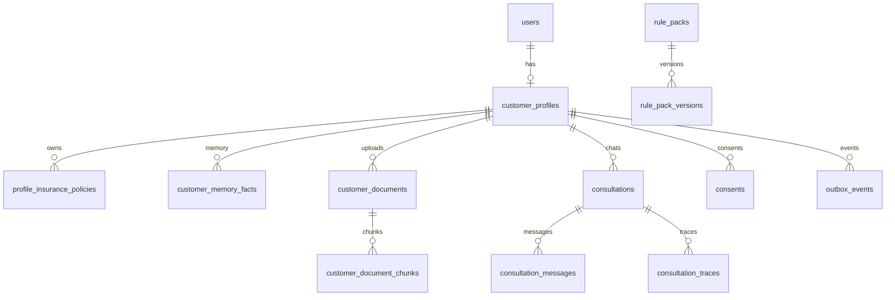

# LIFEGUARD Core — Data Model

PostgreSQL (Supabase). All customer-owned rows include `customer_id` and **RLS**.

---

## 1. Entity relationship (overview)



---

## 2. Core tables

### 2.1 `users` (auth-linked)

| Column | Type | Notes |
|--------|------|-------|
| id | uuid PK | = `auth.users.id` |
| email | text | unique |
| phone | text | optional |
| role | text | `customer` \| `agent` \| `admin` (v1: customer) |
| created_at | timestamptz | |

### 2.2 `customer_profiles`

One row per customer. Signup creates this immediately.

| Column | Type | Notes |
|--------|------|-------|
| id | uuid PK | |
| user_id | uuid FK users | unique |
| display_name | text | |
| birth_date | date | |
| gender | text | |
| job_category | text | |
| status | text | `draft` \| `active` |
| memory_version | int | bumped on memory rebuild |
| created_at / updated_at | timestamptz | |

### 2.3 `profile_health`

| Column | Type | Notes |
|--------|------|-------|
| customer_id | uuid FK | PK or 1:1 |
| smoking | text | |
| drinking | text | |
| hospital_5y | text | enum yes/no/unknown |
| surgery_5y | text | |
| medication | text | |
| outpatient | text | |
| family_history | text | |
| details_json | jsonb | structured follow-ups |
| source | text | `signup` \| `update` |

### 2.4 `profile_insurance_policies`

| Column | Type | Notes |
|--------|------|-------|
| id | uuid PK | |
| customer_id | uuid FK | |
| insurer_name | text | |
| product_name | text | |
| policy_type | text | life / health / indemnity / etc. |
| monthly_premium | numeric | nullable |
| coverage_summary | jsonb | key coverages |
| effective_from | date | |
| source | text | `signup` \| `upload_extract` \| `manual` |
| is_active | boolean | |

---

## 3. Customer memory (AI-facing)

### 3.1 `customer_memory_facts`

Canonical **remembered** facts — not chat logs.

| Column | Type | Notes |
|--------|------|-------|
| id | uuid PK | |
| customer_id | uuid FK | |
| fact_key | text | e.g. `health.smoking`, `policy.count` |
| fact_value | text | normalized display value |
| confidence | numeric | 0–1 |
| provenance_type | text | `profile` \| `document` \| `operator` |
| provenance_ref | uuid | optional doc/message id |
| effective_at | timestamptz | |
| superseded_at | timestamptz | nullable |

**Index:** `(customer_id, fact_key)` where `superseded_at is null`.

**Memory snapshot API** returns all active facts + active policies JSON (cached Redis key: `mem:{customer_id}:v{version}`).

---

## 4. Documents & RAG (per customer)

### 4.1 `customer_documents`

| Column | Type | Notes |
|--------|------|-------|
| id | uuid PK | |
| customer_id | uuid FK | |
| storage_path | text | bucket path |
| mime_type | text | |
| original_filename | text | |
| doc_class | text | `policy_certificate` \| `terms` \| `claim` \| `medical` \| `other` |
| ingest_status | text | `pending` \| `processing` \| `ready` \| `failed` |
| page_count | int | |
| created_at | timestamptz | |

### 4.2 `customer_document_chunks`

| Column | Type | Notes |
|--------|------|-------|
| id | uuid PK | |
| customer_id | uuid FK | **required for RLS** |
| document_id | uuid FK | |
| chunk_index | int | |
| content | text | |
| content_tsv | tsvector | generated |
| embedding | vector(1536) | model-dependent dim |
| embedding_model | text | |
| doc_title | text | denormalized |
| section | text | |
| page | int | |
| metadata | jsonb | |

**Indexes:**

- `ivfflat (embedding vector_cosine_ops)` with `WHERE customer_id = ?` via partitioning or composite filter
- GIN on `content_tsv`
- `(customer_id, document_id, chunk_index)` unique

### 4.3 RPC: `match_customer_chunks`

```sql
-- Parameters: p_customer_id uuid, p_query_embedding vector, p_threshold float, p_count int
-- MUST filter: customer_id = p_customer_id
```

Never use a global `insurance_chunks` table without customer filter.

---

## 5. Consultation (chat)

### 5.1 `consultations`

| Column | Type | Notes |
|--------|------|-------|
| id | uuid PK | |
| customer_id | uuid FK | |
| title | text | auto from first message |
| status | text | `open` \| `archived` |
| created_at | timestamptz | |

**Default screen** = list/open single `consultation` (product); schema supports many threads per customer.

### 5.2 `consultation_messages`

| Column | Type | Notes |
|--------|------|-------|
| id | uuid PK | |
| consultation_id | uuid FK | |
| role | text | `user` \| `assistant` \| `system` |
| content | text | |
| sources_json | jsonb | chunk ids, fact keys, rule version |
| model | text | |
| latency_ms | int | |
| created_at | timestamptz | |

### 5.3 `consultation_traces` (debug + compliance)

| Column | Type | Notes |
|--------|------|-------|
| id | uuid PK | |
| message_id | uuid FK | assistant message |
| memory_version | int | |
| chunk_ids | uuid[] | retrieved |
| rule_pack_version_id | uuid | |
| retrieval_scores | jsonb | |
| prompt_token_estimate | int | |

---

## 6. Rules registry

### 6.1 `rule_packs`

| Column | Type | Notes |
|--------|------|-------|
| id | uuid PK | |
| slug | text | e.g. `claim-readiness-kr` |
| title | text | |

### 6.2 `rule_pack_versions`

| Column | Type | Notes |
|--------|------|-------|
| id | uuid PK | |
| rule_pack_id | uuid FK | |
| version | text | semver |
| body_markdown | text | or json rules |
| topic_tags | text[] | for routing |
| effective_from | timestamptz | |
| is_active | boolean | |

Consultation loads **active versions** matching query topics (keyword v1; classifier v2).

---

## 7. Consent

### 7.1 `consents`

| Column | Type | Notes |
|--------|------|-------|
| id | uuid PK | |
| customer_id | uuid FK | |
| consent_type | text | `health_data` \| `document_storage` \| `ai_analysis` |
| version | text | |
| granted_at | timestamptz | |
| revoked_at | timestamptz | |

Ingest blocked if `document_storage` not granted.

---

## 8. Extension tables (stubs)

### 8.1 `outbox_events`

| Column | Type | Notes |
|--------|------|-------|
| id | uuid PK | |
| customer_id | uuid FK | |
| event_type | text | `notification.*` \| `rebalancing.*` \| `agent.*` |
| payload | jsonb | |
| status | text | `pending` \| `processed` |
| created_at | timestamptz | |

### 8.2 `notification_preferences` (stub)

| Column | Type |
|--------|------|
| customer_id | uuid PK |
| channel | text |
| enabled | boolean |

### 8.3 `rebalancing_recommendations` (stub)

| Column | Type |
|--------|------|
| id | uuid PK |
| customer_id | uuid FK |
| snapshot_json | jsonb |
| status | text |

### 8.4 `agent_assignments` (stub)

| Column | Type |
|--------|------|
| id | uuid PK |
| customer_id | uuid FK |
| agent_user_id | uuid |
| status | text |

---

## 9. RLS policy pattern

```sql
-- Example pattern (pseudo)
CREATE POLICY customer_isolation ON customer_document_chunks
  FOR ALL USING (customer_id = auth.customer_id());
```

`auth.customer_id()` = mapping from `auth.uid()` → `customer_profiles.id`.

Agents/admins: separate policies with role claims (future).

---

## 10. Signup data flow (tables touched)

```
users
  → customer_profiles (draft)
  → profile_health
  → profile_insurance_policies (0..n)
  → consents (3 rows)
  → [job] memory_builder → customer_memory_facts
  → customer_profiles.status = active
```

---

## 11. Migration naming

```
supabase/migrations/
  001_core_identity.sql
  002_profile_health_insurance.sql
  003_memory_facts.sql
  004_documents_chunks_vector.sql
  005_consultations.sql
  006_rule_packs.sql
  007_extensions_outbox.sql
  008_rls_policies.sql
```

No shared migration files with INSUX projects.
