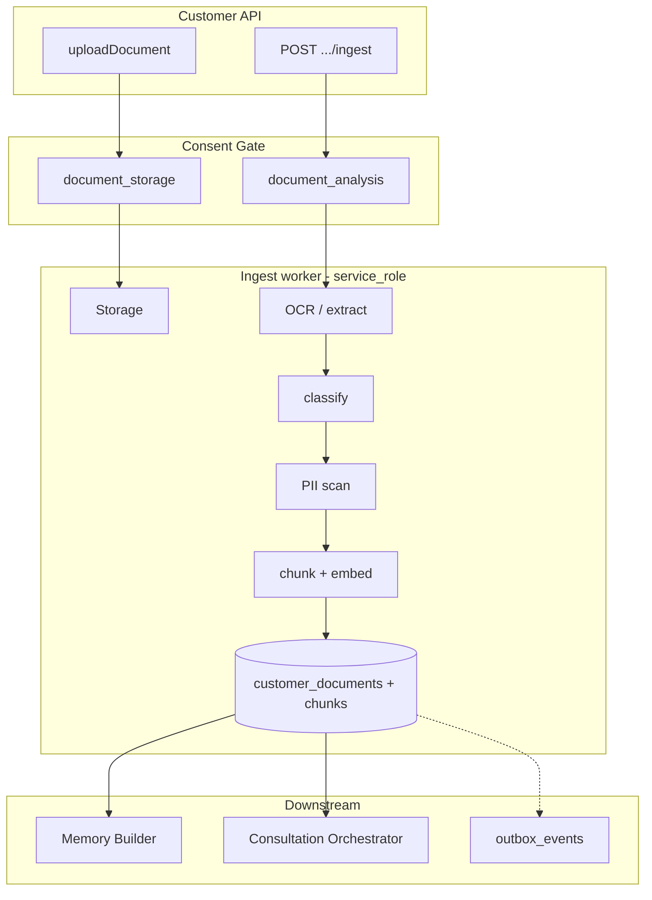

# LIFEGUARD Core — Document Ingest

Design-only pipeline for customer-uploaded **PDF/images** → per-customer storage, OCR, classification, chunking, embedding, and RAG readiness.

**Not in scope:** INSUX, INSUX2, insux-pro-ai, UI, server implementation, demo/mock/sample/fake documents.

Related: [CONSENT_ARCHITECTURE.md](./CONSENT_ARCHITECTURE.md), [MEMORY_BUILDER.md](./MEMORY_BUILDER.md), [CONSULTATION_ORCHESTRATOR.md](./CONSULTATION_ORCHESTRATOR.md), [AI_PIPELINE.md](./AI_PIPELINE.md), `001_initial_schema.sql`, `004_customer_consents.sql`, `002_rls_service_policies.sql`.

---

## 1. Purpose

| Goal | Description |
|------|-------------|
| **Ingest real customer files** | Only blobs uploaded by authenticated customer; no synthetic corpus |
| **Tenant isolation** | Every row and object path scoped to `customer_id`; RAG RPC requires `p_customer_id` |
| **Consent-first** | `document_storage` before upload; `document_analysis` before OCR/embed/RAG |
| **Downstream hooks** | `ingest_status = ready` → Memory Builder extract; Orchestrator RAG at question time |
| **Audit** | Upload log, ingest trace, consent snapshot; no silent cross-customer leakage |



---

## 2. Input document types

Canonical `document_type` (detected at classification; stored in `customer_documents` metadata and/or extended `doc_class`).

| `document_type` | Description | Maps to rule-pack context |
|-----------------|-------------|----------------------------|
| `insurance_policy_pdf` | 보험증권 PDF | insurance, disclosure |
| `insurance_certificate` | 가입증명/증권 사본 | insurance |
| `insurance_terms` | 약관 | claim, terms |
| `diagnosis_certificate` | 진단서 | claim, disclosure |
| `surgery_certificate` | 수술 확인서 | claim, disclosure |
| `hospitalization_record` | 입원/퇴원 기록 | claim, disclosure |
| `medical_receipt` | 영수증 | claim |
| `medical_statement` | 세부내역서 | claim |
| `health_checkup` | 건강검진 결과 | disclosure, health |
| `tax_or_finance_document` | 세금/재무 (보험료 등) | finance — **not** tax advice |
| `unknown` | 분류 불가 | general; low confidence |

**001 schema:** `doc_class` (legacy). **005 migration:** adds `document_type` + extended `ingest_status` — see `005_document_ingest_extend.sql`.

Customer may hint type at upload; classifier may override based on OCR text — always store **detected** + **customer_hint** in `metadata_json`.

---

## 3. Processing flow

| Step | Action | Actor | Consent |
|------|--------|-------|---------|
| 1 | Upload request (signed URL or multipart) | API | `document_storage` |
| 2 | `lifeguard_has_consent(customer_id, 'document_storage')` | API | block → 403 if false |
| 3 | Insert `customer_documents` (`ingest_status` → `uploaded`) | API | server sets `customer_id` from JWT |
| 4 | Write object to storage `customers/{customer_id}/docs/{document_id}/...` | API / storage | — |
| 5 | Client calls `POST /api/documents/:id/ingest` | API | `document_analysis` |
| 6 | If no analysis consent → `analysis_blocked_by_consent`; no job | API | — |
| 7 | Enqueue ingest job (`queued`) | API / queue | — |
| 8 | Worker: `processing` — OCR/text extraction | Worker | re-check consent |
| 9 | Classify document type | Worker | — |
| 10 | PII/sensitive scan (mask logs; flag chunks) | Worker | — |
| 11 | Chunk text (400–800 chars, ~80 overlap) | Worker | — |
| 12 | Embed chunks (`embedding_model` config) | Worker | — |
| 13 | Insert `customer_document_chunks` | Worker | attach `consent_version` |
| 14 | `ingest_status = ready`, `page_count` set | Worker | — |
| 15 | `triggerMemoryBuilder(customerId, documentId)` | Worker | `document_analysis` |
| 16 | Optional `outbox_events`: `document.ingest.completed` | Worker | — |

**Async:** Steps 7–16 run off-request; customer polls `GET /api/documents/:id` for status.

### 3.1 Worker runtime (Phase 22D Step 1B — embedding foundation)

**Edge Function:** `document-ingest-worker`

| Step | Action | Output |
|------|--------|--------|
| 1 | Storage download → CLOVA OCR | `chunks.content` (real OCR text) |
| 2 | PII sanitize → insert chunk | `embedding = NULL` initially |
| 3 | OpenAI embed chunk text | `embedding`, `embedding_model` updated |
| 4 | Mark document ready | `ingest_status = ready` only after embedding succeeds |

**Flow:** OCR → `chunk.content` → embedding → `ready`

**Edge Function secrets:**

| Secret | Purpose |
|--------|---------|
| `OPENAI_API_KEY` | OpenAI Embeddings API (Phase 22D Step 1B+) |
| `CLOVA_OCR_API_URL` | CLOVA General OCR endpoint (unchanged) |
| `CLOVA_OCR_SECRET_KEY` | CLOVA API secret (unchanged) |
| `SERVICE_ROLE_KEY` | Worker DB/storage access (unchanged) |

**Embedding config:** `text-embedding-3-small`, **1536 dimensions** (matches `customer_document_chunks.embedding VECTOR(1536)`).

**Embedding failure:** If OCR/chunk insert succeeds but embedding fails, the worker sets `ingest_status = failed` with `error_message` containing `embedding_failed` (or `embedding_failed_missing_api_key` when `OPENAI_API_KEY` is unset). OCR text in `chunks.content` is **not** deleted; `embedding` remains NULL so RAG RPC excludes the row.

---

## 4. `customer_documents` status model

Target lifecycle (design). **001 currently:** `pending`, `processing`, `ready`, `failed` — extend via migration 005.

| `ingest_status` | Meaning |
|-----------------|--------|
| `uploaded` | Metadata + storage object exist; ingest not started |
| `queued` | Job enqueued |
| `processing` | OCR / chunk / embed in progress |
| `ready` | Chunks searchable; Memory Builder may run |
| `failed` | Terminal error (`error_message`) |
| `deleted` | Soft-delete (`deleted_at`); chunks tombstoned |
| `analysis_blocked_by_consent` | Storage OK; analysis consent missing or revoked |

| Transition | Trigger |
|------------|---------|
| → `uploaded` | Successful storage + DB insert |
| → `queued` | Ingest API accepted |
| → `processing` | Worker start |
| → `ready` | All chunks saved + validation pass |
| → `failed` | Unrecoverable error |
| → `analysis_blocked_by_consent` | Ingest requested without `document_analysis` |
| → `deleted` | Customer DELETE or erasure job |

---

## 5. Chunk design

Logical model for `customer_document_chunks`. **001 physical columns** in parentheses.

| Logical field | Physical (001) | Notes |
|---------------|----------------|-------|
| `chunk_text` | `content` | Searchable excerpt; not full document |
| `chunk_index` | `chunk_index` | 0-based per document |
| `page_number` | `page` | Nullable for single-page images |
| `section_title` | `section` | Heading / clause title if detected |
| `embedding` | `embedding` | `vector(1536)`; null until embed step |
| `embedding_model` | `embedding_model` | e.g. `text-embedding-3-small` |
| `token_count` | `metadata.token_count` | For prompt budget |
| `confidence` | `metadata.ocr_confidence` | Page/chunk level 0–1 |
| `detected_entities` | `metadata.detected_entities` | jsonb: `{ "insurer": "...", "dates": [] }` — **no** national ID values |
| `consent_version` | `metadata.consent_version` | From active `document_analysis` grant |
| `metadata_json` | `metadata` | Merge: `document_type`, `pii_redacted`, `consent_snapshot` |

**Denormalized:** `doc_title` ← `original_filename` or classified title.

**Rules:**

- Max chunk text length cap (e.g. 1200 chars) to limit prompt injection surface.
- Duplicate near-identical chunks deduped by hash in metadata.
- Chunks inherit `customer_id` from document; never insert with mismatched id.

---

## 6. RAG security principles

| # | Rule |
|---|------|
| 1 | `match_customer_document_chunks(p_customer_id, ...)` — **mandatory** `p_customer_id`; no global search |
| 2 | Customer A chunks **never** returned for customer B queries (DB filter + integration tests) |
| 3 | Agents: **no** RLS on chunks (002) — agent APIs must not expose chunk text |
| 4 | Revoked `document_analysis`: RPC returns empty or worker sets `chunks.deleted_at` / document `analysis_blocked_by_consent` |
| 5 | Only `ingest_status = ready` and `deleted_at IS NULL` documents participate |
| 6 | Optional `optional_document_ids` in orchestrator further restricts retrieval |
| 7 | `service_role` for ingest only on server — never in browser |

Orchestrator wraps RPC: if `NOT lifeguard_has_consent(customer_id, 'document_analysis')` → skip RAG block, answer with **자료 부족**.

---

## 7. Document classification rules

Classifier input: first N pages OCR text + filename extension + customer hint.

| Detected class (Korean) | `document_type` |
|-------------------------|-----------------|
| 보험증권 / policy schedule | `insurance_policy_pdf` or `insurance_certificate` |
| 약관 / terms | `insurance_terms` |
| 진단서 | `diagnosis_certificate` |
| 영수증 | `medical_receipt` |
| 세부내역서 | `medical_statement` |
| 입원·퇴원 | `hospitalization_record` |
| 수술 확인 | `surgery_certificate` |
| 건강검진 | `health_checkup` |
| 세금·재무 | `tax_or_finance_document` |
| 신뢰도 &lt; threshold | `unknown` |

**No guess beyond text evidence.** Low confidence → `unknown` + ingest may still `ready` for RAG but orchestrator treats as low-trust (wider **자료 부족** wording).

Keyword lists maintained in config — not INSUX OCR engines.

---

## 8. OCR principles

| Principle | Implementation |
|-----------|----------------|
| Record confidence | Per page → aggregate `document.metadata_json.ocr_confidence_avg` |
| Low confidence | Below threshold (e.g. 0.55): flag `low_ocr_confidence`; orchestrator must not treat as strong evidence |
| No memory copy | Memory Builder reads **structured extract slots** only — never full OCR dump into `customer_memory_facts` |
| Terminology | Medical/insurance terms preserved in `chunk_text`; separate short **summary** slot for memory if any |
| PII in OCR | Detect RRN/account patterns → redact in stored chunks; reject ingest if unredactable critical PII in logs |
| Languages | Korean primary; garbled output → `failed` or `unknown` class |

---

## 9. Memory Builder integration

| Rule | Detail |
|------|--------|
| Trigger | After `markReady(documentId)` only |
| Consent | `lifeguard_has_consent(customer_id, 'document_analysis')` at extract time |
| Input | Structured extract JSON from ingest (insurer, product, dates, coverage slots) — not raw chunks |
| Facts | `source_table = customer_documents`, `source_id = document_id`; consent metadata per MEMORY_BUILDER §2.4 |
| Minimize | No diagnosis certainty; no payout conclusions |
| Revoke | Consent revoke → `revokeMemoryFactsByConsent` for document-sourced facts; no new extract |

See [MEMORY_BUILDER.md](./MEMORY_BUILDER.md) `extractFactsFromDocuments`.

---

## 10. Consultation Orchestrator integration

| Step | Behavior |
|------|----------|
| Pre-check | `document_analysis` + `ai_consultation` as needed |
| Embed question | Same `embedding_model` as chunks |
| Retrieve | `match_customer_document_chunks(customer_id, embedding, ...)` |
| Prompt | Cite `[D#]` with `doc_title`, `section`, `page_number` |
| `sources` | Include `document_id`, `chunk_id`, `page_number`, similarity |
| Insufficient | No chunks or low OCR confidence → **자료 부족**; no fabricated policy clauses |

Traces store `chunk_ids` + `consent_snapshot` (CONSENT_ARCHITECTURE §9).

---

## 11. Failure handling

| Failure | `ingest_status` | Customer-visible | Retry |
|---------|-----------------|------------------|-------|
| OCR failure | `failed` | “문서를 읽을 수 없습니다” | Manual re-upload |
| Corrupt file | `failed` | Same | New file |
| Consent missing | `analysis_blocked_by_consent` | “문서 분석 동의 필요” | Grant consent → re-ingest |
| Unsupported MIME | `failed` (422 at upload) | Format list | Convert file |
| Embedding API down | `failed` or stay `processing` + retry | “일시적 오류” | Worker retry 3x |
| Storage failure | No document row or rollback | Upload error | Retry upload |
| PII block | `failed` | “민감정보가 포함되어 처리할 수 없습니다” | Redacted re-upload |

Failed documents **do not** enter RAG. Partial chunk writes must be rolled back per document transaction.

---

## 12. Security and audit

| Artifact | Contents |
|----------|----------|
| **Upload log** | `document_upload_events` (future): `document_id`, `customer_id`, `mime_type`, `size_bytes`, `ip_hash`, `at` |
| **Ingest trace** | `document_ingest_traces` (future): step timings, OCR model, chunk count, errors |
| **consent_snapshot** | `granted` types + versions at ingest start, stored on document `metadata_json` |
| **RAG trace** | `consultation_traces.chunk_ids`, `retrieval_scores` |
| **Delete / revoke** | Soft-delete document + chunks; storage lifecycle delete per retention policy |
| **Admin** | Read metadata + traces; not bulk download without policy |

No demo document fixtures in repository. CI uses ephemeral blobs created in test run only.

---

## 13. Pseudocode

```text
FUNCTION uploadDocument(customerId, file, hintType=null):
  REQUIRE customerId = resolveFromAuth()   -- never from body alone
  REQUIRE lifeguard_has_consent(customerId, 'document_storage')
  REQUIRE mimeAllowed(file.mime_type)

  docId = INSERT customer_documents (
    customer_id: customerId,
    ingest_status: 'uploaded',
    mime_type, original_filename,
    doc_class: mapHintToLegacyClass(hintType),
    metadata_json: { customer_hint: hintType }
  )

  PUT storage at path(customers/{customerId}/docs/{docId}/original)
  LOG document_upload_event(docId)
  RETURN docId


FUNCTION enqueueIngestJob(documentId):
  doc = loadDocument(documentId)
  REQUIRE lifeguard_is_own_customer(doc.customer_id)

  IF NOT lifeguard_has_consent(doc.customer_id, 'document_analysis'):
    UPDATE customer_documents SET ingest_status = 'analysis_blocked_by_consent'
    RETURN { blocked: true }

  UPDATE ingest_status = 'queued'
  PUSH queue { documentId, customerId, consent_snapshot: snapshotConsents(doc.customer_id) }
  RETURN { job_id }


FUNCTION processDocumentIngest(documentId):
  doc = loadDocument(documentId)
  IF NOT lifeguard_has_consent(doc.customer_id, 'document_analysis'):
    UPDATE ingest_status = 'analysis_blocked_by_consent'
    RETURN

  UPDATE ingest_status = 'processing'
  trace = startIngestTrace(documentId)

  TRY:
    bytes = storageGet(doc.storage_path)
    textPages = extractText(bytes, doc.mime_type)   -- OCR if image/scanned PDF
    trace.ocr_confidence_avg = avg(page.confidence)

    IF trace.ocr_confidence_avg < OCR_MIN_THRESHOLD:
      doc.metadata_json.low_ocr_confidence = true

    docType = classifyDocument(textPages, doc.original_filename, doc.metadata_json.customer_hint)
    piiResult = scanPii(textPages)
    IF piiResult.block: RAISE PiiBlocked

    chunks = createChunks(textPages, { maxChars: 600, overlap: 80 })
    chunks = embedChunks(chunks, EMBEDDING_MODEL)
    saveCustomerChunks(doc.customer_id, documentId, chunks, docType, snapshotConsents(...))

    markReady(documentId, page_count = len(textPages))
    triggerMemoryBuilder(doc.customer_id, documentId)
    emitOutboxOptional('document.ingest.completed', { documentId, docType })

  CATCH err:
    UPDATE ingest_status = 'failed', error_message = safeMessage(err)
    trace.error = err.code
  FINALLY:
    closeIngestTrace(trace)


FUNCTION extractText(document):
  IF document.mime_type IN IMAGE_MIMES: RETURN ocrImage(...)
  IF document.mime_type = 'application/pdf': RETURN extractPdfTextOrOcr(...)
  RAISE UnsupportedFormat


FUNCTION classifyDocument(textPages, filename, hint):
  features = keywords + layout signals from textPages
  RETURN bestMatch(DOCUMENT_TYPE_RULES) OR 'unknown'


FUNCTION createChunks(textPages):
  FOR page IN textPages:
    segments = splitWithOverlap(page.text, CHUNK_SIZE, OVERLAP)
    FOR seg IN segments:
      YIELD { chunk_text: seg, page_number: page.num, section_title: seg.heading, confidence: page.confidence }


FUNCTION embedChunks(chunks, model):
  FOR c IN chunks:
    c.embedding = embeddingApi(c.chunk_text, model)
    c.embedding_model = model
    c.token_count = countTokens(c.chunk_text)
  RETURN chunks


FUNCTION saveCustomerChunks(customerId, documentId, chunks, docType, consentSnapshot):
  FOR i, c IN enumerate(chunks):
    INSERT customer_document_chunks (
      customer_id: customerId,
      document_id: documentId,
      chunk_index: i,
      content: c.chunk_text,
      page: c.page_number,
      section: c.section_title,
      embedding: c.embedding,
      embedding_model: c.embedding_model,
      metadata: {
        token_count: c.token_count,
        ocr_confidence: c.confidence,
        detected_entities: redactEntities(c.entities),
        consent_version: consentSnapshot.document_analysis.version,
        document_type: docType,
        consent_snapshot: consentSnapshot
      }
    )


FUNCTION markReady(documentId, page_count):
  UPDATE customer_documents
  SET ingest_status = 'ready', page_count = page_count, updated_at = now()
  WHERE id = documentId


FUNCTION triggerMemoryBuilder(customerId, documentId):
  IF lifeguard_has_consent(customerId, 'document_analysis'):
    QUEUE rebuildCustomerMemory(customerId, scope: { documentId })
```

---

## 14. Test scenarios (acceptance)

Use **real** uploaded bytes in isolated CI bucket — no checked-in sample PDFs.

| # | Setup | Expected |
|---|--------|----------|
| T1 | No `document_storage` | `uploadDocument` → 403; no `customer_documents` row |
| T2 | Storage granted, no `document_analysis` | Upload OK (`uploaded`); ingest → `analysis_blocked_by_consent`; zero chunks |
| T3 | A ready doc, B queries RAG | `match_customer_document_chunks(B, ...)` returns no A chunks |
| T4 | OCR confidence below threshold | `ready` optional; orchestrator labels **자료 부족** for evidence |
| T5 | `ingest_status != ready` | RPC returns no chunks for that document |
| T6 | Revoke `document_analysis` after ready | RPC empty or chunks excluded; memory facts superseded |
| T7 | Agent JWT | SELECT on `customer_document_chunks` → 0 rows |
| T8 | Repo scan | No `demo/`, `mock/`, `sample/`, `fake` ingest fixtures in tree |

---

## 15. Schema alignment notes (001 → target)

| Topic | 001 today | Target |
|-------|-----------|--------|
| `ingest_status` | pending, processing, ready, failed | Add uploaded, queued, deleted, analysis_blocked_by_consent |
| `doc_class` | 5 values | Align with §2 `document_type` |
| Ingest audit tables | — | `document_upload_events`, `document_ingest_traces` (`005`) |

Legacy `pending` rows are migrated to `uploaded` in `005`.

---

## 16. Deliberate exclusions

- INSUX global `insurance_chunks`, INSUX2 OCR routes, insux-pro-ai storage.
- Using customer documents for cross-tenant model training.
- Pre-seeded demonstration insurance PDFs in the repo.
- Agent access to chunk plaintext.

---

*Draft v0.1 — LIFEGUARD Core Document Ingest.*
