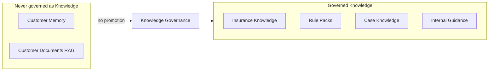

# LIFEGUARD Core — Knowledge Governance

Design-only framework for **creating, reviewing, approving, deploying, deprecating, and auditing** shared knowledge artifacts — distinct from per-customer **Customer Memory**.

**Not in scope:** INSUX, INSUX2, insux-pro-ai, UI, server code, demo/mock/sample/fake knowledge seeds.

Related: [CASE_KNOWLEDGE_ENGINE.md](./CASE_KNOWLEDGE_ENGINE.md), [MEMORY_BUILDER.md](./MEMORY_BUILDER.md), `003_seed_rule_packs.sql`, [LIFEGUARD_REASONING_ENGINE.md](./LIFEGUARD_REASONING_ENGINE.md), [CONSENT_ARCHITECTURE.md](./CONSENT_ARCHITECTURE.md).

---

## 1. Purpose

| Objective | Description |
|-----------|-------------|
| **Quality** | Insurance-facing knowledge is accurate, sourced, and reviewed before use in production |
| **Trust** | Every artifact has a **trust tier**, source registry entry, and confidence bounds |
| **Lifecycle** | Clear states from draft → active → retired; no silent edits |
| **Traceability** | Answers record *which* knowledge domain, *version*, and *why* it appeared in the prompt |
| **Separation** | **Customer Memory never becomes Knowledge** — no promotion path without de-identification and governance (Case only) |

Governance applies to **shared** layers only. Customer Memory is governed by [CONSENT_ARCHITECTURE](./CONSENT_ARCHITECTURE.md) and RLS — not this document’s approval queue.



---

## 2. Knowledge domains

| Domain | Storage (current / future) | Identifiable? | Governance |
|--------|---------------------------|---------------|------------|
| **Insurance Knowledge** | `insurance_knowledge_entries` (future) + sourced excerpts | No customer | Full lifecycle |
| **Case Knowledge** | `case_knowledge_items`, `case_extraction_jobs` (`006`) | **No** — anonymized only | Full + de-id review |
| **Rule Packs** | `rule_packs`, `rule_pack_versions` (`003`) | N/A | Full lifecycle |
| **Internal Guidance** | `internal_guidance_entries` (future) | N/A | Tier D review |
| **Customer Memory** | `customer_memory_facts` | **Yes** | **Out of scope** — consent + Memory Builder only |

**Absolute rule:** Customer Memory, profile rows, and customer document chunks are **not** Knowledge domains and **cannot** enter Insurance/Case/Guidance stores without a separate de-identified extraction pipeline ([CASE_KNOWLEDGE_ENGINE](./CASE_KNOWLEDGE_ENGINE.md)).

---

## 3. Source registry

Canonical registry: `knowledge_sources` (future table). Every governed artifact links `source_id`.

| `source_kind` | Korean label | Typical trust tier | Used by |
|---------------|--------------|-------------------|---------|
| `policy_terms` | 보험약관 | A | Insurance Knowledge, Rule Packs |
| `product_disclosure` | 상품설명서 | B | Insurance Knowledge |
| `regulatory_filing` | 공시자료 | B | Insurance Knowledge |
| `supervisory_rule` | 감독규정 | A | Insurance Knowledge, Rule Packs |
| `statute` | 법규 | A | Insurance Knowledge |
| `case_knowledge` | 사례지식 (익명) | C | `case_knowledge_items` only |
| `internal_ops_guide` | 내부운영가이드 | D | Internal Guidance |

| Registry field | Purpose |
|----------------|---------|
| `id` | UUID |
| `source_kind` | Enum above |
| `publisher` | Insurer / regulator / LIFEGUARD internal |
| `external_ref` | URL or document control number (not customer doc) |
| `locale` | `ko-KR` |
| `captured_at` | When source was registered |
| `trust_tier` | A–D (default by kind, overridable with approval) |

Customer-uploaded `customer_documents` are **not** registry sources for shared Knowledge — they feed **Customer Documents RAG** only.

---

## 4. Trust levels

| Tier | Sources | Use in answers |
|------|---------|----------------|
| **A** | 공식 약관, 감독규정, 법령 | Primary normative reference; may constrain rule pack wording |
| **B** | 보험사 공시, 상품설명서 | Supporting insurance knowledge; cite source registry |
| **C** | 익명화 사례지식 (Case Knowledge) | **Supplementary only** — “유사 익명 사례” |
| **D** | 내부 가이드 (tone, ops, escalation) | Internal Guidance — never overrides Tier A/B for legal facts |

Retrieval ranking: **A/B Rule Packs + customer evidence** &gt; **A/B Insurance Knowledge excerpts** &gt; **C Case** &gt; **D Guidance**.

LLM must not treat Tier C/D as law or customer-specific fact.

---

## 5. Lifecycle states

Applies to Insurance Knowledge, Case Knowledge, Rule Pack versions, Internal Guidance.

| State | Meaning | Retrievable? |
|-------|---------|--------------|
| `draft` | Authoring; not in production prompts | No |
| `review` | Awaiting compliance/legal/ops review | No |
| `active` | Approved and effective | Yes |
| `deprecated` | Superseded soon; still readable for audit | Yes with warning flag in trace |
| `retired` | Removed from retrieval | **No** |

**Rule Packs mapping:** `rule_pack_versions.status = active` ↔ governance `active`; `retired` ↔ `retired`.

---

## 6. Approval workflow

| Step | Actor | Actions |
|------|-------|---------|
| **1 작성 (draft)** | Knowledge author (admin role) | Create artifact + link `source_id`(s); set proposed `trust_tier` |
| **2 검토 (review)** | Compliance / legal reviewer | De-id checklist (Case); source verification (Insurance); safety wording (Rule Packs) |
| **3 승인 (active)** | Approver (separate role if policy requires) | Sign-off record in `knowledge_approvals` |
| **4 배포 (active)** | System | `effective_from = now()`; index for retrieval; rule pack `is_active = true` |
| **5 폐기 (deprecated → retired)** | Approver | Set `effective_to`; `replaced_by` → new version id; retire old |

Case Knowledge **requires** step 2 de-identification scan pass ([CASE_KNOWLEDGE_ENGINE](./CASE_KNOWLEDGE_ENGINE.md) §3).

Rejection returns artifact to `draft` with review notes — no partial publish.

---

## 7. Versioning

| Field | Applies to |
|-------|------------|
| `knowledge_version` | Semantic string e.g. `2026.03.1` (all domains) |
| `effective_from` | Timestamptz when `active` |
| `effective_to` | Set on deprecate/retire |
| `replaced_by` | UUID of successor row |

**Rule Packs:** `rule_pack_versions.version` + `replaced_by` in metadata or new version row per slug.

**Immutability:** `active` content is not edited in place — new version row + deprecate prior.

**Customer Memory** uses `customer_profiles.memory_version` — unrelated to `knowledge_version`.

---

## 8. Retrieval rules (answer-time precedence)

Enforced in [LIFEGUARD_REASONING_ENGINE](./LIFEGUARD_REASONING_ENGINE.md) and [CONSULTATION_ORCHESTRATOR](./CONSULTATION_ORCHESTRATOR.md).

| Priority | Layer | Condition |
|----------|-------|-----------|
| 1 | **Customer Memory** | Consent + active facts |
| 2 | **Customer Documents (RAG)** | `document_analysis` + `ready` chunks |
| 3 | **Rule Packs** | `active` versions only; slug selected by category |
| 4 | **Insurance Knowledge** | `active`, Tier A/B, relevant to question |
| 5 | **Case Knowledge** | `published`/`active`, Tier C, optional |
| 6 | **Internal Guidance** | Tier D — tone/escalation templates only |

| Situation | Rule |
|-----------|------|
| Customer fact conflicts with Case | **Customer wins** |
| Rule pack label vs Case narrative | **Rule pack label wins** for enum; Case is narrative hint only |
| Insurance Knowledge vs customer doc | **Customer doc wins** on customer-specific facts |
| Insufficient customer data | **자료 부족** — do not substitute Tier C/D as fact |

Knowledge layers are **never** primary for individual payout/disclosure/coverage conclusions.

---

## 9. Audit

### 9.1 Per-answer trace (existing + extension)

`consultation_traces.retrieval_scores` extended:

```json
{
  "knowledge_used": [
    {
      "domain": "rule_packs",
      "artifact_id": "uuid",
      "knowledge_version": "1.0.0",
      "trust_tier": "A",
      "reason": "category=claim → claim_possibility_basic"
    },
    {
      "domain": "case_knowledge",
      "artifact_id": "uuid",
      "knowledge_version": "2026.01.2",
      "trust_tier": "C",
      "reason": "optional_similar_pattern"
    }
  ],
  "customer_memory_version": 4,
  "chunk_ids": ["..."]
}
```

| Audit question | Field |
|----------------|-------|
| What knowledge was used? | `knowledge_used[].domain` + `artifact_id` |
| Which version? | `knowledge_version` |
| Why? | `reason` (machine-readable code) |

### 9.2 Governance audit tables (future)

| Table | Purpose |
|-------|---------|
| `knowledge_approvals` | who approved, when, checklist version |
| `knowledge_change_log` | draft → review → active transitions |
| `knowledge_retrieval_log` | aggregate counts per artifact (no PII) |

Admin read-only; customers cannot see governance tables.

---

## 10. Prohibitions

| # | Prohibition |
|---|-------------|
| 1 | Promoting `customer_memory_facts` or chat text into Insurance/Case/Guidance without Case pipeline + governance |
| 2 | Using customer documents as Tier A/B registry sources for shared Knowledge |
| 3 | Processing without applicable consent (customer layers) or without authorisation (shared layers) |
| 4 | Retrieving `draft`, `review`, or `retired` artifacts in production |
| 5 | demo/mock/sample/fake knowledge in repo or production DB |
| 6 | Mixing INSUX / insux-pro-ai global KB into LIFEGUARD governed stores |
| 7 | Tier D Internal Guidance presented as law or insurer commitment |
| 8 | Tier C Case presented as “your situation” to the current customer |
| 9 | Silent in-place edit of `active` artifacts |
| 10 | Cross-customer model training from governed knowledge without separate legal basis |

---

## 11. Domain-specific governance notes

### Rule Packs (`003`)

- Seed packs start `active` only in **dedicated** LIFEGUARD Supabase project — not copied from INSUX.
- Changes via `POST /api/admin/rule-packs/:id/versions` → governance workflow before `active`.

### Case Knowledge

- Mandatory de-id + Tier C cap; see [CASE_KNOWLEDGE_ENGINE](./CASE_KNOWLEDGE_ENGINE.md).

### Insurance Knowledge (future)

- Chunked excerpts with `source_id`, `trust_tier`, effective dates — not full unlicensed republication of third-party PDFs in shared store.

### Internal Guidance (future)

- Tone, escalation scripts, Communication Engine supplements — Tier D only.

---

## 12. Test scenarios

| # | Test | Expected |
|---|------|----------|
| G1 | Promote memory fact to `insurance_knowledge_entries` without pipeline | Blocked by policy / no API |
| G2 | Retrieve `retired` rule_pack_version in orchestrator | Not loaded; trace empty for that slug |
| G3 | Case in `draft` | `match_case_knowledge` returns zero |
| G4 | Answer trace | `knowledge_used` includes version + reason |
| G5 | Customer doc vs Insurance Knowledge conflict | Plan prefers customer doc (Reasoning) |
| G6 | Repo scan | No `demo/`, `mock/`, `sample/` knowledge seeds |
| G7 | INSUX import script | Not present in lifeguard-core |
| G8 | Tier C only, no customer memory | Answer must state 자료 부족 for individual claim |

---

## 13. Implementation map (future migrations)

| Artifact | Suggested migration |
|----------|---------------------|
| `knowledge_sources` | `006_knowledge_sources.sql` |
| `insurance_knowledge_entries` | `007_insurance_knowledge.sql` |
| `knowledge_approvals`, `knowledge_change_log` | `008_knowledge_governance_audit.sql` |
| Trace extension | Application-level JSON in `consultation_traces` (no customer PII) |

---

## 14. Deliberate exclusions

- Customer Memory governance (consent / RLS / Memory Builder).
- UI for reviewers.
- INSUX knowledge import tools.

---

*Draft v0.1 — LIFEGUARD Core Knowledge Governance.*
