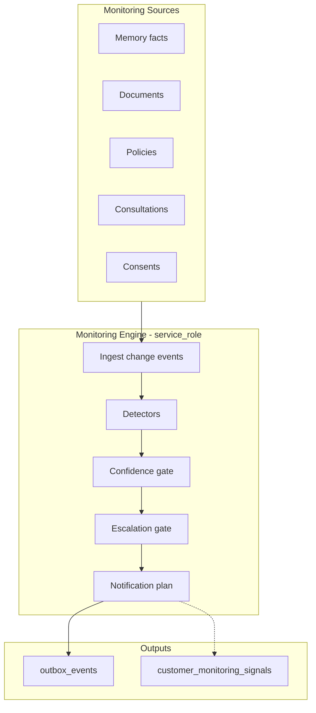

# LIFEGUARD Core — Monitoring Engine

Design-only **proactive monitoring**: detect customer state changes, risks, opportunities, and required actions **without waiting for a chat question**.

Runs on **real** `customer_id` data only. No inference to fill gaps; no alert if evidence is insufficient.

**Not in scope:** INSUX, INSUX2, insux-pro-ai, UI, server code, demo/mock/sample/fake monitoring fixtures.

Related: [MEMORY_BUILDER.md](./MEMORY_BUILDER.md), [DOCUMENT_INGEST.md](./DOCUMENT_INGEST.md), [CONSENT_ARCHITECTURE.md](./CONSENT_ARCHITECTURE.md), [LIFEGUARD_REASONING_ENGINE.md](./LIFEGUARD_REASONING_ENGINE.md), [CUSTOMER_STATE_ENGINE.md](./CUSTOMER_STATE_ENGINE.md), [NOTIFICATION_SERVICE.md](./NOTIFICATION_SERVICE.md), `004_customer_consents.sql`, `007_customer_state_snapshots.sql`, `008_monitoring_signals.sql`, `009_notification_service.sql`.

---

## 1. Purpose

| Objective | Description |
|------|-------------|
| **Early signal** | Surface renewal risk, premium burden, coverage gaps, claim windows, disclosure flags when **grounded data** exists |
| **Customer protection** | Calm, actionable nudges — not fear-based marketing |
| **Designer leverage** | Route high-stakes cases to agents via outbox, not raw memory dumps |
| **Consent-bound** | No detection on data classes without active consent |
| **No hallucinated monitors** | If memory/docs/policies insufficient → **no** monitoring record for that detection type |
| **Async** | Scheduler / event-driven workers (`service_role`); not in chat request path |

Monitoring Engine **does not** replace Consultation Orchestrator. It **feeds** `outbox_events`; customer delivery is via [NOTIFICATION_SERVICE.md](./NOTIFICATION_SERVICE.md) (`outbox-worker` → `notification_events`).



---

## 2. Monitoring sources

Only fields present in DB (or structured extract) may trigger detectors.

| Source | Table(s) | Consent required | What changes matter |
|--------|----------|------------------|---------------------|
| **Memory** | `customer_memory_facts` | Per fact `consent_type` in metadata | New/superseded facts: renewal cluster, premium burden stated, family, disclosure flags |
| **Documents** | `customer_documents`, `customer_document_chunks` | `document_storage`, `document_analysis` | New `ready` doc; type classification; claim-related uploads |
| **Policies** | `profile_insurance_policies` | `insurance_data_processing` | Add/update/delete active policy; `coverage_summary.renewal` |
| **Consultations** | `consultations`, `consultation_messages` | `ai_consultation`, `memory_retention` | Archived thread; escalation triggers; cancellation intent patterns (already in memory extract) |
| **Consents** | `customer_consents` | — | Revoke, upcoming version expiry, missing required consent for enabled feature |
| **Future claims** | TBD external/imports | TBD | Paid/denied claim events — **not** v1 |

**Excluded:** INSUX global tables, cross-customer aggregates, LLM-only “predictions” without source rows.

---

## 3. Detection types

Each type maps to a `signal_type` enum and optional rule-pack alignment. **Create signal only if detector conditions are satisfied with explicit evidence.**

| `signal_type` | Korean label | Typical evidence (examples) |
|---------------|--------------|----------------------------|
| `renewal_risk` | 갱신 위험 | ≥3 policies with `coverage_summary.renewal = true` (memory fact `risk.rebalancing.renewal_cluster` or policy rows) |
| `premium_burden` | 보험료 부담 | Memory `preference.premium.burden_stated` OR structured finance field (future) |
| `coverage_gap` | 보장 공백 | Policies present + memory/orchestrator prior `coverage_gap` label **not** used — detector uses policy axes only, labels “검토 필요” |
| `claim_opportunity` | 청구 기회 | New `medical_receipt` / `diagnosis_certificate` doc `ready` + active indemnity policy |
| `disclosure_risk` | 고지 위험 | Health memory: medication / hospitalization / surgery flags — **not** legal violation |
| `family_change` | 가족 변화 | Profile/memory fact `family.*` changed since last scan |
| `agent_escalation_needed` | 설계사 연결 필요 | Consultation escalation or memory `risk.cancellation.intent_stated` |
| `consent_expiry` | 동의 만료/재동의 | New `consent_version` published AND customer on old version; or required consent revoked |

**No signal** when evidence list is empty for that type.

---

## 4. Detection pipeline

| Phase | Action |
|-------|--------|
| **P0 — Trigger** | Cron (daily), or events: `memory.rebuild.completed`, `document.ingest.completed`, `consent.revoked`, policy CRUD |
| **P1 — Scope** | One `customer_id` per job; load active consents snapshot |
| **P2 — Source snapshot** | Read memory (active), policies (active), documents (`ready`), recent consultations (archived, 90d) |
| **P3 — Run detectors** | Each detector returns `{ signal_type, evidence_refs[], proposed_confidence }` or null |
| **P4 — Confidence gate** | Apply §5; drop below threshold |
| **P5 — Escalation gate** | Apply §6; set `escalation_priority` |
| **P6 — Deduplicate** | Same `signal_type` + same evidence hash within cooldown (e.g. 7d) → skip |
| **P7 — Notification plan** | §7; respect `notification_delivery` / `marketing_optional` |
| **P8 — Outbox** | §8 INSERT `outbox_events` |
| **P9 — Audit** | §9 persist signal row + trace |

```text
FUNCTION runMonitoringForCustomer(customerId, trigger):
  consents = loadActiveConsents(customerId)
  snapshot = buildSourceSnapshot(customerId, consents)
  signals = []

  FOR detector IN REGISTERED_DETECTORS:
    IF NOT detector.requiredConsentsGranted(consents): CONTINUE
    result = detector.evaluate(customerId, snapshot)
    IF result IS NULL: CONTINUE
    IF result.evidence_refs IS EMPTY: CONTINUE
    signals.append(result)

  FOR s IN signals:
    s.confidence = computeConfidence(s)
    IF s.confidence < MIN_PUBLISH_CONFIDENCE: CONTINUE
    s.escalation = applyEscalationRules(s)
    IF isDuplicate(customerId, s): CONTINUE
    plan = planNotification(s, consents)
    publishOutbox(customerId, s, plan)
    auditSignal(customerId, s, trigger)
```

---

## 5. Confidence rules

Confidence = **evidence strength**, not propensity scoring.

| Rule | Effect |
|------|--------|
| Each `evidence_ref` must point to `source_table` + `source_id` | Required |
| Single weak indicator (e.g. one keyword in old message) | cap ≤ 0.45 |
| Structured policy field + memory fact align | +0.15 bonus (cap 0.85) |
| OCR `low_ocr_confidence` on sole document | cap ≤ 0.4 |
| Missing policies when detection needs portfolio | **no signal** (not low confidence) |
| Revoked consent for evidence class | **no signal** |

| Band | Range | Action |
|------|-------|--------|
| Suppressed | &lt; 0.35 | Do not write outbox |
| Low | 0.35–0.55 | In-app feed only (future); no push |
| Medium | 0.55–0.75 | Optional notification if consented |
| High | 0.75–0.85 | Notification + optional agent queue hint |

Never use 0.95+ for underwriting/legal outcomes.

---

## 6. Escalation rules

| Condition | `escalation_priority` | Outbox |
|-----------|----------------------|--------|
| `agent_escalation_needed` or cancellation intent | `critical` | `agent.escalation.requested` |
| `disclosure_risk` + health facts | `high` | `monitoring.disclosure.review` + optional agent |
| `renewal_risk` / `premium_burden` | `medium` | `monitoring.rebalancing.review` |
| `claim_opportunity` | `medium` | `monitoring.claim.documents_ready` |
| `consent_expiry` blocking AI | `high` | `consent.reconsent.required` |
| `coverage_gap` | `low` | `monitoring.coverage.review` — no product names |

Escalation does **not** auto-assign agent without `agent_assignments` workflow. No “해지” or “가입” in payload text.

---

## 7. Notification planning

| Step | Rule |
|------|------|
| Check | `lifeguard_has_consent(customer_id, 'notification_delivery')` |
| Marketing | Separate check for `marketing_optional` — monitoring defaults to **service** not marketing |
| Channel | `notification_preferences` + `009_notification_service.sql`; copy per [COMMUNICATION_ENGINE.md](./COMMUNICATION_ENGINE.md) |
| Cooldown | Max 1 monitoring notification per `signal_type` per 7 days; dedup on `notification_events.source_ref` |
| Quiet hours | `notification_preferences.quiet_hours_json` |
| Content | What was detected (plain), what customer can do, link to upload/profile — **no** fabricated amounts |

If notification consent false: still write **internal** outbox for agent/admin dashboards (service_role), do not push to customer.

---

## 8. Outbox event generation

| `event_type` | When | Payload keys (ids only, no PII blob) |
|--------------|------|--------------------------------------|
| `monitoring.signal.detected` | Any published signal | `customer_id`, `signal_type`, `confidence`, `evidence_refs[]`, `signal_id` |
| `monitoring.rebalancing.review` | renewal_risk / premium_burden | `customer_id`, `policy_ids[]`, `memory_fact_ids[]` |
| `monitoring.coverage.review` | coverage_gap | `customer_id`, `axes[]` |
| `monitoring.claim.documents_ready` | claim_opportunity | `customer_id`, `document_ids[]` |
| `monitoring.disclosure.review` | disclosure_risk | `customer_id`, `fact_ids[]` |
| `consent.reconsent.required` | consent_expiry | `customer_id`, `consent_types[]`, `target_version` |
| `agent.escalation.requested` | critical handoff | Same as orchestrator |

`status = pending` → outbox-worker → `notification_events` (see [NOTIFICATION_SERVICE.md](./NOTIFICATION_SERVICE.md), CONSENT_ARCHITECTURE §5.5).

Customer JWT cannot INSERT monitoring outbox rows (002 — server only).

---

## 9. Audit (DB — `008_monitoring_signals.sql`)

| Artifact | Purpose |
|----------|---------|
| **`customer_monitoring_signals`** | Published signal row: `id`, `customer_id`, `signal_type`, `severity`, `status`, `title`, `summary`, `evidence_refs` (JSONB array of `{source_table, source_id}`), `confidence` (0–1), `source_state_snapshot_id` (optional FK → `customer_state_snapshots`), `detection_run_id`, `consent_snapshot`, `created_at`, `resolved_at`, `dismissed_at` |
| **`monitoring_detection_runs`** | Batch/event run: `run_type` (`scheduled` \| `event` \| `single_customer`), `status`, `started_at`, `finished_at`, `customer_count`, `signal_count`, `error_message`, `metadata_json` |
| **Views** | `lifeguard_open_customer_monitoring_signals` (customer open/notified); `lifeguard_agent_monitoring_signal_summary` (assigned customers, `critical`/`high` only) |
| **Consent snapshot** | `consent_snapshot` JSONB at detection time — same pattern as `consultation_traces` |
| **Outbox** | No `outbox_event_id` on signal row; worker links via `signal_id` in `outbox_events.payload` after §8 INSERT |
| **Admin** | RLS: SELECT + UPDATE on `customer_monitoring_signals`; SELECT on `monitoring_detection_runs` |
| **service_role** | INSERT signals + runs (RLS bypass per `002`); outbox INSERT after `notification_delivery` check |

**RLS (authenticated JWT):**

| Role | `customer_monitoring_signals` | Views |
|------|------------------------------|-------|
| Customer | SELECT own; UPDATE dismiss-only (`status` + `dismissed_at`); no INSERT | Open signals view |
| Agent | No direct table SELECT | `lifeguard_agent_monitoring_signal_summary` when assigned |
| Admin | SELECT, UPDATE | All applicable rows |

**`status` values:** `open`, `notified`, `resolved`, `dismissed`, `expired`.

Revoked consent for evidence class → set related open signals to `expired`; do not re-notify.

---

## 10. Test scenarios

Real DB fixtures per test customer — no repo-committed fake policies.

| # | Setup | Expected |
|---|--------|----------|
| M1 | 3 renewal policies, `insurance_data_processing` granted | `renewal_risk` signal; confidence ≥ 0.55; outbox emitted |
| M2 | No policies, coverage_gap detector | **No** signal (insufficient — not low confidence) |
| M3 | Health medication fact, no `sensitive_health_processing` | **No** disclosure_risk signal |
| M4 | `notification_delivery` revoked | Outbox may exist; worker skips customer push |
| M5 | Same renewal signal within 7d cooldown | Second run deduped — no duplicate outbox |
| M6 | Customer A detector job | Evidence refs only A rows |
| M7 | Document `ready` receipt + indemnity policy | `claim_opportunity` if both evidenced |
| M8 | Repo scan | No demo/mock/sample monitoring JSON |

---

## 11. Integration map

| Component | Role |
|-----------|------|
| Memory Builder | Emits rebuild events → P0 trigger |
| Document Ingest | `document.ingest.completed` → P0 |
| Consultation Orchestrator | Escalation events → optional P0 |
| Reasoning Engine | **Does not** run monitoring inline |
| Communication Engine | Notification copy only |
| Scheduler | `pg_cron` / queue: nightly `runMonitoringForCustomer` batch |

---

## 12. Deliberate exclusions

- INSUX renewal campaigns or demo “risk scores”.
- Predictive lapse models without policy rows.
- Monitoring based on other customers’ statistics.
- Alerts that assert payout, disclosure violation, or required cancellation.

---

*Draft v0.1 — LIFEGUARD Core Monitoring Engine.*
