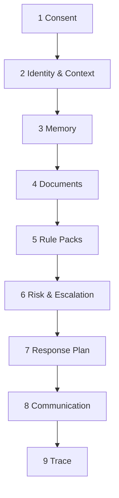

# LIFEGUARD Core — Reasoning Engine

Design-only **pre-answer judgment pipeline**: the ordered steps LIFEGUARD must complete before generating customer-facing text.

**Not in scope:** INSUX, INSUX2, insux-pro-ai, UI, server code, demo/mock/sample/fake customer narratives.

Related: [CONSULTATION_ORCHESTRATOR.md](./CONSULTATION_ORCHESTRATOR.md), [CONSENT_ARCHITECTURE.md](./CONSENT_ARCHITECTURE.md), [MEMORY_BUILDER.md](./MEMORY_BUILDER.md), [DOCUMENT_INGEST.md](./DOCUMENT_INGEST.md), [COMMUNICATION_ENGINE.md](./COMMUNICATION_ENGINE.md), `003_seed_rule_packs.sql`.

---

## 1. Purpose

| Goal | Description |
|------|-------------|
| **Ordered reasoning** | Fixed stage sequence so every answer follows the same safety and evidence checks |
| **No inference gap-filling** | Missing memory/docs/rules → stop at “자료 부족” path; do not invent coverage or outcomes |
| **Explicit uncertainty** | Confidence reflects *evidence coverage*, not model self-belief alone |
| **Human explanation last** | Structured reasoning → [Communication Engine](./COMMUNICATION_ENGINE.md) → Korean text |
| **Auditability** | Each stage output feeds `consultation_traces` and consent snapshot |

Reasoning Engine is the **logical spine** inside the Consultation Orchestrator — not a separate LLM “chain-of-thought” exposed to customers. Internal notes may be structured JSON; only Stage 8 produces user-visible prose.

**Premise:** All inputs are **real** rows for the authenticated `customer_id` only.

---

## 2. Judgment stages

### Stage 1 — Consent Validation

| Check | Action if fail |
|-------|----------------|
| `ai_consultation` | Abort AI path; return consent-required message (no LLM) |
| `memory_retention` | Do not load memory facts for prompt |
| `document_analysis` | Skip Stage 4 RAG (empty chunk set) |
| Feature-specific | `lifeguard_required_consents_for_feature('ai_consultation')` |

Record `consent_snapshot[]` for Stage 9.

**No consent → no reasoning on that data class** (not: guess from general knowledge).

---

### Stage 2 — Identity & Customer Context

| Load | Use |
|------|-----|
| `customer_profiles` | Display name, status, `memory_version` |
| `profile_health` | Only if `sensitive_health_processing` — else mark health context “unavailable” |
| `profile_insurance_policies` | Active policies if `insurance_data_processing` |

Output: `context_summary` (structured, non-PII excess). **Never** accept `customer_id` from request body.

---

### Stage 3 — Memory Review

| Step | Rule |
|------|------|
| Load | Active `customer_memory_facts` (`superseded_at` null, consent valid) |
| Select | Tier: critical/high always; medium if topic match; low only if token budget |
| Conflict | Newer `effective_at` wins; flag low confidence in plan |
| Empty | Set `memory_sufficiency = insufficient` — do not fabricate facts |

Output: `used_memory_facts[]`, `memory_sufficiency`.

---

### Stage 4 — Document Review

| Step | Rule |
|------|------|
| Gate | `document_analysis` + documents `ingest_status = ready` |
| Embed | Query embedding from customer question |
| Retrieve | `match_customer_document_chunks(p_customer_id, …)` — **mandatory** customer id |
| Filter | `optional_document_ids` if client supplied |
| OCR quality | Low `metadata.ocr_confidence` → downgrade evidence strength |
| Empty | `document_sufficiency = insufficient` |

Output: `used_document_chunks[]`, `document_sufficiency`, citation refs `[D1]…`.

**Cross-tenant check:** retrieval must never include another customer’s `document_id`.

---

### Stage 5 — Rule Pack Selection

| Input | Logic |
|-------|--------|
| Question text + `requested_category` hint | Keyword classifier (v1) per [CONSULTATION_ORCHESTRATOR](./CONSULTATION_ORCHESTRATOR.md) §4 |
| Categories | disclosure, claim, coverage_gap, duplicate_coverage, rebalancing, general, agent_required |
| Load | Active `rule_pack_versions` from `003` seeds |
| Always evaluate | `agent_escalation_basic` |

Output: `used_rule_packs[]`, `primary_rule_pack`, `rule_labels` (enum only — not legal conclusions).

---

### Stage 6 — Risk & Escalation Review

| Check | Source |
|-------|--------|
| `agent_escalation_basic` triggers | cancellation, disclosure final, payment final, tax/legal, high-value change |
| User phrasing | Pattern pre-scan (orchestrator) |
| `hard_block_ai` | If true → skip LLM; template + outbox only |

Output: `escalation_required`, `escalation_reason[]`, `emit_outbox` boolean.

---

### Stage 7 — Response Planning

Synthesize Stages 3–6 into an **internal plan** (JSON), not customer text.

| Field | Content |
|-------|---------|
| `category` | Final question category |
| `primary_label` | From rule pack (e.g. 청구 가능성 중간) |
| `evidence_gaps` | List missing docs/memory fields |
| `confidence_inputs` | memory/doc sufficiency, OCR, retrieval scores |
| `recommended_next_action` | Non-coercive steps |
| `allow_llm` | false if escalation hard-block or consent fail |
| `communication_profile` | Category tone from Communication Engine §6 |

**If both memory and document sufficiency insufficient** → plan uses **자료 부족** path; LLM may only explain gaps, not infer coverage.

---

### Stage 8 — Communication Engine Translation

| Input | Output |
|-------|--------|
| Response plan + sources | Korean `answer` per [COMMUNICATION_ENGINE.md](./COMMUNICATION_ENGINE.md) |
| Forbidden phrase guard | Output Guard + CE §3 |

LLM (when `allow_llm`) receives plan + evidence blocks — instructed **not** to override plan labels with certainties.

---

### Stage 9 — Trace & Audit

| Persist | Contents |
|---------|----------|
| `consultation_messages` | user + assistant rows |
| `consultation_traces` | `memory_version`, `chunk_ids`, `rule_pack_version_id`, `retrieval_scores`, `prompt_hash`, `consent_snapshot` |
| `outbox_events` | If `agent.escalation.requested` |

Customer cannot SELECT traces (002 RLS).

---

## 3. Question-type reasoning paths

Abbreviated stage focus per category (all stages still run; emphasis differs).

| Type | Stage 3–4 focus | Stage 5 packs | Stage 6 |
|------|-----------------|---------------|---------|
| **청구 (claim)** | Receipts, diagnosis, terms chunks | `claim_possibility_basic` | Payment-final phrases → escalate |
| **고지 (disclosure)** | Health memory + medical docs | `disclosure_check_basic` | Disclosure-final → escalate |
| **보장분석 (coverage_gap)** | Policies memory + policy/terms docs | `coverage_gap_basic` | No “must buy” |
| **중복보장** | Policy list memory | `duplicate_coverage_basic` | No cancel push |
| **리밸런싱** | Premium/family memory, renewal signals | `rebalancing_basic` | No product recommend |
| **문서질문** | Stage 4 primary; optional narrow `document_ids` | Minimal / general | Low OCR → 자료 부족 tone |
| **일반질문** | Light memory; docs if relevant | General / safety only | Standard escalation scan |

**문서질문:** If user asks “what does my uploaded document say?” — Stage 4 must have chunks; else stop at 자료 부족.

---

## 4. Insufficient data handling

| Signal | Reasoning behavior |
|--------|-------------------|
| No memory facts for topic | `memory_sufficiency = insufficient` |
| No chunks / not `ready` | `document_sufficiency = insufficient` |
| Low OCR confidence | Answer may cite doc but label interpretation weak |
| Revoked consent | Treat as no data for that class |
| Plan rule | **Do not** select high/medium claim labels without evidence |

**Customer message pattern:** Communication Engine Template B (자료 부족 + what to upload).

**Confidence cap:** When insufficient → `confidence` ≤ 0.4 (see §6).

---

## 5. Designer (agent) connection handling

| Condition | Reasoning path |
|-----------|----------------|
| `escalation_required = true` | Stage 7: `allow_llm = false` or restricted template |
| Plan | Short summary of *what was checked* + why human needed |
| Outbox | `agent.escalation.requested` with `trigger_codes` |
| Tone | Communication Engine §6 “설계사 연결” |
| Without `agent_sharing` | Do not expose memory contents to agent APIs — handoff metadata only |

AI must **not** promise designer callback time or outcome.

---

## 6. Confidence calculation philosophy

`confidence` is a **heuristic evidence score** (0–1), not LLM logprob.

| Factor | Weight (guideline) |
|--------|-------------------|
| Memory sufficiency | +0.2 if relevant facts present |
| Document sufficiency + retrieval score | +0.3 max |
| Rule label clarity | +0.1 if single dominant label |
| OCR / ingest quality | −0.2 if low |
| Both insufficient | cap at 0.35 |
| Escalation hard-block | N/A (template response; confidence high only for “handoff needed”) |

**Never** set confidence &gt; 0.85 on payout/disclosure outcomes. Communication Engine uses confidence to force non-definitive wording.

---

## 7. Forbidden behaviors

| # | Forbidden |
|---|-----------|
| 1 | Skipping Stage 1 consent |
| 2 | Reasoning about another `customer_id` |
| 3 | Inventing policies, diagnoses, or amounts |
| 4 | Proceeding to certainty labels with empty memory and empty chunks |
| 5 | Bypassing `agent_escalation_basic` |
| 6 | Exposing raw `fact_key`, chunk UUIDs, or prompt to customer |
| 7 | Using INSUX/global insurance corpora |
| 8 | Training or tuning on customer data without explicit legal basis |
| 9 | Overriding rule-pack “자료 부족” with optimistic LLM prose |
| 10 | Including demo/mock/sample narratives in reasoning fixtures |

---

## 8. Audit trail

| Stage | Trace field |
|-------|-------------|
| 1 | `consent_snapshot` |
| 3 | `memory_version`, fact ids in `retrieval_scores` |
| 4 | `chunk_ids`, similarity scores |
| 5 | `rule_pack_version_id`, `category` |
| 6 | `escalation_reason` in message `sources_json` |
| 7–8 | `prompt_hash`, `prompt_token_estimate` |
| 9 | Immutable message ids for replay |

Admin reads traces; customers see only assistant `content` + safe `sources_json`.

Future: `reasoning_plan_json` column on traces (structured Stage 7 output).

---

## 9. Test scenarios

CI uses real DB fixtures per customer — no embedded fake policies in docs.

| # | Scenario | Pass criteria |
|---|----------|---------------|
| R1 | Missing `ai_consultation` | Stage 1 stops; no LLM; no memory in prompt |
| R2 | Claim question, zero chunks | Plan: 자료 부족; no “지급 확정” |
| R3 | Customer A question | Stage 4 chunks all `customer_id = A` |
| R4 | Cancellation definitive phrasing | Stage 6 escalation; outbox event |
| R5 | Low OCR document only | Confidence ≤ 0.5; weak wording in answer |
| R6 | Revoked `document_analysis` | Stage 4 empty; no document-based labels |
| R7 | Trace row exists | `consent_snapshot` populated |
| R8 | Repo scan | No demo/mock/sample reasoning JSON in tree |

---

## 10. Stage summary table

| Stage | Name | Primary output |
|-------|------|----------------|
| 1 | Consent Validation | `consent_ok`, `consent_snapshot` |
| 2 | Identity & Context | `context_summary` |
| 3 | Memory Review | `used_memory_facts`, sufficiency |
| 4 | Document Review | `used_document_chunks`, sufficiency |
| 5 | Rule Pack Selection | `used_rule_packs`, `category` |
| 6 | Risk & Escalation | `escalation_required`, triggers |
| 7 | Response Planning | `reasoning_plan` (internal) |
| 8 | Communication Engine | `answer` (customer-visible) |
| 9 | Trace & Audit | DB persist |

---

## 11. Deliberate exclusions

- Chain-of-thought shown to end users.
- INSUX2 / insux-pro-ai prompt or engine reuse.
- Sample customer “reasoning walkthrough” PDFs in repository.

---

*Draft v0.1 — LIFEGUARD Core Reasoning Engine.*
