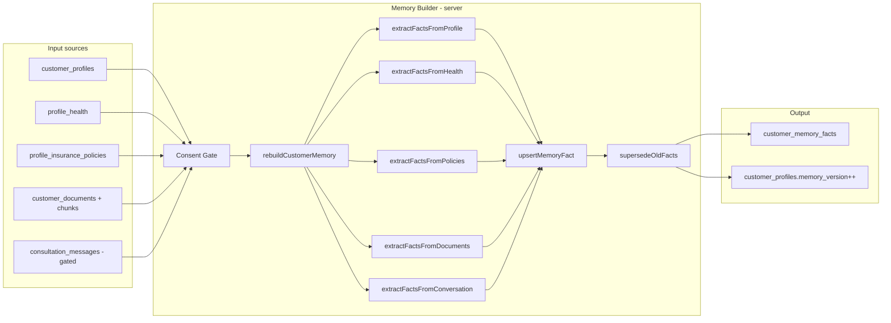

# LIFEGUARD Core — Memory Builder

Design-only specification for turning **real** customer inputs into `customer_memory_facts` for the consultation orchestrator.

**Not in scope:** INSUX, INSUX2, insux-pro-ai, UI, server implementation, demo/mock/sample customers, fake insurance analysis, or placeholder facts.

Related: [CONSENT_ARCHITECTURE.md](./CONSENT_ARCHITECTURE.md), [DATA_MODEL.md](./DATA_MODEL.md), [AI_PIPELINE.md](./AI_PIPELINE.md), [CONSULTATION_ORCHESTRATOR.md](./CONSULTATION_ORCHESTRATOR.md), `001_initial_schema.sql`, `002_rls_service_policies.sql`, `004_customer_consents.sql`.

---

## 1. Purpose

| Goal | Description |
|------|-------------|
| **Normalize inputs** | Map `customer_profiles`, `profile_health`, `profile_insurance_policies`, and **confirmed** extractions from documents/conversations into stable `fact_key` rows |
| **Version memory** | Bump `customer_profiles.memory_version` on each successful rebuild so orchestrator traces stay auditable |
| **Supersede stale facts** | Set `superseded_at` on replaced rows; never delete history silently |
| **Minimize sensitive data** | Store short summaries only; forbid national IDs, accounts, phones in facts |
| **Evidence-only** | Create a fact **only** when a source row/field or extracted document field exists and passes validation — otherwise **no fact** (orchestrator answers **자료 부족**) |
| **No inference** | Do not guess diagnoses, premiums, or coverage from missing fields |
| **Consent gate** | Create a fact **only** when the customer has granted the **legally required consent** for that source and scope — see §2 |

Memory Builder runs with **`service_role`** (RLS bypass). Customers read facts via RLS; they do not write facts directly from chat text in v1. **Consent Gate required before memory build** — every extractor checks consent before reading source data or calling `upsertMemoryFact`.



---

## 2. Consent Gate

Memory Builder treats **consent as a hard precondition**, not a UI checkbox. Facts are derived only from data the customer is legally permitted to use for the given purpose.

### 2.1 Principles

| Principle | Rule |
|-----------|------|
| **Check before every source** | No extractor runs on a source until required consent(s) are active |
| **No consent → no fact** | Missing consent means **zero facts** from that source — not placeholders, not inferred substitutes |
| **Revocation → deactivate** | On withdraw, facts in that consent scope are `superseded_at` and/or `metadata_json.revoked_at` set; excluded from new prompts and RAG |
| **Sensitive health** | Medication, disease history, hospitalization, surgery, diagnosis-related extracts require **`sensitive_health_processing`** |
| **Document analysis** | Structured extract from uploads requires **`document_analysis`**; chunk RAG in orchestrator uses the same scope |
| **AI memory use** | Facts used in AI consultation require **`ai_consultation`** and **`memory_retention`** (상담 기록·기억 보관) |
| **Agent sharing** | Agents never receive full `customer_memory_facts`; **`agent_sharing`** enables **summary card only** (non-sensitive, aggregated) |
| **No global training** | Customer data must not be written to cross-tenant model training corpora |

Consent Gate reads **`customer_consents`** (`004_customer_consents.sql`) via **`lifeguard_has_consent(customer_id, consent_type)`** on the server (`service_role` or trusted API). Client body consent flags are **not** trusted. Re-consent uses a new `consent_version` per unique constraint.

### 2.2 Consent types (catalog)

| `consent_type` | Purpose (Korean label) |
|----------------|-------------------------|
| `privacy_collection` | 개인정보 수집·이용 |
| `sensitive_health_processing` | 민감정보 처리 (건강, 병력, 복용약, 수술·입원) |
| `insurance_data_processing` | 보험정보 처리 |
| `document_storage` | 문서 보관 |
| `document_analysis` | 문서 분석 (OCR/구조 추출/RAG) |
| `ai_consultation` | AI 상담 이용 |
| `memory_retention` | AI 상담 기억·보관 |
| `agent_sharing` | 담당 설계사 요약 공유 |

### 2.3 Input source → required consent(s)

| Input source | Required consent(s) | Notes |
|--------------|---------------------|--------|
| `customer_profiles` | `privacy_collection` | Demographics, job, age band facts |
| `profile_health` | `sensitive_health_processing` | All health / disclosure-review facts |
| `profile_insurance_policies` | `insurance_data_processing` | Policy summary facts |
| `consultation_messages` | `ai_consultation`, `memory_retention` | Preference / risk extract from user messages only |
| `customer_documents` | `document_storage` | Metadata-only facts (e.g. “진단서 업로드됨”) if ever stored |
| `customer_document_chunks` | `document_storage`, `document_analysis` | No fact from raw chunk text; extract slots need analysis consent |
| Document structured extract → facts | `document_analysis` | Same as chunks; ingest must not extract without consent |
| `agent_assignments` / agent summary card | `agent_sharing` | Summary fields only; **no** `customer_memory_facts` dump |

Orchestrator (separate doc) must also check `ai_consultation` / `document_analysis` before loading memory or RAG — Memory Builder and orchestrator share the same consent matrix.

### 2.4 `metadata_json` consent fields (every fact)

Each inserted fact **must** include:

```json
{
  "consent_type": "sensitive_health_processing",
  "consent_version": "2026-01",
  "consent_granted_at": "2026-05-01T09:00:00Z",
  "consent_scope": "profile_health",
  "consent_required": true
}
```

| Field | Required | Description |
|-------|----------|-------------|
| `consent_type` | yes | Primary consent that authorizes this fact |
| `consent_version` | yes | Legal text version id at grant time |
| `consent_granted_at` | yes | Timestamp from `customer_consents` |
| `consent_scope` | yes | Source scope: table name or `document_analysis` |
| `consent_required` | yes | Always `true` for customer-derived facts |

`upsertMemoryFact` rejects facts missing these keys when `consent_required` applies.

### 2.5 Consent withdrawal

| Step | Action |
|------|--------|
| 1 | Customer revokes consent in legal UI → `customer_consents.revoked_at` set |
| 2 | `revokeMemoryFactsByConsent(customerId, consentType)` runs (sync or queued) |
| 3 | Matching active facts: set `superseded_at = now()`, `metadata_json.revoked_at = now()` |
| 4 | Orchestrator snapshot excludes superseded / revoked facts |
| 5 | `match_customer_document_chunks` excludes documents without `document_analysis` consent |
| 6 | `consultation_traces` may retain historical `memory_version` / chunk ids for audit; **new** answers must not load revoked facts |
| 7 | Data subject request (delete/anonymize) links to erasure job — out of builder scope but must not resurrect facts |

### 2.6 Prohibitions (consent-related)

- Creating memory from any source without passing `assertConsentBeforeFactCreation`.
- Storing medication or diagnosis under `identity.*` or non-health keys to bypass `sensitive_health_processing`.
- Copying document chunk body into `fact_value`.
- Exposing full memory to agent APIs without `agent_sharing` (and even then, summary-only).
- Using customer facts or documents for **global** or cross-customer model training.

### 2.7 Consent pseudocode

```text
FUNCTION hasConsent(customerId, consentType):
  -- Delegates to PostgreSQL (canonical types — see CONSENT_ARCHITECTURE.md §2)
  RETURN lifeguard_has_consent(customerId, mapLegacyConsentAlias(consentType))
  -- mapLegacyConsentAlias: personal_data -> privacy_collection, etc.


FUNCTION assertConsentBeforeFactCreation(customerId, sourceType):
  required = mapSourceTypeToConsents(sourceType)
  // e.g. sourceType 'profile_health' -> ['sensitive_health_processing']
  FOR ct IN required:
    IF NOT hasConsent(customerId, ct):
      RAISE ConsentRequired(ct, sourceType)
  RETURN required   // caller attaches to fact.metadata_json


FUNCTION mapSourceTypeToConsents(sourceType):
  SWITCH sourceType:
    CASE 'customer_profiles': RETURN ['privacy_collection']
    CASE 'profile_health': RETURN ['sensitive_health_processing']
    CASE 'profile_insurance_policies': RETURN ['insurance_data_processing']
    CASE 'consultation_messages': RETURN ['ai_consultation', 'memory_retention']
    CASE 'customer_documents': RETURN ['document_storage']
    CASE 'customer_document_chunks': RETURN ['document_storage', 'document_analysis']
    CASE 'document_extract': RETURN ['document_analysis']
    DEFAULT: RETURN []


FUNCTION revokeMemoryFactsByConsent(customerId, consentType):
  FOR row IN SELECT * FROM customer_memory_facts
             WHERE customer_id = customerId
               AND superseded_at IS NULL
               AND metadata_json->>'consent_type' = consentType:
    UPDATE customer_memory_facts
    SET superseded_at = now(),
        metadata_json = jsonb_set(metadata_json, '{revoked_at}', to_jsonb(now()))
    WHERE id = row.id

  incrementMemoryVersion(customerId)
  EMIT optional outbox 'memory.consent.revoked'
```

### 2.8 Agent summary (not Memory Builder output table)

With `agent_sharing` only, a separate **AgentSummaryBuilder** may emit a denormalized card (e.g. policy count, open consultation count, “건강 정보 등록됨” label). It must **not** read superseded facts or health/document tables blocked by RLS (002).

---

## 3. Input sources

| Source | When read | What may produce facts |
|--------|-----------|-------------------------|
| `customer_profiles` | Signup, profile PUT | identity, family (if fields present), preference (if explicit fields added later) |
| `profile_health` | Health PUT, rebuild | health, disclosure/claim **review flags** (not diagnoses invented) |
| `profile_insurance_policies` | Policy CRUD, rebuild, document extract | insurance, rebalancing **risk flags** |
| `customer_documents` | After `ingest_status = ready` | insurance, claim (only **extracted structured fields** with doc id) |
| `customer_document_chunks` | Document extract job | Same as documents — **never** copy full chunk text into a fact |
| `consultation_messages` | Consultation **closed** or explicit confirm (v1 conservative) | preference, risk, agent — **user role only**, pattern rules, no assistant hallucination |
| *Future* claim history | TBD | claim |
| *Future* notification / outbox | TBD | system, preference |
| *Future* rebalancing events | TBD | finance, risk |

**Excluded as fact sources (v1):** assistant message text, rule pack output, LLM guesses, empty strings, sentinel values (`unknown`, `null`, `-`).

---

## 4. Output table

### 4.1 `customer_memory_facts` (primary)

All active memory for prompts: `superseded_at IS NULL`, unique per `(customer_id, fact_key)`.

### 4.2 `customer_profiles.memory_version`

Integer incremented **once per successful rebuild** (atomic with fact commit). Orchestrator stores `memory_version` on `consultation_traces`.

---

## 5. Fact structure (logical model)

Logical fields used by Memory Builder. Map to physical columns in §5.1.

| Field | Type | Required | Description |
|-------|------|----------|-------------|
| `fact_key` | string | yes | Stable dot-notation key (e.g. `health.medication.summary`) |
| `fact_text` | string | yes | Short Korean summary for prompts (≤ 240 chars recommended) |
| `fact_type` | enum | yes | See §6 |
| `importance` | enum | yes | See §7 |
| `source_table` | string | yes | Origin table name |
| `source_id` | uuid | yes | Origin row id |
| `confidence` | 0–1 | yes | 1.0 for direct profile fields; lower only for document extract with OCR quality flag |
| `effective_from` | timestamptz | yes | When fact became true in source |
| `effective_to` | timestamptz | no | Optional end (usually use supersede instead) |
| `superseded_at` | timestamptz | no | Set when replaced |
| `metadata_json` | object | yes (customer facts) | **Consent block (§2.4)** + non-PII extras: `{ "field": "medication" }` |

### 5.1 Schema mapping (001 today → target)

Current `001_initial_schema.sql`:

| Logical | Physical column (001) | Notes |
|---------|----------------------|--------|
| `fact_text` | `fact_value` | Same semantics |
| `source_table` + `source_id` | `provenance_type` + `provenance_ref` | Map `provenance_type`: `profile` \| `document` \| `operator` \| `system`; store table name in `metadata_json.source_table` until migration adds column |
| `fact_type`, `importance` | `metadata_json` | Recommended: migration `004_memory_fact_metadata.sql` adds first-class columns |
| `effective_from` | `effective_at` | Rename in API docs only |
| `effective_to` | — | Use `superseded_at` instead in v1 |

**Rule:** Builder never inserts a fact without `source_table` + `source_id` resolvable to an existing row.

---

## 6. `fact_type` classification

| `fact_type` | Use for |
|-------------|---------|
| `identity` | Name, age band, job category from profile |
| `health` | Smoking, hospitalization, medication **summary** from `profile_health` |
| `insurance` | In-force product type, insurer label, coverage axis flags from policies/doc extract |
| `family` | Dependents / marital status when captured on profile |
| `finance` | Stated premium burden **only if** captured in structured field or confirmed user message |
| `claim` | Document-backed claim-related flags (e.g. receipt uploaded), not payout conclusions |
| `risk` | Rebalancing pressure, renewal cluster, escalation-related **signals** |
| `preference` | Customer-stated goals (burden, simplicity) from confirmed conversation patterns |
| `agent` | Handoff requested, designer contact preference |
| `system` | Builder-generated housekeeping (e.g. `memory.last_rebuild_at`) — no PII |

---

## 7. `importance` classification

| Level | Prompt priority | Typical facts |
|-------|-----------------|---------------|
| `critical` | Always include in snapshot | Active escalation signal, major disclosure flag from health |
| `high` | Include unless token trim | Medication summary, recent hospitalization, indemnity held |
| `medium` | Include when topic matches | Renewal-type policy count, family responsibility |
| `low` | Include only in full snapshot | Minor preferences, system timestamps |

Orchestrator may trim `low` first; `critical`/`high` never dropped.

---

## 8. Memory creation rules (examples)

**Global rules:**

1. If the source field is empty, `unknown`, or missing → **do not create** the fact.
2. If required consent is not granted → **do not create** the fact (Consent Gate).
3. No “자료 부족” row in `customer_memory_facts` — absence means absence.

| Condition (must be true in DB) | `fact_key` (example) | `fact_type` | `importance` | `fact_text` shape |
|--------------------------------|----------------------|-------------|--------------|-------------------|
| `profile_health.medication` non-empty + `sensitive_health_processing` consent | `health.medication.summary` | health | high | Verbatim **short** copy of field (truncate 120) |
| `profile_health.surgery_5y = yes` | `health.surgery.recent_flag` | health | high | Fixed label: `최근 5년 수술 이력 있음 (프로필)` |
| `profile_health.hospital_5y = yes` | `health.hospitalization.recent_flag` | health | high | Fixed label from profile source |
| Active policy with `policy_type` indemnity | `insurance.indemnity.held` | insurance | high | `실손/의료보장 계약 보유 (출처: policy {id})` |
| Count active policies where renewal signaled in `coverage_summary` | `risk.renewal_policy.count` | risk | medium | Only if count ≥ 3 **and** `coverage_summary.renewal = true` on each counted row |
| Profile field `dependents_count ≥ 1` (future column) | `family.dependents.present` | family | medium | From profile only |
| User message (confirmed pipeline) matches premium-stress pattern | `preference.premium.burden_stated` | preference | medium | Paraphrase ≤ 80 chars, `source_id` = message id |
| User message matches cancellation intent pattern | `risk.cancellation.intent_stated` | risk | critical | Triggers orchestrator escalation pack; not a legal conclusion |

**Forbidden:**

- Creating `health.diagnosis.cancer` without a structured source field or labeled document extract.
- Creating insurance facts when `profile_insurance_policies` has zero active rows.
- Filling gaps with “추정” or industry averages.

---

## 9. Update modes

| Trigger | Job | Scope |
|---------|-----|--------|
| Profile PUT | `rebuildCustomerMemory(customerId)` | Profile + health + policies extractors |
| Health PUT | Same (async queue) | Health + dependent review flags |
| Policy POST/PUT/DELETE | Same | Policies + insurance/risk facts |
| Document ingest `ready` | `extractFactsFromDocuments` then partial rebuild | Document-backed facts only |
| Consultation `archived` / end session | `extractFactsFromConversation` | Gated user messages only |
| Operator correction | `provenance_type = operator` | Manual supersede + new fact |

### 9.1 Rebuild sequence

1. Load consent snapshot for `customer_id`.
2. Load all current active facts for `customer_id` (exclude `metadata_json.revoked_at` set).
3. Run extractors → candidate fact list (each extractor calls `assertConsentBeforeFactCreation` first).
4. For each candidate: attach consent metadata; `upsertMemoryFact` if key new or `fact_text` changed.
4. `supersedeOldFacts` for keys present in DB but not in candidate set **for that extractor scope** (scoped supersede avoids wiping document facts on profile-only rebuild).
5. `UPDATE customer_profiles SET memory_version = memory_version + 1`.
6. Emit optional outbox `memory.rebuild.completed` (future).

### 9.2 Duplicate merge

Same `fact_key` from two sources → prefer **higher confidence**, then **newer `effective_from`**. Loser gets `superseded_at = now()`.

### 9.3 Conversation gating (v1)

- Do **not** parse assistant messages.
- User messages: only after `consultations.status = archived` OR explicit `memory_extract_requested` flag (future).
- Patterns are **keyword/phrase lists** maintained in builder config — not LLM extraction in v1.

---

## 10. Privacy and sensitivity

| Rule | Enforcement |
|------|-------------|
| No national ID, bank account, card, full phone in facts | Validator rejects on `upsertMemoryFact` |
| Medication / condition | Store as profile-stated short text only; no ICD codes unless operator-entered |
| No full document body in `fact_text` | Document extractor reads structured slots only |
| No harmful certainty | Wording like “고지 위반”, “보험금 거절 확정” forbidden in facts |
| Provenance | Every fact has `source_table` + `source_id`; `metadata_json` may include `field_name` |
| Agent visibility | Agents have **no** RLS on `customer_memory_facts` (002) — API must not expose raw facts to agent routes |

---

## 11. Pseudocode

```text
FUNCTION rebuildCustomerMemory(customerId):
  REQUIRE customer_profiles row exists for customerId
  candidates = []

  candidates += extractFactsFromProfile(customerId)      // checks privacy_collection inside
  candidates += extractFactsFromHealth(customerId)
  candidates += extractFactsFromPolicies(customerId)
  candidates += extractFactsFromDocuments(customerId)   // only ready docs
  candidates += extractFactsFromConversation(customerId, consultationId=null)
    // null = all archived consultations since last rebuild

  activeKeys = {}
  FOR fact IN candidates:
    IF NOT validateFact(fact): CONTINUE
    upsertMemoryFact(customerId, fact)
    activeKeys.add(fact.fact_key)

  supersedeOldFacts(customerId, scope='full_rebuild', keepKeys=activeKeys)
  incrementMemoryVersion(customerId)
  RETURN { memory_version, facts_upserted: activeKeys.size }


FUNCTION attachConsentMetadata(fact, customerId, sourceType):
  consents = assertConsentBeforeFactCreation(customerId, sourceType)
  grant = loadPrimaryConsentGrant(customerId, consents[0])
  fact.metadata_json = merge(fact.metadata_json, {
    consent_type: grant.consent_type,
    consent_version: grant.version,
    consent_granted_at: grant.granted_at,
    consent_scope: sourceType,
    consent_required: true
  })
  RETURN fact


FUNCTION extractFactsFromProfile(customerId):
  IF NOT hasConsent(customerId, 'privacy_collection'): RETURN []
  row = SELECT * FROM customer_profiles WHERE id = customerId AND deleted_at IS NULL
  IF row IS NULL: RETURN []

  facts = []
  IF row.job_category IS NOT NULL AND row.job_category NOT IN (SENTINELS):
    facts.append(attachConsentMetadata({
      fact_key: 'identity.job_category',
      fact_text: '직업: ' + row.job_category,
      fact_type: 'identity',
      importance: 'medium',
      source_table: 'customer_profiles',
      source_id: row.id,
      confidence: 1.0,
      effective_from: row.updated_at
    }, customerId, 'customer_profiles'))

  IF row.birth_date IS NOT NULL:
    ageBand = computeAgeBand(row.birth_date)   // e.g. 40-44, not exact DOB in text if policy forbids
    facts.append(attachConsentMetadata({
      fact_key: 'identity.age_band',
      fact_text: '연령대: ' + ageBand,
      fact_type: 'identity',
      importance: 'medium',
      source_table: 'customer_profiles',
      source_id: row.id,
      confidence: 1.0,
      effective_from: row.updated_at
    }, customerId, 'customer_profiles'))

  RETURN facts


FUNCTION extractFactsFromHealth(customerId):
  IF NOT hasConsent(customerId, 'sensitive_health_processing'): RETURN []
  row = SELECT * FROM profile_health WHERE customer_id = customerId
  IF row IS NULL: RETURN []

  facts = []

  IF isPresent(row.medication):
    facts.append(attachConsentMetadata({
      fact_key: 'health.medication.summary',
      fact_text: truncate('복용: ' + row.medication, 120),
      fact_type: 'health',
      importance: 'high',
      source_table: 'profile_health',
      source_id: row.customer_id,
      confidence: 1.0,
      effective_from: row.updated_at,
      metadata_json: { field: 'medication' }
    }, customerId, 'profile_health'))
    facts.append(attachConsentMetadata({
      fact_key: 'health.disclosure.review_recommended',
      fact_text: '복용 약물 기재됨 — 고지 검토 참고 (프로필)',
      fact_type: 'health',
      importance: 'high',
      source_table: 'profile_health',
      source_id: row.customer_id,
      confidence: 1.0,
      effective_from: row.updated_at
    }, customerId, 'profile_health'))

  IF row.surgery_5y = 'yes':
    facts.append(attachConsentMetadata({
      fact_key: 'health.surgery.recent_flag',
      fact_text: '최근 5년 수술 이력 있음 (프로필)',
      fact_type: 'health',
      importance: 'high',
      source_table: 'profile_health',
      source_id: row.customer_id,
      confidence: 1.0,
      effective_from: row.updated_at
    }, customerId, 'profile_health'))
    facts.append(attachConsentMetadata({
      fact_key: 'health.claim.review_recommended',
      fact_text: '수술 이력 있음 — 청구/고지 검토 참고 (프로필)',
      fact_type: 'claim',
      importance: 'medium',
      source_table: 'profile_health',
      source_id: row.customer_id,
      confidence: 1.0,
      effective_from: row.updated_at
    }, customerId, 'profile_health'))

  IF row.hospital_5y = 'yes':
    facts.append(attachConsentMetadata({ ... fact_key: 'health.hospitalization.recent_flag' ... },
      customerId, 'profile_health'))

  RETURN facts


FUNCTION extractFactsFromPolicies(customerId):
  IF NOT hasConsent(customerId, 'insurance_data_processing'): RETURN []
  rows = SELECT * FROM profile_insurance_policies
         WHERE customer_id = customerId AND is_active AND deleted_at IS NULL
  IF rows IS EMPTY: RETURN []

  facts = []
  indemnityCount = 0
  renewalRenewalCount = 0

  FOR pol IN rows:
    IF pol.policy_type IN ('indemnity', 'indemnity_medical'):
      indemnityCount += 1
      facts.append({
        fact_key: 'insurance.indemnity.held',
        fact_text: '실손/의료보장 계약 보유: ' + coalesce(pol.product_name, '상품명 미기재'),
        fact_type: 'insurance',
        importance: 'high',
        source_table: 'profile_insurance_policies',
        source_id: pol.id,
        confidence: 1.0,
        effective_from: pol.updated_at
      })

    IF json_bool(pol.coverage_summary, 'renewal') = true:
      renewalRenewalCount += 1

  IF renewalRenewalCount >= 3:
    facts.append({
      fact_key: 'risk.rebalancing.renewal_cluster',
      fact_text: '갱신형 계약 다수(' + renewalRenewalCount + '건) — 리밸런싱 검토 참고',
      fact_type: 'risk',
      importance: 'medium',
      source_table: 'profile_insurance_policies',
      source_id: rows[0].id,   // or synthetic metadata only in metadata_json.count
      confidence: 1.0,
      effective_from: now(),
      metadata_json: { renewal_count: renewalRenewalCount }
    })

  RETURN facts


FUNCTION extractFactsFromDocuments(customerId):
  IF NOT hasConsent(customerId, 'document_analysis'): RETURN []
  IF NOT hasConsent(customerId, 'document_storage'): RETURN []
  docs = SELECT id FROM customer_documents
         WHERE customer_id = customerId AND ingest_status = 'ready' AND deleted_at IS NULL
  facts = []
  FOR docId IN docs:
    extracted = loadStructuredExtract(docId)   // from ingest pipeline, not LLM at rebuild
    IF extracted IS NULL OR extracted.empty: CONTINUE
    FOR slot IN extracted.slots:                // e.g. policy_type, insurer_name
      IF slot.value IS NULL: CONTINUE
      facts.append(attachConsentMetadata({
        fact_key: 'insurance.document.' + slot.key,
        fact_text: truncate(slot.label + ': ' + slot.value, 120),
        fact_type: 'insurance',
        importance: 'medium',
        source_table: 'customer_documents',
        source_id: docId,
        confidence: slot.confidence,             // from OCR quality
        effective_from: slot.extracted_at
      }, customerId, 'document_extract'))
  RETURN facts


FUNCTION extractFactsFromConversation(customerId, consultationId):
  IF NOT hasConsent(customerId, 'ai_consultation'): RETURN []
  IF NOT hasConsent(customerId, 'memory_retention'): RETURN []
  IF consultationId IS NOT NULL:
    consultations = [consultationId]
  ELSE:
    consultations = SELECT id FROM consultations
      WHERE customer_id = customerId AND status = 'archived'

  facts = []
  FOR cid IN consultations:
    messages = SELECT * FROM consultation_messages
      WHERE consultation_id = cid AND role = 'user' AND deleted_at IS NULL
      ORDER BY created_at

    FOR msg IN messages:
      IF matchesPattern(msg.content, PREMIUM_BURDEN_PATTERNS):
        facts.append(attachConsentMetadata({
          fact_key: 'preference.premium.burden_stated',
          fact_text: truncate(neutralParaphrase(msg.content), 80),
          fact_type: 'preference',
          importance: 'medium',
          source_table: 'consultation_messages',
          source_id: msg.id,
          confidence: 0.95,
          effective_from: msg.created_at
        }, customerId, 'consultation_messages'))

      IF matchesPattern(msg.content, CANCELLATION_INTENT_PATTERNS):
        facts.append(attachConsentMetadata({
          fact_key: 'risk.cancellation.intent_stated',
          fact_text: '해지 관련 의사 표현 (상담 메시지)',
          fact_type: 'risk',
          importance: 'critical',
          source_table: 'consultation_messages',
          source_id: msg.id,
          confidence: 0.95,
          effective_from: msg.created_at
        }, customerId, 'consultation_messages'))

  RETURN facts


FUNCTION upsertMemoryFact(customerId, fact):
  assert fact.source_table AND fact.source_id
  assert NOT containsForbiddenPII(fact.fact_text)
  assert sourceRowExists(fact.source_table, fact.source_id, customerId)
  assert fact.metadata_json.consent_required = true
  assert fact.metadata_json.consent_type IS NOT NULL
  assert hasConsent(customerId, fact.metadata_json.consent_type)

  existing = SELECT * FROM customer_memory_facts
    WHERE customer_id = customerId AND fact_key = fact.fact_key AND superseded_at IS NULL

  IF existing IS NULL:
    INSERT customer_memory_facts (
      customer_id, fact_key, fact_value, confidence,
      provenance_type, provenance_ref, effective_at,
      metadata_json  -- includes fact_type, importance, source_table
    ) VALUES (...)
    RETURN

  IF existing.fact_value = fact.fact_text AND metadata matches:
    RETURN   // no-op

  UPDATE customer_memory_facts SET superseded_at = now() WHERE id = existing.id
  INSERT new row with same fact_key ...


FUNCTION supersedeOldFacts(customerId, scope, keepKeys):
  FOR row IN SELECT * FROM customer_memory_facts
             WHERE customer_id = customerId AND superseded_at IS NULL:
    IF row.fact_key NOT IN keepKeys AND scopeApplies(scope, row):
      UPDATE SET superseded_at = now() WHERE id = row.id


FUNCTION incrementMemoryVersion(customerId):
  UPDATE customer_profiles
  SET memory_version = memory_version + 1, updated_at = now()
  WHERE id = customerId
```

### 11.1 Validation helpers

```text
FUNCTION isPresent(value):
  RETURN value IS NOT NULL
    AND trim(value) <> ''
    AND lower(trim(value)) NOT IN ('unknown', '없음', '모름', 'n/a', '-')

FUNCTION validateFact(fact):
  RETURN isPresent(fact.fact_text)
    AND isPresent(fact.fact_key)
    AND fact.confidence > 0
    AND NOT containsForbiddenPII(fact.fact_text)
    AND fact.metadata_json.consent_required = true
    AND fact.metadata_json.consent_type IS NOT NULL
```

---

## 12. Test scenarios (acceptance)

Run against **real test fixtures** created in CI via SQL inserts — not documented sample personas or demo JSON files.

| # | Setup (real DB rows) | Expected |
|---|----------------------|----------|
| T1 | `profile_health.medication` = non-empty + `sensitive_health_processing` granted in `customer_consents` | Active `health.medication.summary`; `lifeguard_has_consent` true |
| T2 | One active policy `policy_type = indemnity` | `insurance.indemnity.held` exists; text references policy id |
| T3 | ≥3 active policies with `coverage_summary.renewal = true` | `risk.rebalancing.renewal_cluster` exists; count in metadata |
| T4 | Archived consultation with user message matching premium-burden pattern | `preference.premium.burden_stated` exists; `source_table = consultation_messages` |
| T5 | Change `medication` from value A to B, rebuild | Old medication fact `superseded_at` set; new row active |
| T6 | Attempt insert fact_text containing national-id pattern | `upsertMemoryFact` rejects; no row |
| T7 | Empty profile_health row / all sentinels | Zero health facts |
| T8 | No policies, no docs | Zero insurance facts; orchestrator reports 자료 부족 for insurance questions |
| T9 | Document `ingest_status = pending` | No facts from that document id |
| T10 | Repo/doc scan | No files named `demo`, `mock`, `sample`, `fake` in memory builder config |
| T11 | `profile_health.medication` set, **`sensitive_health_processing` not granted** | No health facts; `lifeguard_has_consent` false |
| T12 | Document ready + extract slots, **`document_analysis` not granted** | No `insurance.document.*` facts |
| T13 | Archived user message + premium pattern, **`ai_consultation` or `memory_retention` missing** | No `preference.premium.burden_stated` |
| T14 | Active medication fact, then revoke `sensitive_health_processing` in `customer_consents` | `revokeMemoryFactsByConsent`; `lifeguard_has_consent` false |
| T15 | Agent summary API without `agent_sharing` | Response has no memory fact fields; only assignment metadata |

---

## 13. Future extensions

| Item | Description |
|------|-------------|
| **Scheduler** | Nightly `rebuildCustomerMemory` for active customers with stale version |
| **Notification engine** | Subscribe to `memory.rebuild.completed` / risk facts → `outbox_events` |
| **Agent summary card** | Denormalized read model from facts — still no health raw on agent RLS |
| **Life risk score** | Derived **only** from explicit facts + policies, versioned `customer_risk_scores` table; label as “검토 지표” not underwriting decision |
| **Suggested facts queue** | LLM proposes keys; operator confirms before `upsert` |
| **Migration 004** | First-class `fact_type`, `importance`, `source_table`, `metadata_json` columns |

---

## 14. Orchestrator integration

| Step | Behavior |
|------|----------|
| `GET /api/customers/me/memory` | Read active facts + `memory_version` |
| `POST .../messages` | Snapshot by `memory_version`; trace stores version id |
| Missing facts | Do not fabricate in prompt — use orchestrator **자료 부족** wording |
| Consent revoked | Orchestrator loads only facts with `superseded_at IS NULL` and no `revoked_at`; skips RAG if `document_analysis` revoked |

Memory Builder **does not** call the LLM. Document structured extract is produced by ingest pipeline (rules/OCR), not chat model inference.

---

## 15. Phase 23 Step 1C — Worker skeleton (implemented)

**Edge Function:** `memory-builder-worker` (`supabase/functions/memory-builder-worker/`)

| Item | Step 1C behavior |
|------|------------------|
| **Auth** | `service_role` Bearer only — customer/agent/admin JWT rejected (`403 service_role_required`) |
| **Request** | `POST` body: `job_id` **or** `customer_id` + `scope`; `mode=smoke`, `scope=smoke` only |
| **Job queue** | Reads `worker_jobs` where `job_type = memory_builder`; updates status + `worker_runs` audit |
| **Customer check** | `customer_profiles` row must exist (`deleted_at IS NULL`) |
| **Consent** | Records `lifeguard_has_consent` snapshot; **does not** block smoke (no customer data extracted) |
| **Output** | One safe system fact via `service_role` write path |

### 15.1 Smoke fact (test mode only)

| Field | Value |
|-------|--------|
| `fact_key` | `system.memory_builder.smoke_test` |
| `fact_type` | `system` |
| `importance` | `low` |
| `source_table` | `worker_jobs` when `job_id` present, else `system` |
| `metadata_json` | `{ phase: "23-1C", mode: "smoke", no_customer_data_extracted: true, ... }` |

**Idempotency:** Re-run with unchanged payload → `fact_action: no_op` (single active row per `customer_id` + `fact_key`). Value/metadata change → supersede prior active row, insert new active row.

**Explicitly forbidden in Step 1C:** profile/health/policy extractors, OCR chunk copy, Claude answer parsing, health/insurance fact creation.

**Test:** `npm run test:phase23-step1c-smoke` (requires `SERVICE_ROLE_KEY` for full worker invoke).

---

## 16. Phase 23 Step 2A — Profile / Health / Policy extractors (implemented)

**Edge Function:** `memory-builder-worker` (same deploy unit as Step 1C)

| Item | Step 2A behavior |
|------|------------------|
| **Modes** | `mode=extract` or `mode=rebuild` with `scope=profile_health_policy` (Step 1C `mode=smoke` unchanged) |
| **Sources** | `customer_profiles`, `profile_health`, `profile_insurance_policies` only |
| **Consent gate** | Per-source skip when required consent missing (`privacy_collection`, `sensitive_health_processing`, `insurance_data_processing`) |
| **Facts** | Evidence-based structured fields only; `metadata_json.no_llm_generated: true` |
| **Idempotency** | Same `fact_value` + `metadata_json` → `no_op`; change → supersede + insert |
| **memory_version** | Increment only when ≥1 fact inserted or superseded |

### 16.1 Example fact keys

| Source | `fact_key` examples | `fact_type` | `importance` |
|--------|---------------------|-------------|--------------|
| Profile | `profile.name`, `profile.age_band`, `profile.gender`, `profile.occupation` | `identity` | low/medium |
| Health | `health.smoking.status`, `health.medication.summary`, `health.surgery_5y.flag`, `health.hospital_5y.flag`, `health.family_history.summary` | `health` | high/critical |
| Insurance | `insurance.policy.count`, `insurance.indemnity.held`, `insurance.policies.active_summary`, `insurance.carrier_product.summary` | `insurance` | medium/high |

### 16.2 `metadata_json` (extractor facts)

Required keys: `consent_type`, `consent_granted`, `extractor_version`, `source_table`, `source_record_id`, `no_llm_generated: true`.

**Explicitly forbidden in Step 2A:** OCR chunk copy, Claude answer parsing, document/conversation extractors, claims/diagnosis codes, customer direct fact writes.

**Test:** `npm run test:phase23-step2a` (requires `SERVICE_ROLE_KEY`; full E2E needs deployed worker with Step 2A code).

---

## 17. Deliberate exclusions

- INSUX memory engines, demo profiles, global `insurance_chunks`.
- Auto-writing facts from assistant chat (v1).
- Placeholder or “예시 고객” seed data in this pipeline.
- Inferring coverage or claims without source rows.
- Building memory without Consent Gate or consent metadata on facts.

---

*Draft v0.4 — LIFEGUARD Core Memory Builder (Consent Gate + Step 1C skeleton + Step 2A extractors).*
