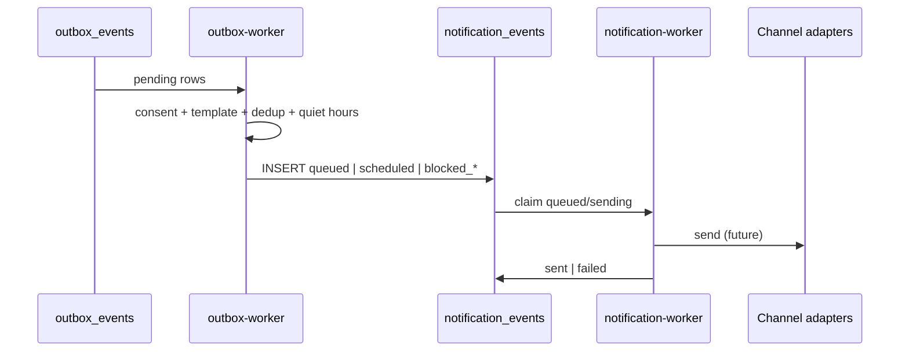

# LIFEGUARD Core — Notification Service

Design-only service that turns **Monitoring signals**, **Consent changes**, and **Outbox events** into customer-facing notifications on allowed channels.

Runs on **real** `customer_id` rows only. No outbound provider integration in this repo (no Kakao/SMS/email SDK).

**Not in scope:** INSUX / INSUX2 / insux-pro-ai, UI, server workers, channel adapters, demo/mock/sample/fake notification fixtures.

Related: [LIFEGUARD_MONITORING_ENGINE.md](./LIFEGUARD_MONITORING_ENGINE.md), [CONSENT_ARCHITECTURE.md](./CONSENT_ARCHITECTURE.md), [COMMUNICATION_ENGINE.md](./COMMUNICATION_ENGINE.md), [DOCUMENT_INGEST.md](./DOCUMENT_INGEST.md), `004_customer_consents.sql`, `008_monitoring_signals.sql`, **`009_notification_service.sql`**.

---

## 1. Purpose

| Objective | Description |
|-----------|-------------|
| **Timely nudges** | Inform customers about renewal risk, premium burden, coverage gaps, claim windows, disclosure review, designer handoff, consent reconfirmation, document ingest outcomes |
| **Consent-first** | No customer-channel delivery without `notification_delivery`; marketing requires `marketing_optional` |
| **Calm copy** | Titles/bodies follow Communication Engine — no fear, no legal certainty |
| **Grounded only** | If outbox payload lacks `source_ref` / evidence ids → **do not** create `notification_events` |
| **Async** | `outbox-worker` creates rows; `notification-worker` updates delivery status (`service_role` only) |

---

## 2. Notification purposes → `event_type`

| Purpose (KO) | `event_type` | Typical outbox / source |
|----------------|--------------|-------------------------|
| 갱신 위험 | `renewal_risk` | `monitoring.rebalancing.review`, `monitoring.signal.detected` |
| 보험료 부담 | `premium_burden` | `monitoring.rebalancing.review` |
| 보장 공백 | `coverage_gap` | `monitoring.coverage.review` |
| 청구 기회 | `claim_opportunity` | `monitoring.claim.documents_ready` |
| 고지 위험 | `disclosure_risk` | `monitoring.disclosure.review` |
| 설계사 연결 필요 | `agent_escalation_needed` | `agent.escalation.requested` (customer notify only if policy allows + consents) |
| 동의 재확인 | `consent_reconsent` | `consent.reconsent.required` |
| 문서 처리 완료 | `document_ingest_completed` | `document.ingest.completed` |
| 문서 처리 실패 | `document_ingest_failed` | `document.ingest.failed` |
| 마케팅 (선택) | `marketing_promotional` | Future marketing outbox only |

---

## 3. Channels

| `channel` | Use |
|-----------|-----|
| `in_app` | In-product feed; always preferred first for service alerts |
| `email` | Async email adapter (future) |
| `kakao_alimtalk` | Alimtalk adapter (future) |
| `sms` | SMS adapter (future) |
| `push` | Mobile/web push (future) |

Stored on `notification_preferences.channel` and `notification_events.channel`.

---

## 4. Consent gates

| Check | Rule |
|-------|------|
| **Service delivery** | `lifeguard_has_consent(customer_id, 'notification_delivery')` required for any outbound customer notification |
| **Marketing** | `event_type = marketing_promotional` also requires `marketing_optional` |
| **Designer-shared wording** | If body references memory/policy summary for agent context, require `agent_sharing` before customer-visible text includes that detail |
| **Revocation** | On revoke, worker sets pending rows to `cancelled` or `blocked_by_consent`; no new sends |

Internal-only outbox (e.g. `agent.escalation.requested` without customer push) does **not** create `notification_events`.

---

## 5. Database (`009_notification_service.sql`)

### 5.1 `notification_preferences`

| Column | Notes |
|--------|-------|
| `customer_id`, `channel` | UNIQUE pair |
| `enabled` | Channel master switch |
| `quiet_hours_json` | e.g. `{ "tz": "Asia/Seoul", "start": "22:00", "end": "08:00" }` |
| `frequency_limit_json` | e.g. `{ "max_per_day": 3, "cooldown_hours": 168 }` |

Customers: SELECT / INSERT / UPDATE own rows (channel + JSON fields only).

### 5.2 `notification_events`

| Column | Notes |
|--------|-------|
| `event_type`, `channel`, `title`, `body` | Rendered copy (Communication Engine compliant) |
| `status` | See §6 |
| `priority` | See §7 |
| `source_type`, `source_ref` | e.g. `outbox_event` + UUID, `monitoring_signal` + signal id |
| `consent_snapshot` | JSON at enqueue time |
| `scheduled_at`, `sent_at`, `failed_at` | Worker timestamps |

Customers: **SELECT own only**; **no INSERT**.

Agents: **no** table access (no RLS policy — zero rows).

### 5.3 `notification_templates`

| Column | Notes |
|--------|-------|
| `template_key`, `channel`, `version` | UNIQUE triple |
| `title_template`, `body_template` | Placeholders `{signal_type}`, `{action_link}` — filled by worker |
| `required_consent_type` | Optional FK to canonical consent list |
| `status` | `draft` \| `active` \| `retired` |

Admin manages templates. **No seed rows** in migration.

---

## 6. `status` lifecycle

| Status | Meaning |
|--------|---------|
| `queued` | Ready for notification-worker |
| `scheduled` | Delayed (`quiet_hours` / rate limit) |
| `sending` | Adapter in flight |
| `sent` | Delivered to channel (or in_app recorded) |
| `failed` | Adapter error; `error_message` set |
| `cancelled` | Superseded or revoked consent |
| `blocked_by_consent` | Missing `notification_delivery` / `marketing_optional` |
| `blocked_by_preference` | Channel `enabled = false` or frequency cap |

---

## 7. `priority`

| Priority | Typical use |
|----------|-------------|
| `critical` | `agent_escalation_needed`, blocking consent |
| `high` | `disclosure_risk`, `consent_reconsent` |
| `medium` | renewal / claim / document completed |
| `low` | `coverage_gap` review nudges |

**Critical policy:** `priority = critical` keeps queue ordering and may still deliver **`in_app`** when push/email are disabled by preference (worker policy). External channels remain subject to `enabled` and consent.

---

## 8. Workers (design only)

### 8.1 outbox-worker (`service_role`)

| Input | `outbox_events` WHERE `status = pending` |
| Output | `notification_events`; UPDATE outbox `processed` |
| Maps | `monitoring.*`, `consent.reconsent.required`, `document.ingest.completed`, `document.ingest.failed` |

Steps:

1. Load `customer_id`, `event_type`, `payload`.
2. If payload missing `source_ref` / required ids → skip (no row).
3. Resolve `event_type` + `priority` from mapping table (§2).
4. Snapshot consents into `consent_snapshot`.
5. If not `lifeguard_has_consent(..., 'notification_delivery')` → INSERT `blocked_by_consent`.
6. Else check `notification_preferences` → `blocked_by_preference` or `scheduled`.
7. Render title/body from active `notification_templates` + Communication Engine rules.
8. Dedup index `notification_events_dedup_active_uq`.

### 8.2 notification-worker (`service_role`)

| Input | `notification_events` WHERE `status IN ('queued','scheduled')` AND `scheduled_at <= now()` |
| Output | UPDATE `status`, `sent_at` / `failed_at` |
| Order | `priority` DESC, `created_at` ASC |

No real SMTP/Kakao/SMS in repo — worker sets `sent` for `in_app` only in v1 design; external channels remain `failed` with `error_message = 'adapter_not_configured'` until adapters exist.

---

## 9. Communication Engine integration

| Rule | Application |
|------|-------------|
| Plain Korean | Short title; body 2–4 sentences |
| No forbidden phrases | Same list as COMMUNICATION_ENGINE §3 |
| No fabricated amounts / product names | Only ids in payload; copy says “연결된 자료 기준” |
| Low evidence | **Do not** create notification row |
| Escalation tone | “설계사 확인이 필요합니다” — not alarmist |

Templates are **starting points**; worker must run Output Guard before persist.

---

## 10. Anti-spam

| Control | Mechanism |
|---------|-----------|
| Cooldown | `frequency_limit_json.cooldown_hours` per `event_type` (default 168h for monitoring) |
| Daily cap | `max_per_day` in preferences |
| Dedup | Unique `(customer_id, event_type, channel, source_ref)` for active statuses |
| Quiet hours | `scheduled_at` bumped to end of quiet window |
| Monitoring alignment | Same `signal_type` 7d rule in LIFEGUARD_MONITORING_ENGINE §7 |

---

## 11. RLS summary

| Role | preferences | events | templates |
|------|-------------|--------|-----------|
| Customer | SELECT, INSERT, UPDATE own | SELECT own | — |
| Agent | — | **no access** | — |
| Admin | SELECT | SELECT, UPDATE | SELECT, INSERT, UPDATE |
| service_role | bypass | INSERT/UPDATE delivery | INSERT/UPDATE |

Customer JWT must **never** run workers (002).

---

## 12. Test scenarios

Real DB + JWT only — no committed fake rows.

| # | Setup | Expected |
|---|--------|----------|
| N1 | A has `notification_delivery` | outbox-worker can queue event |
| N2 | Revoke `notification_delivery` | new row `blocked_by_consent` |
| N3 | Customer A INSERT `notification_events` | RLS deny |
| N4 | A `email` preference `enabled=false` | `blocked_by_preference` for email channel |
| N5 | Duplicate `source_ref` | unique index violation / worker skip |
| N6 | Agent SELECT events | 0 rows |
| N7 | `marketing_promotional` without `marketing_optional` | `blocked_by_consent` |
| N8 | `priority=critical`, push disabled | `in_app` may still `sent` per policy |
| N9 | Empty payload evidence | no `notification_events` row |
| N10 | Repo scan | no demo/mock notification SQL |

SQL checklist: `009_notification_service.sql` POST-MIGRATION TESTS (T1–T11).

---

## 13. Integration map

| Component | Role |
|-----------|------|
| Monitoring Engine | Emits outbox + signals; notification does not re-detect |
| Consent Architecture | `lifeguard_has_consent` gates |
| Communication Engine | Copy policy |
| Document Ingest | `document.ingest.*` outbox |
| Outbox (`001`) | Source bus |
| Future WORKER_ARCHITECTURE | Documents worker boundaries |

---

## 14. Deliberate exclusions

- INSUX campaign or demo push scripts.
- Fictional phone numbers / Kakao template ids in repo.
- Customer JWT creating notification rows.
- Agent reading notification `body` (assignment dashboards use separate summaries).

---

*Draft v0.1 — LIFEGUARD Core Notification Service.*
