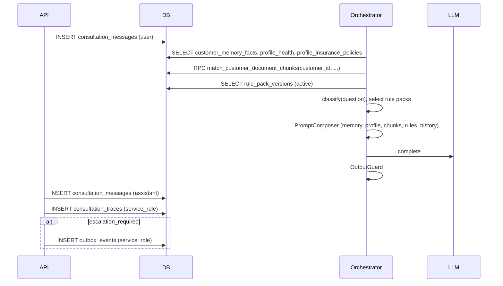

# LIFEGUARD Core — OpenAPI Contract (Draft)

Design-only API contract. **No server implementation, no UI, no INSUX / V2 / insux-pro-ai.**

| | |
|---|---|
| **OpenAPI version** | 3.1 (documented here; YAML export is a future step) |
| **Base URL** | `https://{project}.supabase.co/functions/v1/lifeguard` or dedicated API host `/api` |
| **Auth** | `Authorization: Bearer <supabase_jwt>` |
| **Content-Type** | `application/json` unless noted |

Related: [CONSULTATION_ORCHESTRATOR.md](./CONSULTATION_ORCHESTRATOR.md), [DATA_MODEL.md](./DATA_MODEL.md), `002_rls_service_policies.sql`.

---

## Security principles (global)

| Rule | Implementation |
|------|----------------|
| **No `customer_id` in request body** for authorization | Server sets tenant from `auth.uid()` → `users` → `customer_profiles.id` |
| **RLS on data plane** | Customer JWT uses `lifeguard_auth_customer_id()`; see per-route notes |
| **`service_role`** | Ingest, memory builder, orchestrator traces/outbox INSERT only on server; **never in browser** |
| **Agent scope** | `agent_assignments` active assignment required; no health/documents/chunks/memory/traces |
| **Admin** | Audit reads; sensitive fields masked at API layer where noted |
| **Idempotency** | `client_message_id` on consultation messages |

### Common HTTP errors

| Code | Meaning |
|------|---------|
| `401` | Missing or invalid JWT |
| `403` | Authenticated but wrong role or not assigned / no profile |
| `404` | Resource not found or not visible under RLS |
| `409` | Conflict (duplicate idempotency key) |
| `422` | Validation error |
| `429` | Rate limit |
| `503` | LLM / embedding / ingest queue unavailable |

### Roles

| Role | `users.role` | Typical routes |
|------|--------------|----------------|
| Customer | `customer` | `/api/me`, `/api/customers/me/*`, `/api/consultations`, `/api/documents` |
| Agent | `agent` | `/api/agent/*` |
| Admin | `admin` | `/api/admin/*` |

---

## 1. Auth / Me

### `GET /api/me`

| | |
|---|---|
| **Purpose** | Current session identity, app role, linked `customer_id` if customer |
| **Auth** | `authenticated` (any role) |
| **RLS / security** | Reads `users` (self); `customer_profiles` via own `user_id` only |
| **DB** | **Read:** `users`, `customer_profiles` |

**Request** — no body.

**Response `200`**

```json
{
  "user": {
    "id": "auth-user-uuid",
    "email": "customer@example.com",
    "role": "customer",
    "created_at": "2026-06-01T10:00:00Z"
  },
  "customer_id": "customer-profile-uuid",
  "profile_status": "active"
}
```

For `role: agent`, `customer_id` may be `null`. For `role: admin`, `customer_id` is usually `null`.

**Errors:** `401`

---

### `GET /api/customers/me/memory`

| | |
|---|---|
| **Purpose** | AI-facing memory snapshot (facts + summaries) for client display or debug |
| **Auth** | Customer only (`users.role = customer`) |
| **RLS / security** | `customer_memory_facts`, `profile_health`, policies via own `customer_id` only |
| **DB** | **Read:** `customer_profiles`, `customer_memory_facts`, `profile_health`, `profile_insurance_policies` (aggregate) |

**Response `200`**

```json
{
  "customer_id": "uuid",
  "memory_version": 3,
  "profile_summary": {
    "display_name": "홍길동",
    "birth_date": "1985-03-15",
    "gender": "male",
    "job_category": "office"
  },
  "health_summary": {
    "smoking": "no",
    "hospital_5y": "yes"
  },
  "policies_summary": {
    "active_count": 2
  },
  "facts": [
    {
      "id": "uuid",
      "fact_key": "health.medication",
      "fact_value": "고혈압 약 복용",
      "confidence": 0.9,
      "provenance_type": "profile",
      "effective_at": "2026-05-01T00:00:00Z"
    }
  ],
  "generated_at": "2026-06-01T12:00:00Z"
}
```

**Errors:** `401`, `403` (not a customer or no profile)

---

## 2. Profile

All routes resolve `customer_id` from JWT — **do not send `customer_id` in body.**

### `GET /api/customers/me/profile`

| | |
|---|---|
| **Purpose** | Demographics and profile status |
| **Auth** | Customer |
| **RLS** | `customer_profiles` own row |
| **DB** | **Read:** `customer_profiles` |

**Response `200`**

```json
{
  "profile": {
    "id": "uuid",
    "display_name": "홍길동",
    "birth_date": "1985-03-15",
    "gender": "male",
    "job_category": "office",
    "status": "active",
    "memory_version": 3,
    "created_at": "2026-06-01T10:00:00Z",
    "updated_at": "2026-06-01T11:00:00Z"
  }
}
```

**Errors:** `401`, `403`, `404`

---

### `PUT /api/customers/me/profile`

| | |
|---|---|
| **Purpose** | Update demographics; may bump `memory_version` via async memory builder |
| **Auth** | Customer |
| **RLS** | `customer_profiles` UPDATE own |
| **DB** | **Write:** `customer_profiles` · **Read:** same |

**Request**

```json
{
  "display_name": "홍길동",
  "birth_date": "1985-03-15",
  "gender": "male",
  "job_category": "office"
}
```

**Response `200`**

```json
{
  "profile": { "id": "uuid", "display_name": "홍길동", "memory_version": 4, "updated_at": "2026-06-01T12:05:00Z" }
}
```

**Errors:** `401`, `403`, `422`

---

### `GET /api/customers/me/health`

| | |
|---|---|
| **Purpose** | Health disclosure fields (sensitive) |
| **Auth** | Customer only |
| **RLS** | `profile_health` — customer SELECT own; agents denied |
| **DB** | **Read:** `profile_health` |

**Response `200`**

```json
{
  "health": {
    "customer_id": "uuid",
    "smoking": "no",
    "drinking": "occasional",
    "hospital_5y": "yes",
    "surgery_5y": "no",
    "medication": "혈압약",
    "outpatient": "no",
    "family_history": "당뇨(부)",
    "details_json": {},
    "source": "signup",
    "updated_at": "2026-06-01T10:00:00Z"
  }
}
```

**Errors:** `401`, `403`, `404`

---

### `PUT /api/customers/me/health`

| | |
|---|---|
| **Purpose** | Upsert health disclosures |
| **Auth** | Customer |
| **RLS** | `profile_health` INSERT/UPDATE own |
| **DB** | **Write:** `profile_health` · **Async (service_role):** memory builder → `customer_memory_facts` |

**Request**

```json
{
  "smoking": "no",
  "hospital_5y": "yes",
  "medication": "혈압약",
  "details_json": { "last_checkup": "2025-11" }
}
```

**Response `200`** — same shape as GET.

**Errors:** `401`, `403`, `422`

---

### `GET /api/customers/me/policies`

| | |
|---|---|
| **Purpose** | List in-force / known policies summary |
| **Auth** | Customer |
| **RLS** | `profile_insurance_policies` own, `deleted_at` null |
| **DB** | **Read:** `profile_insurance_policies` |

**Response `200`**

```json
{
  "policies": [
    {
      "id": "policy-uuid",
      "insurer_name": "KB손해보험",
      "product_name": "실손의료비",
      "policy_type": "indemnity",
      "monthly_premium": 45000,
      "coverage_summary": { "deductible": "1만원" },
      "is_active": true,
      "effective_from": "2020-01-01"
    }
  ]
}
```

**Errors:** `401`, `403`

---

### `POST /api/customers/me/policies`

| | |
|---|---|
| **Purpose** | Add manual policy row |
| **Auth** | Customer |
| **RLS** | INSERT with server-set `customer_id` |
| **DB** | **Write:** `profile_insurance_policies` |

**Request**

```json
{
  "insurer_name": "삼성화재",
  "product_name": "암진단비",
  "policy_type": "critical_illness",
  "monthly_premium": 32000,
  "coverage_summary": {},
  "effective_from": "2022-06-01"
}
```

**Response `201`**

```json
{
  "policy": {
    "id": "new-policy-uuid",
    "insurer_name": "삼성화재",
    "is_active": true,
    "created_at": "2026-06-01T12:00:00Z"
  }
}
```

**Errors:** `401`, `403`, `422`

---

### `PUT /api/customers/me/policies/:policyId`

| | |
|---|---|
| **Purpose** | Update policy summary |
| **Auth** | Customer |
| **RLS** | Row must belong to `lifeguard_auth_customer_id()` |
| **DB** | **Write:** `profile_insurance_policies` |

**Request** — partial fields allowed.

```json
{
  "monthly_premium": 35000,
  "coverage_summary": { "limit": "5천만원" },
  "is_active": true
}
```

**Response `200`** — full policy object.

**Errors:** `401`, `403`, `404`, `422`

---

### `DELETE /api/customers/me/policies/:policyId`

| | |
|---|---|
| **Purpose** | Soft-delete policy (`deleted_at`) |
| **Auth** | Customer |
| **RLS** | Own row only |
| **DB** | **Write:** `profile_insurance_policies` (soft delete) |

**Response `204`** — no body.

**Errors:** `401`, `403`, `404`

---

## 3. Consultations

### `POST /api/consultations`

| | |
|---|---|
| **Purpose** | Open new consultation thread |
| **Auth** | Customer |
| **RLS** | INSERT `consultations` with server `customer_id` |
| **DB** | **Write:** `consultations` |

**Request**

```json
{
  "title": "실손 청구 문의"
}
```

**Response `201`**

```json
{
  "consultation": {
    "id": "consultation-uuid",
    "customer_id": "uuid",
    "title": "실손 청구 문의",
    "status": "open",
    "created_at": "2026-06-01T12:00:00Z"
  }
}
```

**Errors:** `401`, `403`, `422`

---

### `GET /api/consultations`

| | |
|---|---|
| **Purpose** | List customer's consultations (chat home) |
| **Auth** | Customer |
| **RLS** | `consultations` own, not deleted |
| **DB** | **Read:** `consultations` |

**Query:** `status=open|archived`, `limit` (default 20), `cursor`

**Response `200`**

```json
{
  "consultations": [
    {
      "id": "uuid",
      "title": "실손 청구 문의",
      "status": "open",
      "updated_at": "2026-06-01T12:30:00Z",
      "last_message_preview": "청구 가능성은 중간..."
    }
  ],
  "next_cursor": null
}
```

**Errors:** `401`, `403`

---

### `GET /api/consultations/:consultationId`

| | |
|---|---|
| **Purpose** | Thread detail + message history |
| **Auth** | Customer (owner) |
| **RLS** | `consultations`, `consultation_messages` own |
| **DB** | **Read:** `consultations`, `consultation_messages` — **not** `consultation_traces` |

**Query:** `include_messages=true`, `message_limit=50`, `before=<iso>`

**Response `200`**

```json
{
  "consultation": {
    "id": "uuid",
    "title": "실손 청구 문의",
    "status": "open",
    "created_at": "2026-06-01T12:00:00Z"
  },
  "messages": [
    {
      "id": "msg-uuid-1",
      "role": "user",
      "content": "지난달 입원했는데 실손 청구 가능한가요?",
      "created_at": "2026-06-01T12:01:00Z"
    },
    {
      "id": "msg-uuid-2",
      "role": "assistant",
      "content": "등록된 자료 기준 청구 가능성은 중간으로 보입니다...",
      "sources_json": {
        "category": "claim",
        "confidence": 0.62
      },
      "model": "lifeguard-llm-v1",
      "latency_ms": 3100,
      "created_at": "2026-06-01T12:01:05Z"
    }
  ]
}
```

**Errors:** `401`, `403`, `404`

---

### `POST /api/consultations/:consultationId/messages`

| | |
|---|---|
| **Purpose** | **Primary AI turn** — save user question, run orchestrator, return structured answer |
| **Auth** | Customer (consultation owner) |
| **RLS** | User message via customer JWT; trace/outbox via **service_role** on server |
| **DB** | See pipeline table below |

#### Request

```json
{
  "question": "지난달 입원했는데 실손 청구 가능한가요?",
  "optional_document_ids": [
    "doc-uuid-1",
    "doc-uuid-2"
  ],
  "requested_category": "claim",
  "client_message_id": "client-uuid-optional"
}
```

| Field | Type | Required | Description |
|-------|------|----------|-------------|
| `question` | string | yes | 1–8000 chars (alias accepted: `content` for backward compat) |
| `optional_document_ids` | uuid[] | no | Restrict RAG to these docs if `ingest_status=ready`; must belong to same customer |
| `requested_category` | enum | no | Hint: `disclosure`, `claim`, `coverage_gap`, `duplicate_coverage`, `rebalancing`, `general` — server may override |
| `client_message_id` | string | no | Idempotency key |

**Forbidden in body:** `customer_id`, `consultation_id` (use path), `embedding`, raw document text.

#### Internal processing (server, not exposed)



| Step | Action | Tables / services |
|------|--------|-------------------|
| 1 | Validate JWT → `customer_id` | `users`, `customer_profiles` |
| 2 | Verify `consultationId` owned, `status=open` | `consultations` |
| 3 | Idempotency check | `consultation_messages` |
| 4 | Save user turn | `consultation_messages` INSERT `role=user` |
| 5 | Memory snapshot | `customer_memory_facts`, `customer_profiles.memory_version` |
| 6 | Profile context | `profile_health`, `profile_insurance_policies` |
| 7 | Embed `question` | Embedding service |
| 8 | RAG | `match_customer_document_chunks` → `customer_document_chunks` (+ filter `optional_document_ids`) |
| 9 | Classify | Rule packs from `003` seeds |
| 10 | Load rules | `rule_packs`, `rule_pack_versions` |
| 11 | Prompt + LLM + guard | — |
| 12 | Save assistant | `consultation_messages` + `sources_json` |
| 13 | Trace | `consultation_traces` (customer cannot SELECT) |
| 14 | Escalation | `outbox_events` `agent.escalation.requested` if needed |

#### Response `200`

```json
{
  "message": {
    "id": "assistant-msg-uuid",
    "consultation_id": "consultation-uuid",
    "role": "assistant",
    "content": "등록된 자료를 기준으로 실손 의료비 청구 가능성은 **중간** 수준으로 보입니다. 입원 세부내역서·진단서가 추가되면 검토 정확도가 높아질 수 있습니다. 최종 심사는 보험사에서 진행됩니다.\n\n출처: [D1] 실손약관, 기억 health.hospital_5y, 규칙팩 claim_possibility_basic v1.0.0",
    "created_at": "2026-06-01T12:01:05Z"
  },
  "answer": "등록된 자료를 기준으로 실손 의료비 청구 가능성은 **중간** 수준으로 보입니다...",
  "category": "claim",
  "confidence": 0.62,
  "sources": {
    "memory": ["health.hospital_5y"],
    "documents": [
      { "ref": "D1", "document_id": "doc-uuid-1", "doc_title": "실손약관", "section": "제4조", "page": 12 }
    ],
    "rule_packs": [
      { "slug": "claim_possibility_basic", "version": "1.0.0", "primary_label": "청구 가능성 중간" }
    ]
  },
  "used_memory_facts": [
    {
      "id": "fact-uuid",
      "fact_key": "health.hospital_5y",
      "fact_value": "yes"
    }
  ],
  "used_document_chunks": [
    {
      "id": "chunk-uuid",
      "document_id": "doc-uuid-1",
      "similarity": 0.78
    }
  ],
  "used_rule_packs": [
    {
      "slug": "claim_possibility_basic",
      "version": "1.0.0",
      "rule_pack_version_id": "rpv-uuid"
    },
    {
      "slug": "agent_escalation_basic",
      "version": "1.0.0",
      "rule_pack_version_id": "rpv-uuid-2"
    }
  ],
  "recommended_next_action": "입원 세부내역서와 진단서를 업로드하면 검토에 도움이 됩니다. 담당 설계사 확인을 권장합니다.",
  "escalation_required": false,
  "escalation_reason": null,
  "trace_id": "trace-uuid"
}
```

`trace_id` is opaque to client; customer cannot read `consultation_traces` row via Supabase client RLS.

#### Escalation response example (`200`)

```json
{
  "answer": "계약 해지와 해지환급금 확정은 AI가 단독으로 안내할 수 없습니다. 담당 설계사가 확인해 드릴 예정입니다.",
  "category": "agent_required",
  "confidence": 0.95,
  "escalation_required": true,
  "escalation_reason": ["cancellation_decision"],
  "recommended_next_action": "설계사 연결 대기",
  "used_rule_packs": [
    { "slug": "agent_escalation_basic", "version": "1.0.0", "primary_label": "설계사 연결 필요" }
  ],
  "message": { "id": "uuid", "role": "assistant", "content": "..." }
}
```

#### Errors

| Code | When |
|------|------|
| `401` | No JWT |
| `403` | Not owner / profile missing |
| `404` | Unknown consultation |
| `409` | Duplicate `client_message_id` |
| `422` | Empty question, invalid `optional_document_ids`, bad category |
| `503` | LLM/embedding failure (may include `user_message_id` for retry) |

#### RLS / security notes

- Never persist assistant trace under customer JWT; use server `service_role`.
- `optional_document_ids` validated server-side against `customer_documents.customer_id`.
- Output must not contain payout/disclosure/cancellation certainty (guard layer).

---

## 4. Documents

### `POST /api/documents`

| | |
|---|---|
| **Purpose** | Register uploaded file metadata after storage upload |
| **Auth** | Customer |
| **RLS** | INSERT `customer_documents` with server `customer_id` |
| **DB** | **Write:** `customer_documents` |

**Request**

```json
{
  "storage_path": "customers/{customer_id}/docs/{uuid}.pdf",
  "mime_type": "application/pdf",
  "original_filename": "실손약관.pdf",
  "doc_class": "terms"
}
```

`doc_class`: `policy_certificate` | `terms` | `claim` | `medical` | `other`

**Response `201`**

```json
{
  "document": {
    "id": "doc-uuid",
    "ingest_status": "pending",
    "doc_class": "terms",
    "original_filename": "실손약관.pdf",
    "created_at": "2026-06-01T12:00:00Z"
  }
}
```

**Errors:** `401`, `403`, `422`

---

### `GET /api/documents`

| | |
|---|---|
| **Purpose** | List customer documents (metadata only) |
| **Auth** | Customer |
| **RLS** | Own rows, not deleted |
| **DB** | **Read:** `customer_documents` |

**Response `200`**

```json
{
  "documents": [
    {
      "id": "doc-uuid",
      "original_filename": "실손약관.pdf",
      "doc_class": "terms",
      "ingest_status": "ready",
      "page_count": 24,
      "created_at": "2026-06-01T12:00:00Z"
    }
  ]
}
```

**Errors:** `401`, `403`

---

### `GET /api/documents/:documentId`

| | |
|---|---|
| **Purpose** | Document metadata + ingest status (not full text in API v1) |
| **Auth** | Customer |
| **RLS** | Own document |
| **DB** | **Read:** `customer_documents` — **not** exposing `customer_document_chunks` to list endpoint |

**Response `200`**

```json
{
  "document": {
    "id": "doc-uuid",
    "original_filename": "실손약관.pdf",
    "ingest_status": "ready",
    "page_count": 24,
    "mime_type": "application/pdf",
    "created_at": "2026-06-01T12:00:00Z"
  }
}
```

**Errors:** `401`, `403`, `404`

---

### `POST /api/documents/:documentId/ingest`

| | |
|---|---|
| **Purpose** | Enqueue OCR → chunk → embed pipeline |
| **Auth** | Customer (ownership check) then **worker `service_role`** |
| **RLS** | Customer may only trigger own doc; worker bypasses for chunks |
| **DB** | **Read:** `customer_documents` · **Write (worker):** `customer_documents`, `customer_document_chunks` |

**Request**

```json
{
  "force": false
}
```

**Response `202`**

```json
{
  "document_id": "doc-uuid",
  "ingest_status": "processing",
  "job_id": "job-uuid"
}
```

**Errors:** `401`, `403`, `404`, `409` (already processing)

---

### `DELETE /api/documents/:documentId`

| | |
|---|---|
| **Purpose** | Soft-delete document; chunks retained or tombstoned per policy |
| **Auth** | Customer |
| **RLS** | Own row |
| **DB** | **Write:** `customer_documents.deleted_at` |

**Response `204`**

**Errors:** `401`, `403`, `404`

---

## 5. Agent

Agent routes require `users.role = agent` and active `agent_assignments`. **No access** to `profile_health`, `customer_documents`, `customer_document_chunks`, `customer_memory_facts`, `consultation_traces`.

### `GET /api/agent/customers`

| | |
|---|---|
| **Purpose** | List customers assigned to logged-in agent |
| **Auth** | Agent |
| **RLS** | `agent_assignments` where `agent_user_id = auth.uid()` |
| **DB** | **Read:** `agent_assignments`, `customer_profiles` (limited columns) |

**Response `200`**

```json
{
  "customers": [
    {
      "customer_id": "uuid",
      "display_name": "홍길동",
      "assignment_status": "active",
      "assigned_at": "2026-05-20T09:00:00Z",
      "last_consultation_at": "2026-06-01T12:00:00Z"
    }
  ]
}
```

**Errors:** `401`, `403`

---

### `GET /api/agent/customers/:customerId/summary`

| | |
|---|---|
| **Purpose** | Handoff summary without health raw or document text |
| **Auth** | Agent + `lifeguard_agent_assigned_to_customer(customerId)` |
| **RLS** | Assignment required; API masks sensitive fields |
| **DB** | **Read:** `customer_profiles`, `profile_insurance_policies`, `consultations` (counts) — **not** `profile_health`, **not** documents/chunks |

**Response `200`**

```json
{
  "customer_id": "uuid",
  "display_name": "홍길동",
  "job_category": "office",
  "policies_count": 2,
  "policies_preview": [
    { "insurer_name": "KB손해보험", "product_name": "실손의료비", "policy_type": "indemnity" }
  ],
  "health_status_label": "등록됨",
  "open_consultations_count": 1,
  "note": "건강 세부·문서 원문은 보호되어 표시되지 않습니다."
}
```

**Errors:** `401`, `403` (not assigned), `404`

---

### `GET /api/agent/consultations/:consultationId`

| | |
|---|---|
| **Purpose** | Read consultation messages for assigned customer |
| **Auth** | Agent + assignment to consultation's `customer_id` |
| **RLS** | `consultations`, `consultation_messages` agent SELECT policies |
| **DB** | **Read:** `consultations`, `consultation_messages` |

**Response `200`**

```json
{
  "consultation": {
    "id": "uuid",
    "customer_id": "uuid",
    "title": "실손 청구 문의",
    "status": "open"
  },
  "messages": [
    { "id": "uuid", "role": "user", "content": "...", "created_at": "iso" },
    { "id": "uuid", "role": "assistant", "content": "...", "created_at": "iso" }
  ]
}
```

**Errors:** `401`, `403`, `404`

---

## 6. Admin / Ops

Require `users.role = admin`. Prefer dedicated admin API host + audit logging. Sensitive reads should be column-masked in implementation.

### `GET /api/admin/outbox-events`

| | |
|---|---|
| **Purpose** | Monitor pending/failed async events |
| **Auth** | Admin |
| **RLS** | `lg_outbox_events_admin_select_audit` |
| **DB** | **Read:** `outbox_events` |

**Query:** `status=pending|processed|failed`, `limit`, `cursor`

**Response `200`**

```json
{
  "events": [
    {
      "id": "uuid",
      "customer_id": "uuid",
      "event_type": "agent.escalation.requested",
      "status": "pending",
      "payload": {
        "consultation_id": "uuid",
        "trigger_codes": ["cancellation_decision"]
      },
      "created_at": "2026-06-01T12:01:06Z"
    }
  ]
}
```

**Errors:** `401`, `403`

---

### `GET /api/admin/consultation-traces/:consultationId`

| | |
|---|---|
| **Purpose** | Audit retrieval provenance for a consultation (all messages) |
| **Auth** | Admin |
| **RLS** | Admin SELECT on `consultation_traces` — customers/agents denied |
| **DB** | **Read:** `consultation_traces`, `consultation_messages`, `consultations` |

**Response `200`**

```json
{
  "consultation_id": "uuid",
  "traces": [
    {
      "message_id": "assistant-msg-uuid",
      "memory_version": 3,
      "chunk_ids": ["chunk-uuid"],
      "rule_pack_version_id": "rpv-uuid",
      "retrieval_scores": { "category": "claim", "prompt_hash": "sha256:..." },
      "prompt_token_estimate": 4200,
      "created_at": "2026-06-01T12:01:05Z"
    }
  ]
}
```

**Errors:** `401`, `403`, `404`

---

### `GET /api/admin/rule-packs`

| | |
|---|---|
| **Purpose** | List rule catalog + active versions |
| **Auth** | Admin (authenticated read also allowed for customers on catalog) |
| **RLS** | SELECT all packs |
| **DB** | **Read:** `rule_packs`, `rule_pack_versions` |

**Response `200`**

```json
{
  "rule_packs": [
    {
      "id": "pack-uuid",
      "slug": "claim_possibility_basic",
      "title": "보험금 청구 가능성 (기본)",
      "active_version": {
        "id": "version-uuid",
        "version": "1.0.0",
        "status": "active",
        "title": "청구 가능성 분류 — 기본"
      }
    }
  ]
}
```

**Errors:** `401`, `403`

---

### `POST /api/admin/rule-packs`

| | |
|---|---|
| **Purpose** | Create new rule pack slug |
| **Auth** | Admin |
| **RLS** | `lg_rule_packs_admin_insert` |
| **DB** | **Write:** `rule_packs` |

**Request**

```json
{
  "slug": "custom_pack_v2",
  "title": "커스텀 팩"
}
```

**Response `201`**

```json
{
  "rule_pack": {
    "id": "pack-uuid",
    "slug": "custom_pack_v2",
    "title": "커스텀 팩"
  }
}
```

**Errors:** `401`, `403`, `409` (duplicate slug), `422`

---

### `POST /api/admin/rule-packs/:rulePackId/versions`

| | |
|---|---|
| **Purpose** | Publish new rule pack version |
| **Auth** | Admin |
| **RLS** | `lg_rule_pack_versions_admin_insert` |
| **DB** | **Write:** `rule_pack_versions` |

**Request**

```json
{
  "version": "1.1.0",
  "title": "청구 가능성 분류 — 개정",
  "description": "영수증 필드 보강",
  "body_markdown": "## 요약\n...",
  "rule_body": {},
  "prompt_guidelines": "...",
  "safety_guidelines": "...",
  "output_schema": {},
  "topic_tags": ["claim"],
  "status": "active",
  "set_active": true
}
```

**Response `201`**

```json
{
  "rule_pack_version": {
    "id": "version-uuid",
    "rule_pack_id": "pack-uuid",
    "version": "1.1.0",
    "status": "active",
    "is_active": true
  }
}
```

**Errors:** `401`, `403`, `404`, `409`, `422`

---

## Appendix A — Path index (OpenAPI-style)

```yaml
openapi: 3.1.0
info:
  title: LIFEGUARD Core API
  version: 0.1.0-draft
servers:
  - url: /api
paths:
  /me:
    get: { summary: Current user + customer_id }
  /customers/me/memory:
    get: { summary: Memory snapshot }
  /customers/me/profile:
    get: { summary: Profile }
    put: { summary: Update profile }
  /customers/me/health:
    get: { summary: Health disclosures }
    put: { summary: Upsert health }
  /customers/me/policies:
    get: { summary: List policies }
    post: { summary: Add policy }
  /customers/me/policies/{policyId}:
    put: { summary: Update policy }
    delete: { summary: Soft-delete policy }
  /consultations:
    get: { summary: List consultations }
    post: { summary: Create consultation }
  /consultations/{consultationId}:
    get: { summary: Get consultation + messages }
  /consultations/{consultationId}/messages:
    post: { summary: AI orchestration turn }
  /documents:
    get: { summary: List documents }
    post: { summary: Register document }
  /documents/{documentId}:
    get: { summary: Document metadata }
    delete: { summary: Soft-delete document }
  /documents/{documentId}/ingest:
    post: { summary: Start ingest job }
  /agent/customers:
    get: { summary: Assigned customers }
  /agent/customers/{customerId}/summary:
    get: { summary: Agent handoff summary }
  /agent/consultations/{consultationId}:
    get: { summary: Agent read consultation }
  /admin/outbox-events:
    get: { summary: Outbox monitor }
  /admin/consultation-traces/{consultationId}:
    get: { summary: Trace audit }
  /admin/rule-packs:
    get: { summary: List rule packs }
    post: { summary: Create rule pack }
  /admin/rule-packs/{rulePackId}/versions:
    post: { summary: Create rule version }
```

---

## Appendix B — DB touch matrix (quick reference)

| Endpoint | Read tables | Write tables |
|----------|-------------|--------------|
| `GET /api/me` | users, customer_profiles | — |
| `GET .../memory` | customer_profiles, customer_memory_facts, profile_health, profile_insurance_policies | — |
| Profile CRUD | customer_profiles, profile_health, profile_insurance_policies | same |
| Consultations | consultations, consultation_messages | consultations, consultation_messages |
| `POST .../messages` | memory, profile, chunks (RPC), rule_packs, versions, messages | messages, traces†, outbox† |
| Documents | customer_documents | customer_documents (+ worker: chunks) |
| Agent | agent_assignments, customer_profiles, consultations, messages, policies | — |
| Admin | outbox_events, consultation_traces, rule_packs, versions | rule_packs, versions (POST) |

† `service_role` on server only.

---

## Appendix C — Future (out of draft scope)

- OpenAPI YAML export (`openapi/lifeguard-core.yaml`)
- Webhooks for `outbox_events`
- Signed upload URL endpoint (`POST /api/documents/upload-url`)
- Pagination standards (`cursor`, `has_more`)
- Problem Details (`application/problem+json`) for errors

---

*Draft v0.1 — LIFEGUARD Core only. Do not reference INSUX route shapes or shared deployment.*
