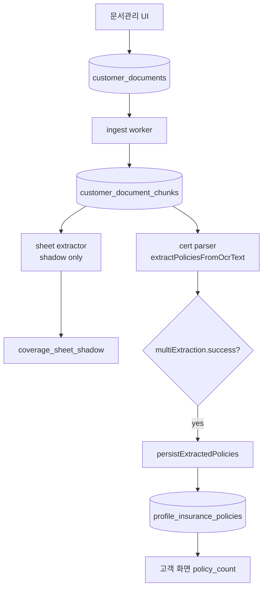

# PR-C3: Coverage Analysis Sheet Live Gate — Design (v2)

**Status:** Design only (no implementation)  
**Date:** 2026-06-13  
**Review:** Claude Approve with changes — incorporated  
**Prerequisite:** PR-C2b merged (`coverage_sheet_shadow` shadow-only extractor on `main`)  
**Goal:** `coverage_analysis_sheet`가 certificate parser garbage를 `profile_insurance_policies`에 저장하지 못하게 차단

---

## Executive summary

현재 `coverage_analysis_sheet`는 OCR 이후 **cert parser와 sheet extractor를 병렬 실행**하고, persist는 **cert `multiExtraction` 성공 여부만** 본다. Shadow `coverage_sheet_shadow`는 관측용이며 persist에 연결되지 않는다. 그 결과 carrier split garbage가 `profile_insurance_policies`에 저장될 수 있다.

**PR-C3 권장 아키텍처 (S1):** `coverage_analysis_sheet`는 **extraction 단계에서 cert parser를 아예 타지 않는다.** Sheet 전용 경로만 실행하고, Live Gate + row-level filter 통과 시 **fresh sheet extractor 결과**만 persist 후보로 사용한다.

| 결과 | `policy_extraction_status` | `profile_insurance_policies` |
|------|---------------------------|------------------------------|
| Gate + row filter **PASS** | `completed` | passing row만 insert/update |
| **FAIL / non-PASS** | `pending_manual_review` | **저장 금지 (0건)** |
| cert `multiExtraction` fallback | — | **영구 금지** |

---

## 1. 현재 혈류 분석

### 1.1 End-to-end (`coverage_analysis_sheet`)



### 1.2 문제 (고객·파일명 무관)

| 단계 | 현재 | 문제 |
|------|------|------|
| Extraction | cert + sheet **병렬** | sheet 문서도 carrier split 실행 |
| Persist gate | `multiExtraction.success` | shadow `pass_l1_v1` 무관 |
| Fallback | cert 실패 시 manual review, cert 성공 시 persist | cert **성공**이 garbage persist로 이어짐 |
| Persist source | cert `policies[]` only | sheet `rows[]` 미사용 |

---

## 2. 처리 위치 재검토 — 아키텍처 후보 비교

### 2.1 후보 요약

| ID | 방식 | cert parser 호출 | persist gate | Claude/권장 |
|----|------|------------------|--------------|-------------|
| **S1** | **doc_type extraction 분기 (1순위)** | sheet에서 **호출 안 함** | sheet Live Gate + row filter | **권장** |
| S2 | persist 직전 gate only | sheet에서 **여전히 호출** | persist 직전 차단 | 보조·불충분 |
| S3 | `persistExtractedPolicies` 내부 분기 | 호출됨 | persist 함수 내부 | gate 분산 |
| S4 | cert parser 내부 doc_type skip | 부분 skip | 별도 gate 필요 | 증권 회귀 위험 |
| S5 | DB trigger | 무관 | DB 레벨 | 운영·디버깅 부담 |

### 2.2 S1 — doc_type extraction 분기 (권장, 1순위)

```
ocrText = join(chunks)

if isCoverageAnalysisSheetDocument(document):
  sheetExtraction = extractCoverageSheetFromOcrText(ocrText)     // live + shadow 공통 입력
  shadowState     = runShadowCoverageSheetSafe({ sheetExtraction, document })
  gate            = evaluateCoverageSheetLiveGate(sheetExtraction)
  passingRows     = filterPassingSheetRows(sheetExtraction.rows)

  if !gate.pass || passingRows.length === 0:
    return markSheetManualReview(...)    // persist 금지
  else:
    persistResult = persistCoverageSheetRows(passingRows)  // fresh rows only
    return markCompleted(...)

else:
  multiExtraction = extractPoliciesFromOcrText(ocrText)
  shadowState     = runShadowPolicyValidationSafe(...)
  // 기존 certificate 경로 unchanged
```

**S1 장점**
- cert parser **fallback 경로 자체가 없음** (호출하지 않음)
- garbage 생성 원천 차단 + persist 차단 이중 안전
- 파이프라인 의도가 doc_type별로 명확

**S1 단점**
- `documentPolicyExtractionPipeline.js` 분기 구조 변경 (중간 규모)
- sheet FAIL 시 cert 진단 메타 없음 → `coverage_sheet_shadow` / gate 메타로 대체

### 2.3 S2 — persist 직전 gate only (비권장)

- cert parser를 “진단용”으로 유지하면, 구현 실수·flag off·부분 revert 시 **cert fallback persist**가 재발할 여지가 큼.
- Claude review: **non-PASS 시 cert multiExtraction fallback 금지** — S2는 이를 구조적으로 보장하기 어렵다.
- **결론:** S2는 비교 참고용으로만 문서에 남기고, **PR-C3는 S1 채택**.

---

## 3. cert parser fallback 금지 (필수 불변식)

다음은 `coverage_analysis_sheet`에 대해 **절대 금지**:

| 금지 패턴 | 이유 |
|-----------|------|
| `multiExtraction.success === false` → cert retry → persist | garbage / partial block |
| `gate.pass === false` → cert `multiExtraction`으로 persist | **fallback = garbage persist 재개** |
| `passingRows.length === 0` → cert policies로 대체 persist | row-level 실패를 cert로 메움 |
| shadow FAIL + cert SUCCESS → persist | 현재 Production 버그 패턴 |

**non-PASS 통합 처리**

| 필드 | 값 |
|------|-----|
| `policy_extraction_status` | `pending_manual_review` |
| `policy_extraction_error` | `coverage_sheet_live_gate_blocked` 또는 row-level reason |
| `profile_policy_ids` | `[]` |
| `profile_policy_id` | `null` |
| `profile_insurance_policies` | **insert/update 0건** |

`multiExtraction` 필드는 sheet 경로에서 **기록하지 않음** (또는 `policy_extraction: null`). cert 진단 스냅샷을 metadata에 남기면 운영자가 fallback 근거로 오해할 수 있으므로 **금지**.

---

## 4. Live Gate — document-level (B안 조건)

```js
// proposed: server/coverageSheetLiveGate.js
export function evaluateCoverageSheetLiveGate(sheetExtraction) {
  const pass =
    sheetExtraction?.pass_l1_v1 === true &&
    (sheetExtraction?.row_count ?? 0) >= 1 &&
    sheetExtraction?.confidence === "high";

  return {
    pass,
    criteria: "DOC_PASS-L1-V1+ROW+HIGH",
    pass_l1_v1: Boolean(sheetExtraction?.pass_l1_v1),
    row_count: sheetExtraction?.row_count ?? 0,
    confidence: sheetExtraction?.confidence ?? null,
    layout: sheetExtraction?.layout ?? null,
    warnings: sheetExtraction?.warnings ?? [],
    blocked_reason: pass ? null : deriveBlockedReason(sheetExtraction),
  };
}
```

Document gate **PASS는 persist 허가가 아니라 “row-level 검사 진입 허가”**이다. 최종 persist는 §5 row filter 통과 건수만.

---

## 5. row-level 필터 (필수)

### 5.1 문제

`pass_l1_v1 === true` (document)는 “**최소 1 passing row 존재**”만 보장한다. **전체 `rows[]`를 persist하면 안 된다.** 일부 row는 `AMOUNT_MISSING`, `UNKNOWN_AMOUNT_UNIT` 등 warning을 가질 수 있다.

### 5.2 Row-level PASS 기준 (기존 `evaluatePassL1V1` 단일 row 조건 재사용)

```js
// proposed: server/coverageSheetLiveGate.js
export function isPassingSheetRow(row) {
  return Boolean(
    row?.insurer_name &&
    row?.amount_value != null &&
    row?.amount_unit &&
    row.amount_unit !== "unknown",
  );
}

export function filterPassingSheetRows(rows = []) {
  return rows.filter(isPassingSheetRow);
}
```

| Row 상태 | persist |
|----------|---------|
| `insurer_name` + `amount_value` + `amount_unit` (≠ `unknown`) | **허용 후보** |
| `AMOUNT_MISSING` | **제외** |
| `UNKNOWN_AMOUNT_UNIT` | **제외** |
| `insurer_name` only (carrier line) | **제외** |

### 5.3 Document PASS + 0 passing rows

| 조건 | 처리 |
|------|------|
| `gate.pass === true` && `passingRows.length === 0` | **FAIL 취급** → `pending_manual_review`, persist 금지 |
| `blocked_reason` | `ROW_LEVEL_PASS_EMPTY` |

### 5.4 Persist 건수

```
persisted_count = passingRows.length   // cert policy_count 아님
```

---

## 6. PASS 후 persist source (필수 명확화)

### 6.1 허용 소스

| 소스 | 허용 |
|------|------|
| 동일 `ocrText`에 대한 **fresh** `extractCoverageSheetFromOcrText(ocrText)` 결과 | **예** |
| `filterPassingSheetRows(sheetExtraction.rows)` | **예** |

### 6.2 금지 소스

| 소스 | 금지 이유 |
|------|-----------|
| `extractPoliciesFromOcrText(ocrText)` / cert `multiExtraction` | garbage 원천 |
| `metadata_json.coverage_sheet_shadow` 읽어서 persist | shadow는 **관측 스냅샷**, persist 입력이 아님; stale·불일치 위험 |
| 이전 추출 run의 cached rows | 동일 OCR fresh 실행 원칙 위반 |

### 6.3 Shadow vs Live 실행 관계

```
// 단일 pipeline 호출 내
const sheetExtraction = extractCoverageSheetFromOcrText(ocrText);  // once, fresh

shadowState = runShadowCoverageSheetSafe({ sheetExtraction, document });  // metadata 기록
gate        = evaluateCoverageSheetLiveGate(sheetExtraction);             // gate
passingRows = filterPassingSheetRows(sheetExtraction.rows);               // persist input

persistCoverageSheetRows(passingRows);  // NOT from shadow metadata
```

- `coverage_sheet_shadow`와 persist는 **같은 `sheetExtraction` 객체**에서 파생 (한 번의 extractor 실행).
- metadata에 기록된 shadow는 QA/RLS 검증·운영 관측용; **persist는 metadata를 읽지 않는다.**

---

## 7. persist 대상 store 결정

### 7.1 후보 비교

| Store | 장점 | 단점 |
|-------|------|------|
| **`profile_insurance_policies`** (기존) | `policy_count`, UnifiedState, AI 패널 **즉시 연동**; DB migration 없음 | sheet row ≠ 증권 semantics; 필드 매핑 타협 필요 |
| **`coverage_analysis_rows`** (신규 테이블) | 도메인 정확; cert와 완전 분리 | migration, RLS, UI, unified state, memory-builder **전면 확장** |
| **`metadata_json` only** | 구현 최소 | 고객 화면·policy_count 미반영; Live Gate 목적 미달 |

### 7.2 PR-C3 결정 (명확)

| 항목 | PR-C3 |
|------|-------|
| **Persist store** | **`profile_insurance_policies`** (passing sheet rows → policy row mapper) |
| **신규 테이블** | **하지 않음** |
| **`coverage_analysis_rows`** | **PR-C3+ 별도 설계** (native coverage store); UI가 coverage-native 뷰를 요구할 때 착수 |

> PR-C3의 `profile_insurance_policies` persist는 canonical coverage model이 아니라, Live Gate 통과 row를 기존 `policy_count`/memory/UI 파이프에 연결하기 위한 **temporary bridge projection**이다. 장기적으로 `coverage_analysis_rows` native store 도입 후, 계약(`profile_insurance_policies`)과 분석표 row를 분리하는 migration이 필요하다.

**매핑 계약 (PR-C3)**

| sheet row | `profile_insurance_policies` |
|-----------|------------------------------|
| `insurer_name` | `insurer_name` |
| `product_name` | `product_name` (nullable) |
| `amount_value` + `amount_unit` | `coverage_summary` 금액 필드 + `amount_unit` 메타 |
| — | `source: "upload_extract"` |
| — | `coverage_summary.extractor_origin: "coverage_sheet_l1"` |
| — | `coverage_summary.source_document_id: documentId` |
| — | `coverage_summary.sheet_row_index: row.row_index` |
| `upload_extract_key` | `documentId\|sheet\|row_index\|insurer\|amount` (cert key namespace와 분리) |

**장기 (PR-C3+):** `coverage_analysis_rows` 도입 시 `profile_insurance_policies`로의 projection은 별도 PR. PR-C3는 **garbage 차단 + 최소 usable persist**에 집중.

---

## 8. 증권(certificate) 문서 영향

| 항목 | PR-C3 |
|------|-------|
| `!isCoverageAnalysisSheetDocument(document)` | **코드 경로 무변경** |
| `extractPoliciesFromOcrText` | certificate만 호출 |
| `persistExtractedPolicies` | certificate만 호출 |
| `runShadowPolicyValidationSafe` | 유지 |

격리: sheet 분기는 `if (isCoverageAnalysisSheetDocument(document)) { ... return; }` **early return** — certificate 로직과 파일 내 섞임 최소화.

---

## 9. DB / API / UI

### 9.1 DB (PR-C3)

| 항목 | 필요 |
|------|------|
| Schema migration | **없음** |
| `metadata_json` 키 | `coverage_sheet_shadow` (기존), `coverage_sheet_live_gate` (신규), `sheet_persist_summary` (신규) |
| `policy_extraction_status` | `pending_manual_review` 재사용 |

### 9.2 API

- `POST /api/customer-document-policy-extract` 시그니처 동일
- sheet FAIL: `policy_count: 0`, `status: pending_manual_review`
- sheet PASS: `policy_count: persisted_count` (passing rows only)

### 9.3 고객 화면

| Gate+rows | UI (`formatDocumentPipelineStatus`) |
|-----------|-------------------------------------|
| FAIL | "OCR 완료 · 관리자 검토 대기" |
| PASS | "분석·보험정보 추출 완료" |

FAIL 시 `policy_count` 증가 없음 — garbage N건 표시 제거.

---

## 10. 기존 garbage cleanup — 별도 PR (PR-C3 비범위)

### 10.1 PR-C3에 포함하지 않음

- 이미 persist된 sheet-origin cert garbage 일괄 처리
- Production cross-customer 스캔
- service-role bulk delete

### 10.2 Soft-delete cleanup 계획 (후속 PR: `PR-C3-CLEANUP` 가칭)

**식별 기준 (고객 공통 규칙, ID 하드코딩 없음)**

| 신호 | 조건 |
|------|------|
| Source doc | `coverage_summary.source_document_id` → `customer_documents` where sheet type |
| Extractor | `coverage_summary.extractor_version` = cert 계열 **또는** `extractor_origin` 없음 + sheet doc |
| 품질 | `product_name` NULL AND `monthly_premium` NULL AND `insurer_name` only 패턴 |
| 연령 | sheet doc `policy_extraction_status` in (`completed`, `pending_manual_review`) |

**조치 (soft-delete)**

```sql
-- conceptual only; implementation in cleanup PR
UPDATE profile_insurance_policies
SET is_active = false,
    coverage_summary = coverage_summary || '{"retired_reason":"coverage_sheet_garbage_cleanup"}',
    updated_at = now()
WHERE <rule-based predicate per customer/document>;
```

**실행 원칙**
- RLS 또는 **단일 customer + 단일 document_id** scope
- QA 고객 / 운영 승인 후 단계적 실행
- `scripts/deprecated/pr-c2-unsafe/` 패턴 재발 방지 — cross-customer service-role scan 금지

**PR-C3 재추출 시**
- `forceRetry` + gate ON → 기존 동일 `source_document_id`의 `upload_extract` row는 `planRetiredPolicyIds`로 retire (구현 시 기존 helper 재사용)

---

## 11. 롤백

| 레벨 | 방법 |
|------|------|
| L0 | `COVERAGE_SHEET_LIVE_GATE=0` → sheet도 **pre-C3 legacy** (cert persist 복귀 — 위험, 단기만) |
| L1 | PR revert → S1 분기 제거 |
| L2 | cleanup PR만 revert (데이터 별도) |

**권장:** flag default **off** → QA UI upload + RLS shadow verify → on.

---

## 12. PR-C3 구현 범위 / 비범위

### 12.1 In-scope

| # | 항목 |
|---|------|
| 1 | **S1** doc_type extraction 분기 — sheet에서 cert parser **미호출** |
| 2 | cert fallback **구조적 불가** |
| 3 | `evaluateCoverageSheetLiveGate` + `filterPassingSheetRows` |
| 4 | fresh `sheetExtraction` → passing rows만 `persistCoverageSheetRows` → `profile_insurance_policies` |
| 5 | shadow metadata 기록 (관측); **persist는 metadata 미참조** |
| 6 | `coverage_sheet_live_gate`, `sheet_persist_summary` metadata |
| 7 | Feature flag `COVERAGE_SHEET_LIVE_GATE` |
| 8 | 단위 테스트 + certificate 회귀 |

### 12.2 Out-of-scope

| # | 항목 |
|---|------|
| 1 | Garbage soft-delete cleanup 실행 | `PR-C3-CLEANUP` |
| 2 | `coverage_analysis_rows` 신규 테이블 | PR-C3+ |
| 3 | NON_L1 sheet parser | PR-C4+ |
| 4 | Certificate parser 수정 | 금지 |
| 5 | `coverage_sheet_shadow` metadata → persist 연결 | **명시 금지** |
| 6 | DB migration | 없음 |

### 12.3 Acceptance criteria

| # | 기준 |
|---|------|
| AC-1 | sheet + non-PASS → `profile_insurance_policies` **0건** |
| AC-2 | sheet + PASS → **passing rows만** persist; cert persist **0건** |
| AC-3 | persist 입력이 `metadata_json.coverage_sheet_shadow` **아님** (코드 grep / test) |
| AC-4 | sheet 경로에서 `extractPoliciesFromOcrText` **호출 0회** |
| AC-5 | certificate 문서 → 기존 동작 동일 |
| AC-6 | `coverage_sheet_shadow` metadata 계속 기록 (PASS/FAIL 무관) |

---

## 13. 구현 파일 예상 (미착수)

| 파일 | 변경 |
|------|------|
| `server/coverageSheetLiveGate.js` | **NEW** — doc gate + row filter |
| `server/coverageSheetPersist.js` | **NEW** — passing rows → policies |
| `server/documentPolicyExtractionPipeline.js` | **S1 early branch** |
| `scripts/coverage-sheet-live-gate-unit-test.mjs` | **NEW** |
| `package.json` | test script |

---

## 14. 참조

| 자료 | 역할 |
|------|------|
| `server/documentPolicyExtractionPipeline.js` | 현행 병렬 cert+shadow |
| `server/coverageSheetExtractor.js` | `evaluatePassL1V1`, row shape |
| `server/policyExtractionShadow.js` | shadow metadata (관측 only) |
| `docs/PR-C2-COVERAGE-FORMAT-ANALYSIS.md` | L1 집중도 |
| `scripts/pr-c2b-coverage-sheet-shadow-rls-verify.mjs` | Production QA |

---

## 15. Claude review 변경 이력 (v1 → v2)

| # | 요청 | 반영 |
|---|------|------|
| 1 | 처리 위치 재검토; cert 미호출 1순위 | **§2 S1 채택**, S2 비권장 |
| 2 | cert fallback 금지 | **§3 불변식** |
| 3 | PASS persist source | **§6 fresh extractor only**, shadow metadata 금지 |
| 4 | row-level filter | **§5** |
| 5 | store 결정 | **§7 PR-C3 = profile_insurance_policies** |
| 6 | garbage cleanup 별도 PR | **§10** + soft-delete 계획 |

---

**문서 상태:** v2 보완 완료. **구현 금지** — PR-C3 착수 전 설계 계약.
