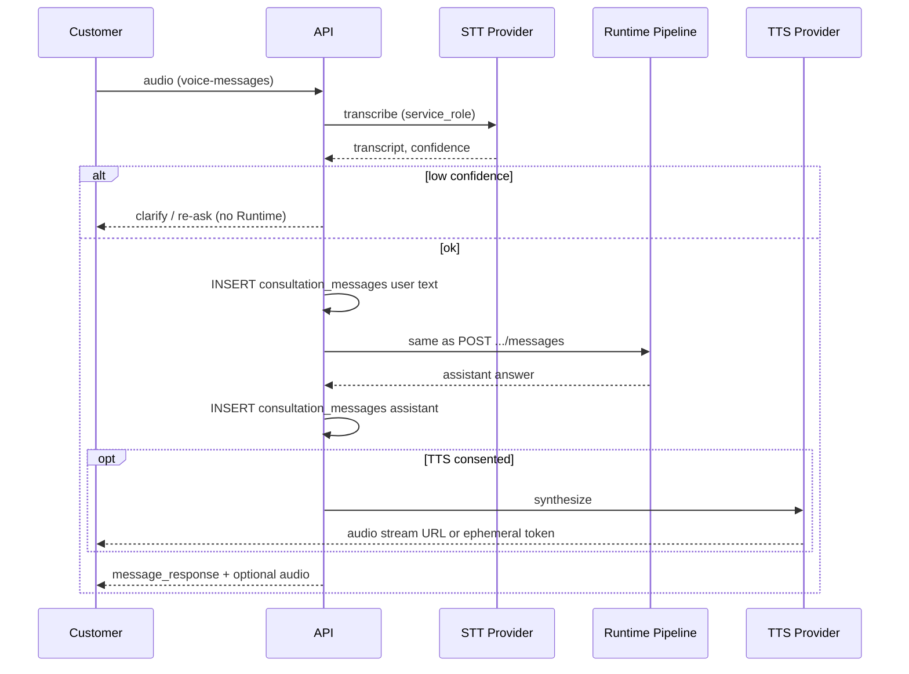

# LIFEGUARD Core — Voice Conversation

Design for **microphone-based consultation**: speech in, text through the existing Runtime, optional speech out — aligned with [API_FINALIZATION.md](./API_FINALIZATION.md), [CONSULTATION_RUNTIME_ARCHITECTURE.md](./CONSULTATION_RUNTIME_ARCHITECTURE.md), [CONSENT_ARCHITECTURE.md](./CONSENT_ARCHITECTURE.md), and [COMMUNICATION_ENGINE.md](./COMMUNICATION_ENGINE.md).

**Not in scope:** Server code, UI, STT/TTS SDK integration, audio file storage implementation, SQL/migrations in this task, demo/mock/sample/fake voice fixtures.

---

## v1 database and MVP activation (read first)

> **Current v1 DB (`004_customer_consents.sql` / migrations 001–012) does NOT include:**
>
> - `voice_input_processing`
> - `voice_transcription_storage`
> - `voice_output_playback`
>
> These are **candidates for a future v2 migration** (extend `lifeguard_consent_types()` + consent UX).
>
> **Therefore v1 MVP does NOT enable voice in production.** This document defines **design-only** linkage to the text Runtime so implementation can proceed after v2 consent + API routes are added.
>
> Until v2: customers use **text** `POST /api/consultations/:id/messages` only; no microphone/STT/TTS endpoints are active.

---

## 1. Purpose

| Goal | Description |
|------|-------------|
| **Voice question** | Customer speaks via device microphone |
| **STT** | Server converts audio to text (external provider, server-side) |
| **Same Runtime** | Transcript becomes `question` for [CONSULTATION_RUNTIME_ARCHITECTURE.md](./CONSULTATION_RUNTIME_ARCHITECTURE.md) pipeline |
| **Optional TTS** | Assistant answer may be synthesized for playback (post-MVP) |
| **Canonical record** | **All turns persist as `consultation_messages` text** (`role=user` / `role=assistant`) — voice is input/output modality, not a parallel chat store |

Voice does not bypass consent, evidence, sufficiency, or Communication Engine rules.

---

## 2. Voice processing flow

```text
microphone input (browser / app)
  → client encodes audio (e.g. webm/ogg) — no server storage yet
  → POST /api/consultations/:id/voice-messages  [v2+ route; inactive in v1 MVP]
  → server STT (service_role + provider API)
  → transcript + transcript_confidence
  → IF confidence below threshold → clarification response (NO Runtime)
  → ELSE INSERT consultation_messages (user, text = transcript)
  → Consultation Runtime Pipeline (identical to text messages)
  → INSERT consultation_messages (assistant, text answer)
  → optional TTS (if voice_output_playback consented) [post-MVP]
  → client: show text + optional audio playback
```



---

## 3. Consent

### 3.1 v2 consent types (not in v1 DB)

| `consent_type` | Required? | Purpose |
|----------------|-----------|---------|
| `voice_input_processing` | **Required** for any STT | Legal basis to send audio to STT provider |
| `voice_transcription_storage` | **Required** to persist transcript in `consultation_messages` | Transcript is stored text tied to consultation |
| `voice_output_playback` | **Optional** | TTS playback of assistant answer |

Existing Runtime consents still apply for the **text** path after STT:

| Consent | Role |
|---------|------|
| `ai_consultation` | Runtime LLM path |
| `memory_retention` | Memory load + conversation-derived facts |

### 3.2 Sensitive health in spoken content

Spoken questions may include health information. Runtime must check:

- `sensitive_health_processing` before loading health memory / health RAG context (same as text Runtime).
- If health content detected in transcript but consent missing → do not use health facts; respond with consent-required or neutral 자료 부족 path per [CONSENT_ARCHITECTURE.md](./CONSENT_ARCHITECTURE.md).

### 3.3 Original audio storage (separate from transcription)

> **Original audio recording storage is forbidden by default.**
>
> - v1/v2 design: **do not** persist raw audio blobs to Supabase Storage or DB.
> - If product later requires call recording or replay of customer voice, a **separate consent** (e.g. future `voice_recording_retention`) and **separate storage policy** (retention, encryption, access audit) must be approved and migrated — not covered by `voice_transcription_storage` alone.

---

## 4. Storage principles

| Rule | Detail |
|------|--------|
| **Canonical message** | Voice input **always** ends as `consultation_messages` **user** row with **text** `content` = transcript |
| **No raw audio default** | Ephemeral buffer for STT only; discard after transcription unless separate recording consent |
| **Transcript metadata** | `sources_json` or message metadata: `{ input_modality: "voice", transcript_confidence, stt_provider, language }` |
| **No audio as memory_fact** | Memory Builder may consume **transcript text** only (with `memory_retention` + voice storage consents) — **never** store audio URI or binary in `customer_memory_facts` |
| **Low confidence** | Do **not** call Runtime; return clarification (§5) |
| **Uncertainty copy** | CE-allowed phrases: “제가 다시 확인해볼게요”, “방금 말씀을 잘 못 들었어요” |

---

## 5. STT confidence gate (before Runtime)

**Do not enter Runtime Pipeline** when transcription is unreliable.

| Condition | Action |
|-----------|--------|
| `transcript_confidence` &lt; `STT_MIN_CONFIDENCE` (e.g. 0.75 — tunable at implement) | HTTP 200 with `ok: true`, `data.clarification_required: true`, **no** assistant Runtime run |
| Empty / garbage transcript | Same — prompt re-speak or type text |
| Language mismatch | Clarification + offer text fallback |

**Clarification response (envelope):**

```json
{
  "ok": true,
  "data": {
    "clarification_required": true,
    "transcript": "partial or low-confidence text",
    "transcript_confidence": 0.42,
    "message": "방금 말씀을 잘 못 들었어요. 다시 말씀해 주시거나, 글자로 입력해 주셔도 됩니다.",
    "runtime_invoked": false
  }
}
```

Only after confidence passes → `consultation_messages` user INSERT → Runtime.

---

## 6. API extension (proposal — inactive in v1 MVP)

Aligns with [API_FINALIZATION.md](./API_FINALIZATION.md) envelope; **not** added to FINALIZATION body until v2 sign-off.

### `POST /api/consultations/:id/voice-messages`

| | |
|---|---|
| **Auth** | Customer (consultation owner) |
| **Forbidden** | `customer_id` in path/body/query for tenant |

**Request (v2):**

```json
{
  "audio_upload_ref": "signed-upload-token-or-inline-base64-policy",
  "language": "ko-KR",
  "client_message_id": "optional-idempotency",
  "requested_category": "optional-hint"
}
```

Prefer short-lived **upload ref** over huge JSON bodies; no permanent audio path returned to client unless recording consent exists.

**Response `data` (success, Runtime invoked):**

```json
{
  "transcript": "실손 청구 가능한가요?",
  "transcript_confidence": 0.91,
  "created_user_message_id": "uuid",
  "message_response": { }
}
```

`message_response` — same schema as `POST .../messages` (answer, category, confidence, sufficiency, sources, escalation_*, `created_message_id`).

**Internal:** After STT gate, server calls the **same** Runtime function as text `POST /api/consultations/:id/messages` with `question = transcript`.

---

## 7. Security

| Control | Rule |
|---------|------|
| Tenant | `auth.uid()` → `customer_profiles` only |
| STT/TTS | **service_role** or server secret — never browser provider keys |
| Audio in transit | TLS; minimal retention in worker memory |
| Provider | Record `stt_provider`, `tts_provider` in audit (no customer PII in provider logs policy — ops) |
| External transfer | Requires `voice_input_processing` (and TTS requires `voice_output_playback`) |
| Training | **Forbidden:** use customer audio or transcripts for model training without separate legal basis |

---

## 8. Communication Engine (voice output)

| Rule | Application |
|------|-------------|
| **Shorter for TTS** | Prefer shorter sentences when `output_modality` includes voice |
| **Calm tone** | No fear marketing; same §3 forbidden list |
| **Long insurance detail** | TTS summary + **full text** in `consultation_messages.content` for readability |
| **Human phrases** | “제가 다시 확인해볼게요”, “잠시만요” allowed when clarifying |
| **No certainty** | Same non-final rules as text |

Text answer remains authoritative; TTS is a rendering of CE-approved text.

---

## 9. Runtime integration

| Step | Behavior |
|------|----------|
| Input | `question` = STT `transcript` |
| Pipeline | Unchanged: Consent → State → Memory → RAG → Rules → Reasoning → CE → Trace → async monitoring enqueue |
| Metadata | Trace / message: `input_modality: "voice"`, `transcript_confidence`, `stt_provider` |
| Confidence (answer) | Still **evidence-based** only — not STT score mixed into payout confidence |
| Health | Re-check `sensitive_health_processing` if transcript triggers health classifiers |
| Monitoring | **No sync monitoring** — same enqueue-only rule as text Runtime |

---

## 10. Audit

Extend `consultation_traces.retrieval_scores` or message-linked audit JSON (application layer until v2 columns):

| Field | Description |
|-------|-------------|
| `transcript_confidence` | STT score |
| `stt_provider` | e.g. provider slug + model version |
| `tts_provider` | If TTS used |
| `voice_consent_snapshot` | voice_* + ai_consultation + memory_retention at turn time |
| `original_audio_stored` | **boolean — default `false`** |
| `message_id` | User + assistant `consultation_messages.id` |
| `input_modality` | `voice` \| `text` |

---

## 11. Prohibitions

| # | Forbidden |
|---|-----------|
| 1 | Store original audio without dedicated recording consent + storage policy |
| 2 | Use customer voice/transcripts for AI training (default) |
| 3 | Run Runtime on low STT confidence and present as high-confidence answer |
| 4 | Promote audio or transcript to Case Knowledge |
| 5 | demo/mock/sample/fake voice files or transcripts in repo |
| 6 | Activate voice endpoints in **v1 MVP** (no v2 consents in DB) |

---

## 12. MVP vs 상용화

### MVP (v1 — design only for voice; **feature off**)

| In scope (text product) | Voice-specific |
|-------------------------|----------------|
| Text `POST .../messages` Runtime | Documented; **not live** |
| Minimal Chat UI text | No microphone requirement |
| Consent for ai_consultation, memory, documents | Voice consents **absent** — voice disabled |

**When v2 consents ship:**

| MVP voice (pilot) | |
|-------------------|---|
| Browser microphone capture | |
| STT → `consultation_messages` user text | |
| Clarification on low confidence | |
| Assistant answer **text** on screen | |
| TTS | **Out of MVP** — post-pilot |

### 상용화 (production voice product)

| Item | |
|------|-----|
| TTS with `voice_output_playback` | |
| Conversational / call-style UI | |
| Kakao / telephony handoff integrations | |
| Call recording retention consent + encrypted storage | |
| Designer call-center integration (agent workflow) | |
| Regional STT/TTS failover, latency SLOs | |

---

## 13. v2 follow-ups (not in this repo change)

| Artifact | Action |
|----------|--------|
| Migration | Add three `consent_type` values to `lifeguard_consent_types()` |
| [API_FINALIZATION.md](./API_FINALIZATION.md) | Add voice-messages route + access matrix row |
| [CONSENT_ARCHITECTURE.md](./CONSENT_ARCHITECTURE.md) | §5 voice capture flows |
| [IMPLEMENTATION_READINESS.md](./IMPLEMENTATION_READINESS.md) | Phase for STT gateway |

---

## 14. References

- [CONSULTATION_RUNTIME_ARCHITECTURE.md](./CONSULTATION_RUNTIME_ARCHITECTURE.md) — pipeline source of truth
- [API_FINALIZATION.md](./API_FINALIZATION.md) — envelope + text message schema
- [COMMUNICATION_ENGINE.md](./COMMUNICATION_ENGINE.md) — tone and length
- [MEMORY_BUILDER.md](./MEMORY_BUILDER.md) — transcript as conversation source only

---

*Voice Conversation design v1 — LIFEGUARD Core (activation pending v2 consent migration).*
