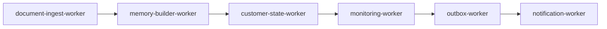
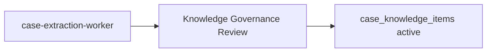

# LIFEGUARD Core — Worker Architecture

Design-only definition of **background workers** that mutate tenant data, emit outbox events, and drive async pipelines.

All workers run in **server runtime** with Supabase **`service_role`** only. Customer, agent, and admin JWTs must **never** invoke worker jobs directly.

**Not in scope:** INSUX / INSUX2 / insux-pro-ai, worker implementation code, SQL migrations, channel adapters (email/Kakao/SMS), UI, demo/mock/sample/fake job payloads.

Related: [ARCHITECTURE.md](./ARCHITECTURE.md), [CONSENT_ARCHITECTURE.md](./CONSENT_ARCHITECTURE.md), [MEMORY_BUILDER.md](./MEMORY_BUILDER.md), [DOCUMENT_INGEST.md](./DOCUMENT_INGEST.md), [CUSTOMER_STATE_ENGINE.md](./CUSTOMER_STATE_ENGINE.md), [LIFEGUARD_MONITORING_ENGINE.md](./LIFEGUARD_MONITORING_ENGINE.md), [NOTIFICATION_SERVICE.md](./NOTIFICATION_SERVICE.md), [CASE_KNOWLEDGE_ENGINE.md](./CASE_KNOWLEDGE_ENGINE.md), [KNOWLEDGE_GOVERNANCE.md](./KNOWLEDGE_GOVERNANCE.md), `002_rls_service_policies.sql`.

Migrations referenced (read-only): `001`–`009` under `lifeguard-core/supabase/migrations/`.

---

## 1. Common principles

| # | Principle | Enforcement |
|---|-----------|-------------|
| 1 | **No customer JWT workers** | Queue/cron/API routes use `service_role` or trusted server identity only |
| 2 | **service_role exclusive** | RLS bypass per `002`; key never in browser or mobile bundles |
| 3 | **`customer_id` isolation** | Every job payload carries one `customer_id`; no cross-tenant reads/writes |
| 4 | **Consent revocation is immediate** | Workers re-check `lifeguard_has_consent` at job start; revoke handlers supersede facts / block ingest / skip notify |
| 5 | **Memory ≠ Case Knowledge** | Memory Builder touches `customer_memory_facts` only; Case Extraction writes `case_knowledge_items` only after de-identification + governance |
| 6 | **No retired knowledge** | Do not read `case_knowledge_items` with `status != 'active'` or memory facts with `superseded_at` set for new outputs |
| 7 | **No auto-create on insufficient data** | Empty evidence → skip fact, signal, notification row, or case publish |
| 8 | **No demo data** | No repo-committed fake customers, documents, or worker fixtures |

### 1.1 Shared failure and retry defaults

| Aspect | Default policy |
|--------|----------------|
| **Transient errors** (network, rate limit) | Exponential backoff: 30s → 2m → 10m → 1h; max 5 attempts per job id |
| **Permanent errors** (consent missing, validation) | Mark job failed; **no** retry; log `error_message` |
| **Poison message** | After max retries → `failed` + alert admin audit channel |
| **Idempotency** | Use natural keys (`document_id`, `source_ref`, dedup indexes) to avoid duplicate side effects |
| **Audit** | Write domain-specific audit rows (traces, runs, jobs) — never only stdout |

Consultation Orchestrator is **request-path** (not listed below) but may INSERT `outbox_events` via `service_role` for escalation.

---

## 2. Worker catalog

### 2.1 `document-ingest-worker`

| Field | Specification |
|-------|----------------|
| **목적** | OCR, classify, chunk, embed customer uploads; set `ingest_status = ready` or `failed` |
| **트리거** | API enqueue after `POST .../ingest`; queue message `{ customer_id, document_id }`; optional retry cron on `queued`/`processing` staleness |
| **입력 테이블** | `customer_documents`, `customer_consents` (re-check), storage objects |
| **출력 테이블** | `customer_documents`, `customer_document_chunks`, `document_ingest_traces`, `document_upload_logs` (005), optional `outbox_events` |
| **관련 migration** | `001`, `002`, `004`, `005` |
| **관련 문서** | [DOCUMENT_INGEST.md](./DOCUMENT_INGEST.md), [CONSENT_ARCHITECTURE.md](./CONSENT_ARCHITECTURE.md) |
| **필요 consent** | `document_storage` (upload path); `document_analysis` (OCR/embed/RAG) |
| **service_role** | **Yes** — required |
| **실패 처리** | `ingest_status = failed`, `error_message` on document; trace row `status = failed` |
| **재시도 정책** | Transient OCR/embed errors: §1.1; consent revoked mid-flight → cancel, no retry |
| **audit 기록** | `document_ingest_traces` per step; upload log on initial store |
| **outbox 연계** | Optional `document.ingest.completed` / `document.ingest.failed` → consumed by outbox-worker |

---

### 2.2 `memory-builder-worker`

| Field | Specification |
|-------|----------------|
| **목적** | Rebuild `customer_memory_facts` from profile, health, policies, ready documents, gated conversation extracts |
| **트리거** | `document-ingest-worker` completion (`ready`); profile/policy PATCH; `memory.rebuild.completed` schedule; `consent.revoked` handler; manual admin reindex |
| **입력 테이블** | `customer_profiles`, `profile_health`, `profile_insurance_policies`, `customer_documents`, `customer_document_chunks`, `consultation_messages` (gated), `customer_consents` |
| **출력 테이블** | `customer_memory_facts` (upsert/supersede), `customer_profiles.memory_version` increment |
| **관련 migration** | `001`, `002`, `004` |
| **관련 문서** | [MEMORY_BUILDER.md](./MEMORY_BUILDER.md), [CONSENT_ARCHITECTURE.md](./CONSENT_ARCHITECTURE.md) §7.1 |
| **필요 consent** | Per source matrix: e.g. `privacy_collection`, `sensitive_health_processing`, `insurance_data_processing`, `document_analysis`, `memory_retention` |
| **service_role** | **Yes** — required |
| **실패 처리** | Abort rebuild; leave prior active facts; log job error (no partial publish of inferred facts) |
| **재시도 정책** | §1.1 on transient DB/embedding errors; skip if required consent missing |
| **audit 기록** | `metadata_json` on facts; optional future `memory_build_runs`; `memory_version` bump |
| **outbox 연계** | Optional `memory.rebuild.completed` (P0 trigger for monitoring-worker) |

#### Phase 23 Step 1C skeleton (implemented)

| Item | Behavior |
|------|----------|
| **Runtime** | Supabase Edge Function `memory-builder-worker` |
| **Auth** | `service_role` only — no customer JWT |
| **Modes** | `mode=smoke` (Step 1C); `mode=extract` / `mode=rebuild` + `scope=profile_health_policy` (Step 2A) |
| **Jobs** | Optional `job_id` → load `worker_jobs` (`memory_builder`), `worker_runs` audit |
| **Deploy** | `supabase functions deploy memory-builder-worker` (not auto-deployed with app) |
| **Test** | `npm run test:phase23-step1c-smoke`, `npm run test:phase23-step2a` |

Step 2A: profile/health/insurance policy extractors with consent gate and idempotent upsert. Document/conversation extractors deferred to Step 2B+.

---

### 2.3 `customer-state-worker`

| Field | Specification |
|-------|----------------|
| **목적** | Materialize unified nine-domain `CustomerState` into `customer_state_snapshots` |
| **트리거** | After `memory-builder-worker` success; consent change; policy/document updates; scheduled nightly per active customer |
| **입력 테이블** | `customer_memory_facts`, `customer_profiles`, `profile_*`, `customer_documents`, `customer_consents`, `consultations`, `customer_monitoring_signals`, `outbox_events` (pending escalation counts) |
| **출력 테이블** | `customer_state_snapshots`; mark prior snapshot `stale_at` when superseded |
| **관련 migration** | `004`, `007` |
| **관련 문서** | [CUSTOMER_STATE_ENGINE.md](./CUSTOMER_STATE_ENGINE.md) |
| **필요 consent** | Read-only aggregation respects consent: domains omit data when consent revoked (no inference to fill gaps) |
| **service_role** | **Yes** — required |
| **실패 처리** | No snapshot insert if build validation fails; previous latest remains with `stale_at` policy per 007 |
| **재시도 정책** | §1.1; single-customer jobs only |
| **audit 기록** | `customer_state_snapshots` (`state_version`, `calculated_at`, `consent_snapshot` in `state_json` / metadata) |
| **outbox 연계** | None directly; downstream monitoring reads snapshots |

---

### 2.4 `monitoring-worker`

| Field | Specification |
|-------|----------------|
| **목적** | Run grounded detectors; publish `customer_monitoring_signals`; emit monitoring outbox events |
| **트리거** | Cron (daily); `memory.rebuild.completed`; `document.ingest.completed`; `consent.revoked`; single-customer replay |
| **입력 테이블** | Latest `customer_state_snapshots`, `customer_memory_facts`, `profile_insurance_policies`, `customer_documents`, `customer_consents`, `consultations` (90d) |
| **출력 테이블** | `monitoring_detection_runs`, `customer_monitoring_signals`, `outbox_events` (`monitoring.*`, `agent.escalation.requested` when applicable) |
| **관련 migration** | `001`, `002`, `004`, `007`, `008` |
| **관련 문서** | [LIFEGUARD_MONITORING_ENGINE.md](./LIFEGUARD_MONITORING_ENGINE.md) |
| **필요 consent** | Per detector source class (e.g. `insurance_data_processing`, `sensitive_health_processing`, `document_analysis`) |
| **service_role** | **Yes** — required |
| **실패 처리** | `monitoring_detection_runs.status = failed`, `error_message`; no signal if evidence empty |
| **재시도 정책** | §1.1 for run infrastructure; detector null result is not an error (skip) |
| **audit 기록** | `monitoring_detection_runs`, signal rows with `evidence_refs`, `consent_snapshot` |
| **outbox 연계** | **Yes** — primary producer of `monitoring.*` and optional `agent.escalation.requested` |

---

### 2.5 `outbox-worker`

| Field | Specification |
|-------|----------------|
| **목적** | Drain `outbox_events` (`pending`); map to `notification_events` or mark processed; respect consent and dedup |
| **트리거** | Poll/cron on `outbox_events` WHERE `status = pending`; event-driven wake after monitoring/ingest/consent inserts |
| **입력 테이블** | `outbox_events`, `customer_consents`, `notification_preferences`, `notification_templates`, `customer_monitoring_signals` (payload join) |
| **출력 테이블** | `notification_events`, UPDATE `outbox_events` (`processing` → `processed` \| `failed`) |
| **관련 migration** | `001`, `002`, `004`, `009` |
| **관련 문서** | [NOTIFICATION_SERVICE.md](./NOTIFICATION_SERVICE.md), [CONSENT_ARCHITECTURE.md](./CONSENT_ARCHITECTURE.md) §5.5 |
| **필요 consent** | `notification_delivery` for customer channel rows; `marketing_optional` for `marketing_promotional`; template `required_consent_type` |
| **service_role** | **Yes** — required |
| **실패 처리** | `outbox_events.status = failed`; no `notification_events` if payload lacks `source_ref` / evidence |
| **재시도 정책** | §1.1 on outbox row; dedup unique index prevents duplicate notification enqueue |
| **audit 기록** | `outbox_events.processed_at`; `notification_events.consent_snapshot` |
| **outbox 연계** | **Yes** — consumer of outbox; producer of notification queue |

**Consumes (non-exhaustive):** `monitoring.signal.detected`, `monitoring.rebalancing.review`, `monitoring.coverage.review`, `monitoring.claim.documents_ready`, `monitoring.disclosure.review`, `consent.reconsent.required`, `document.ingest.completed`, `document.ingest.failed`.

**Skips customer notification:** internal-only events (e.g. `agent.escalation.requested` without customer push plan).

---

### 2.6 `notification-worker`

| Field | Specification |
|-------|----------------|
| **목적** | Deliver queued notifications per channel; update delivery status |
| **트리거** | Poll `notification_events` WHERE `status IN ('queued','scheduled')` AND `scheduled_at <= now()`; priority ordering |
| **입력 테이블** | `notification_events`, `notification_preferences` |
| **출력 테이블** | UPDATE `notification_events` (`sending` → `sent` \| `failed`); `in_app` treated as in-product feed |
| **관련 migration** | `004`, `009` |
| **관련 문서** | [NOTIFICATION_SERVICE.md](./NOTIFICATION_SERVICE.md), [COMMUNICATION_ENGINE.md](./COMMUNICATION_ENGINE.md) |
| **필요 consent** | Re-validate `notification_delivery` / `marketing_optional` before send; honour preference `enabled` and quiet hours |
| **service_role** | **Yes** — required |
| **실패 처리** | `status = failed`, `failed_at`, `error_message`; external adapters not in repo → `adapter_not_configured` until integrated |
| **재시도 정책** | §1.1 for transient provider errors; `blocked_by_consent` / `blocked_by_preference` — no retry |
| **audit 기록** | `sent_at`, `failed_at`, `error_message` on `notification_events` |
| **outbox 연계** | **Indirect** — downstream of outbox-worker only |

**Critical priority:** `in_app` may still deliver when push/email disabled (see NOTIFICATION_SERVICE §7).

---

### 2.7 `case-extraction-worker`

| Field | Specification |
|-------|----------------|
| **목적** | De-identify consultation/document patterns; create `case_extraction_jobs`; stage candidates for governance — **not** live customer answers |
| **트리거** | Admin-approved extraction request; batch on closed consultation; separate legal basis — never from customer chat JWT |
| **입력 테이블** | `consultations`, `consultation_messages`, `consultation_traces` (admin scope), `case_extraction_jobs` queue; **`source_customer_id` only on jobs table** |
| **출력 테이블** | `case_extraction_jobs` (status, redaction report); draft payloads for review — **`case_knowledge_items` only after Knowledge Governance approval** |
| **관련 migration** | `006` |
| **관련 문서** | [CASE_KNOWLEDGE_ENGINE.md](./CASE_KNOWLEDGE_ENGINE.md), [KNOWLEDGE_GOVERNANCE.md](./KNOWLEDGE_GOVERNANCE.md) |
| **필요 consent** | Separate legal/process gate — not customer memory consents; no extraction without governance workflow |
| **service_role** | **Yes** — required |
| **실패 처리** | `case_extraction_jobs.status = failed`; never publish identifiable payload |
| **재시도 정책** | §1.1 for infrastructure; validation failure → no retry |
| **audit 기록** | `case_extraction_jobs` + governance approval records (future tables per KNOWLEDGE_GOVERNANCE) |
| **outbox 연계** | None to customer notifications; optional internal admin audit events only |

**Post-worker gate:** **Knowledge Governance Review** (human/admin) before `case_knowledge_items.status = active`. Retrieval uses `match_case_knowledge` — **service_role / orchestrator only**, never browser JWT.

---

## 3. Worker Dependency Graph

### 3.1 Primary customer pipeline



```text
document-ingest-worker
  → memory-builder-worker
  → customer-state-worker
  → monitoring-worker
  → outbox-worker
  → notification-worker
```

| Edge | Why |
|------|-----|
| ingest → memory | Facts from `ready` documents and metadata |
| memory → state | State domains read active memory |
| state → monitoring | Detectors use latest snapshot + canonical tables |
| monitoring → outbox | Signals emit `outbox_events` |
| outbox → notification | outbox-worker enqueues `notification_events`; notification-worker sends |

**Parallel inputs:** Profile/policy API updates can trigger `memory-builder-worker` without ingest. `consent.revoked` fans out to memory, ingest cancel, outbox/notification block.

### 3.2 Case knowledge path (isolated)



```text
case-extraction-worker
  → Knowledge Governance Review
  → (on approve) case_knowledge_items
```

Does **not** feed the customer notification chain. Must not write `customer_memory_facts` or customer notifications.

---

## 4. Scheduler and queue (design)

| Pattern | Use |
|---------|-----|
| **Per-customer job** | memory, state, monitoring single-customer replay |
| **FIFO queue** | ingest jobs by `document_id` |
| **Outbox poll** | `outbox_events` pending index (`001`) |
| **Notification poll** | `notification_events` status + `scheduled_at` (`009`) |
| **Cron** | Nightly monitoring batch; stale ingest recovery |

Implementers may use `pg_cron`, Supabase Edge Functions, or external queue — not specified here.

---

## 5. Security checklist

| Check | Requirement |
|-------|-------------|
| JWT in worker | Deny — use `service_role` only |
| `customer_id` in job | Required; validated against source row |
| Agent access | No worker tables via agent JWT; summary views only where defined (007, 008) |
| Case leakage | Published cases have no `customer_id` |
| Retired cases | `status IN ('active')` only for retrieval |
| PII in logs | Hash/redact; no blob content in trace tables |

---

## 6. Deliberate exclusions

- INSUX / insux-pro-ai worker scripts or cron.
- Consultation Orchestrator inline monitoring (async only).
- Cross-customer batch statistics for alerts.
- Demo job payloads in repository.

---

*Draft v0.1 — LIFEGUARD Core Worker Architecture.*
