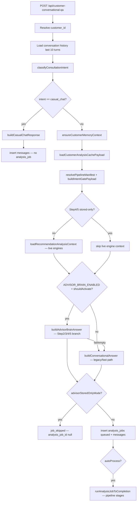
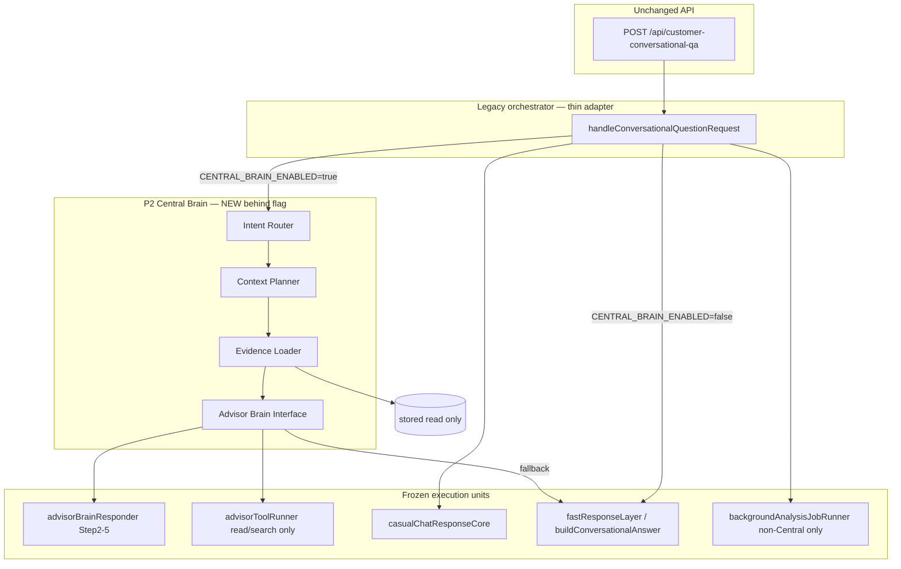

# P2 Central Brain — Architecture Design

**Status:** Design-only (no implementation in this document)  
**Scope:** Central judgment layer that **orchestrates** existing Memory, Documents, OCR, RAG, Coverage Gap, Underwriting, Recommendation, and Design capabilities — **without adding new engines**.

**Hard constraints (P2 design boundary):**

| Constraint | Meaning |
|------------|---------|
| No new engines | Reuse `coverage_gap`, `underwriting_risk`, `recommendation`, `insurance_design`, OCR/document pipeline, Memory, RAG as-is |
| Step2/3/4/5 unchanged | P1 Advisor Brain responders remain the execution units; Central Brain wraps/plans, does not rewrite them |
| Engine code frozen | `recommendationEngine.js`, `customerCoverageGapCore.js`, `customerUnderwritingRiskCore.js` — read-only consumers |
| No DB schema change | No migrations, no new tables |
| No API contract change | `POST /api/customer-conversational-qa` request/response shape unchanged |
| **P2 run-vs-read (Tom/Stein)** | Central Brain path is **read/combine only** — no live engine execution, no new `analysis_jobs`, no live-engine fallback (see §5.1, §12 Q5) |

Related: [LIFEGUARD_REASONING_ENGINE.md](./LIFEGUARD_REASONING_ENGINE.md), [CONSULTATION_RUNTIME_ARCHITECTURE.md](./CONSULTATION_RUNTIME_ARCHITECTURE.md), `server/advisorBrain/*`, `server/conversationalBackgroundAnalysisCore.js`.

---

## 1. Current structure (as-is)

### 1.1 Entry and orchestration owner

```
POST /api/customer-conversational-qa
  └─ api/customer-conversational-qa.js
       └─ handleConversationalQuestionRequest()   [conversationalBackgroundAnalysisCore.js]
```

Single monolithic orchestrator owns: auth, intent, memory sync, cache, fast response, Advisor Brain gate, analysis_job lifecycle, conversation_messages insert.

### 1.2 Current consultation request flow



### 1.3 Intent classification (existing)

`classifyConsultationIntent()` in `intentGateLayer.js` — **no new intents in P2**.

| Intent | Fast path | Pipeline manifest | Advisor Brain P1 (flag on) |
|--------|-----------|-------------------|------------------------------|
| `casual_chat` | `casualChatResponseCore` | `[]` | off |
| `factual_lookup` | deterministic + grounded Claude | `result_claude` | Step3 (selected sub_intents) |
| `coverage_gap_check` | Advisor Brain tools + Claude | `coverage_gap, result_claude` | Step2 |
| `policy_detail` | Policy Explorer helpers | `result_claude` | off |
| `coverage_review_request` | engines + template/grounded | `coverage_gap, result_claude` | off |
| `recommendation_request` | engines + grounded | `coverage_gap, recommendation, result_claude` | off (pure request); Step4 only for reason patterns |
| `design_request` | full pipeline | all 5 stages | off |
| `claim_eligibility_check` | claim bridge | `result_claude` | off |
| `general_consultation` | engines + grounded | `coverage_gap, result_claude` | Step5 (pattern match only) |

### 1.4 Evidence sources today (fragmented)

| Source | Loader today | Used by |
|--------|--------------|---------|
| **Memory** | `ensureCustomerMemoryContext` → `unifiedCustomerState` | all non-casual paths |
| **Documents / OCR** | indirect via unified state + memory rebuild; document ingest pipeline | memory snapshot, policy list |
| **Policies** | `loadUnifiedCustomerState` / Policy Explorer | factual, policy_detail |
| **RAG (policy terms)** | `handlePolicyTermsQaRequest` via Advisor tool `search_policy_terms` | Step2/3 tool path only |
| **Coverage Gap engine** | `loadCoverageAnalysisContext` | tool runner, analysis job, `loadRecommendationAnalysisContext` |
| **Underwriting engine** | `loadUnderwritingAnalysisContext` | analysis job, recommendation context |
| **Recommendation engine** | `loadRecommendationAnalysisContext` | chat fast path (non-stored-only), analysis job |
| **Design generator** | `loadInsuranceDesignAnalysisContext` | analysis job (`design_request`) |
| **Stored analysis_jobs** | `loadLatestCompletedAnalysisJob` | Step4 reason, Step5 conversation |

### 1.5 Advisor Brain P1 (partial centralization)

Already exists under `server/advisorBrain/`:

- `advisorToolRegistry.js` — intent → tool allowlist
- `advisorToolRunner.js` — controlled execution (max 3 calls, depth 1)
- `advisorBrainContext.js` — single unified state load per turn
- `advisorBrainResponder.js` — dispatcher to Step2/3/4/5 responders
- Per-step responders — **remain frozen in P2**

**Gap:** Planning (what to load, stored vs live, job skip) still lives in `conversationalBackgroundAnalysisCore.js`, not in a reusable Central Brain module.

---

## 2. Target structure (P2 Central Brain)

### 2.1 Concept

**Central Brain** = judgment + planning + evidence assembly layer.

It does **not** replace engines or P1 responders. It answers:

1. **What kind of question is this?** (Intent Router — wraps existing classifier + mode flags)
2. **What evidence is required?** (Context Planner — stored-only vs live engines vs tools vs skip job)
3. **How do we load it?** (Evidence Loader — single facade over existing loaders)
4. **What do we pass to Advisor Brain?** (Advisor Brain I/O — stable contract)



### 2.2 Feature flag

| Flag | Phase | Behavior |
|------|-------|----------|
| `ADVISOR_BRAIN_ENABLED=false` | P1 default | Today’s production path unchanged |
| `ADVISOR_BRAIN_ENABLED=true` | P1 Step2–5 | Existing per-intent Advisor Brain activation |
| `CENTRAL_BRAIN_ENABLED=true` | **P2 MVP** | Routes through Central Brain planner/loader; still delegates to P1 responders |

**Rule:** `CENTRAL_BRAIN_ENABLED` implies planning layer only. Step2/3/4/5 responder **code paths must produce identical outcomes** when inputs match P1 (regression tests required before flag ON).

### 2.3 Implementation principles (Tom/Stein)

| Principle | Rule |
|-----------|------|
| **Fail-safe gate** | If `CENTRAL_BRAIN_ENABLED=true` **but** `ADVISOR_BRAIN_ENABLED=false` → treat Central Brain as **OFF**; fall through to legacy orchestrator path exactly as today. Never partially activate planner/loader without Advisor Brain gate. |
| **Read-only Central Brain** | P2 MVP Central Brain is **not** a new engine executor. It reads existing stored results and queryable evidence, then combines judgment for synthesis. |
| **No live-engine fallback** | Central Brain path must not fall back to live `coverageGapAnalysisEngine`, `underwritingRiskAnalysisEngine`, or `recommendationEngine` execution when stored/read evidence is missing. Surface insufficient-evidence response instead. |
| **No new jobs in Central path** | Central Brain path must **never** insert new `analysis_jobs`. |
| **Metadata merge** | When extending `conversation_messages.metadata`, **merge** into existing metadata objects — do **not** overwrite unrelated keys already written by orchestrator, memory sync, or phase tags. |
| **Step4/5 stored-only invariant** | Unchanged: `analysis_job_id: null`, `job_skipped: true`, no live recommendation context load. |

### 2.4 Central Brain Conversation Principles (Tom Runtime)

Tom Runtime defines **how** Central Brain speaks to the customer after evidence is loaded. These principles apply to all Central Brain / Advisor Brain synthesis paths (Step2–5) and are enforced at prompt + guardrail level — not by changing engine internals.

> **Tom Runtime** is an **internal architecture name only**. It is not shown to customers.

#### Top-level priority

```
Naturalness  <  Honesty  <  Evidence
```

| Priority | Rule |
|----------|------|
| **Evidence** | Highest. Answers must be grounded in loaded specialist evidence only. |
| **Honesty** | Natural counsel tone must never override truthfulness. |
| **Naturalness** | Warm consultation style is the default — but only within honesty and evidence bounds. |

**Honesty rules (non-negotiable):**

- Natural consultation tone **cannot** cover up missing or uncertain facts.
- Never state **미확인** (unknown) information as if the customer **보유** (has coverage) or as confirmed fact.
- Always distinguish **미확인** (not yet verified) from **미보유** (confirmed absent).
- Label **inferences** as inferences (e.g. `~로 보입니다`, `추정`, `확인이 필요합니다`) — not as certainties.
- When evidence is insufficient, say so plainly and say what is missing — do not improvise gap scores, ranks, or product facts.

#### Brand principles (customer-facing)

| Rule | Detail |
|------|--------|
| **Customer speaks with LIFEGUARD** | All customer-visible dialogue is from the **LIFEGUARD** advisor persona (보험 주치의). |
| **Tom Runtime = internal only** | "Tom Runtime", "Central Brain", "Advisor Brain", "Planner", "Evidence Loader", and similar labels are engineering names — **never** in customer text. |
| **Internal name ban** | Forbidden in customer responses: `Tom`, `Advisor Brain`, `Engine`, `Planner`, `Coverage Gap Engine`, `Underwriting Engine`, `Recommendation Engine`, pipeline stage names, tool IDs, JSON field names. |

#### Runtime identity

| # | Principle |
|---|-----------|
| 1 | The customer does **not** converse with engines or internal specialists. |
| 2 | The customer converses with **LIFEGUARD** (first-line insurance advisor persona). |
| 3 | Memory, OCR, Documents, Coverage Gap, Underwriting, Recommendation, and Design act as **internal specialists** — they supply evidence; they do not speak to the customer directly. |
| 4 | Specialist names, engine names, pipeline stage labels, and internal tool identifiers must **never** appear in customer-visible text (see Brand principles). |

#### Synthesis rules (not copy-paste)

| # | Principle |
|---|-----------|
| 5 | Central Brain must **not** copy specialist outputs verbatim (no raw scores, ranks, JSON fields, or panel dump). |
| 6 | Central Brain **synthesizes, interprets, and reframes** specialist evidence into counsel-style Korean. |
| 7 | All insurance dialogue defaults to **natural consultation tone** (대화형 상담체). |
| 8 | **Report-style answers are forbidden** (e.g. `분석 결과에 따르면`, `~입니다.` only endings, document headings). |
| 9 | **Enumerated result delivery is forbidden** as the primary shape (bullet lists of engine outputs, score tables, Top-N dumps). |

#### Answer structure (default order)

Every LIFEGUARD counsel response should follow this flow when evidence is available:

```
1. Situation understanding   — what the customer is really asking / their context
2. Empathy or context link   — acknowledge feeling or connect to their circumstances
3. Specialist evidence blend — combine relevant internal expert signals (never name the expert)
4. Customer-perspective explanation — what it means for them, in plain language (honest uncertainty where needed)
5. Follow-up question (if needed) — one natural question to continue the dialogue
```

When evidence is insufficient, LIFEGUARD explains what is missing in plain language — without naming internal systems or suggesting live re-analysis in the Central Brain path.

#### Internal specialist map (customer-invisible)

| Internal specialist | Role in Tom Runtime | Customer sees |
|---------------------|---------------------|---------------|
| Memory | Customer facts, health signals, profile context | "지금 등록된 정보 기준으로…" |
| OCR / Documents | Policy/document grounding | "올려주신 서류/증권 기준으로…" (only if document evidence exists) |
| Coverage Gap | Gap levels, maintained vs weak areas | plain gap counsel, no scores |
| Underwriting | Risk posture, review cues | "가입 전 건강고지·심사 확인이 필요할 수 있어요" |
| Recommendation | Stored priority signals (read-only) | "우선 살펴볼 부분은…" — no product/insurer names |
| Design | Stored design signals (read-only) | budget/fit framing — no plan SKU dump |

#### Style examples

**BAD** (engine/report voice — forbidden):

```
- 보장분석 결과 암 80점
- 추천결과 A상품
- 인수심사 위험도 보통
```

**GOOD** (LIFEGUARD counsel voice — target):

```
현재 확인된 자료 기준으로는 암 보장이 비교적 괜찮아 보입니다.
다만 일부 증권은 추가 확인이 필요합니다.
뇌혈관 보장은 상대적으로 부족해 보이는 편입니다.
보험료를 크게 늘리지 않는 선에서 보완할 수 있는데,
보장 강화와 보험료 절감 중 어느 쪽을 더 중요하게 생각하시나요?
```

#### Implementation hooks (design-only)

| Layer | How principles attach |
|-------|----------------------|
| `advisorBrainInterface` output | Reject or sanitize report/enumeration patterns before return |
| P1 step responder system prompts | Align with §2.4 order + Tom voice (counselor-tone PR baseline) |
| `advisorBrainGuardrails` | Extend fabrication/leak checks: engine names, scores, product picks; enforce 미확인≠미보유 |
| Audit metadata | Record `tom_runtime_version`, `answer_shape: counsel`, `honesty_tier: evidence_first` — merge into message metadata |

---

## 3. Component designs

### 3.1 Intent Router

**File (new):** `server/centralBrain/intentRouter.js`

**Responsibility:** Produce a `CentralRouteDecision` from question + history + env flags.

**Inputs:**

```ts
{
  question: string
  history: ConversationTurn[]
  env: ProcessEnv
}
```

**Outputs:**

```ts
{
  classification: ConsultationIntentResult      // from classifyConsultationIntent — unchanged
  response_lane: "casual" | "legacy_fast" | "advisor_brain" | "analysis_job"
  advisor_brain_mode: null | "step2_gap" | "step3_factual" | "step4_reason" | "step5_conversation"
  stored_only: boolean                          // Step4/5 — no live engine, no job
  pipeline_manifest: string[]                   // from resolvePipelineManifest — unchanged
  blocked_reason: null | "p2_recommendation_blocked" | "p2_design_blocked"
}
```

**Routing rules (reuse, do not reinvent):**

| Condition | `response_lane` | `advisor_brain_mode` |
|-----------|-----------------|----------------------|
| `intent === casual_chat` | `casual` | null |
| `ADVISOR_BRAIN_ENABLED` + `coverage_gap_check` | `advisor_brain` | `step2_gap` |
| `ADVISOR_BRAIN_ENABLED` + activatable `factual_lookup` | `advisor_brain` | `step3_factual` |
| `ADVISOR_BRAIN_ENABLED` + recommendation reason pattern | `advisor_brain` | `step4_reason` |
| `ADVISOR_BRAIN_ENABLED` + conversation pattern (exclusions apply) | `advisor_brain` | `step5_conversation` |
| `stored_only === true` (Step4/5) | `advisor_brain` | step4/5 + `job_skipped` |
| else | `legacy_fast` or `analysis_job` | null — existing behavior |

**Non-goals:** New intents, new regex taxonomy, changing Step2–5 activation predicates (call existing `shouldActivateAdvisorBrainForClassification`, `isRecommendationReasonClassification`, `isAdvisorConversationQuestion`).

---

### 3.2 Context Planner

**File (new):** `server/centralBrain/contextPlanner.js`

**Responsibility:** Given `CentralRouteDecision`, emit an **Evidence Plan** — which loaders/tools to invoke, in what order, with what cache policy.

**Inputs:**

```ts
{
  route: CentralRouteDecision
  customerId: string
  memoryVersion: number
  cacheStatus: CachePayloadSummary
}
```

**Outputs:**

```ts
{
  evidence_plan_id: string
  loaders: EvidenceLoaderRequest[]
  tools: string[]                    // subset of ADVISOR_TOOL_NAMES via resolveAllowedTools
  use_stored_job: boolean
  use_live_engines: boolean
  skip_analysis_job: boolean
  max_tool_calls: 3                  // from advisorToolRunner constant
  rationale: string[]                // audit-friendly reasons
}
```

**Planner matrix (MVP — read-only Central Brain path):**

| Mode | Loaders | Tools | Live engines | Stored job | Skip job |
|------|---------|-------|--------------|------------|----------|
| casual | none | [] | **no** | no | yes |
| step2_gap (`coverage_gap_reason`) | unified, memory, **stored_job**, cache | read/search only (`get_policies`, `search_policy_terms` as applicable) | **no** | **yes** | **yes** |
| step3_factual (`factual_lookup`) | unified, memory, cache | read/search only (allowlist minus engine tools) | **no** | optional read | **yes** |
| step4_reason (`recommendation_reason`) | **stored_job panels only** | [] | **no** | **yes** | **yes** |
| step5_conversation (`advisor_conversation`) | **stored_job panels only** | [] | **no** | **yes** | **yes** |
| legacy_fast (non-Central) | memory, cache | [] | per existing legacy | no | no |
| analysis_job path (non-Central) | memory, cache | [] | deferred to job runner | no | no |

**Key invariant:** All Central Brain advisor modes (Step2–5) use **stored/read evidence only**. No `loadCoverageAnalysisContext`, `loadUnderwritingAnalysisContext`, or `loadRecommendationAnalysisContext` **execution** in Central Brain path. Step4/5 `stored_only` plan must match today’s `advisorStoredOnlyMode` (`analysis_job_id: null`).

---

### 3.3 Evidence Loader

**File (new):** `server/centralBrain/evidenceLoader.js`

**Responsibility:** Execute `EvidenceLoaderRequest[]` and return a normalized `CentralEvidenceBundle`.

**Loader adapters (wrap existing — no engine edits):**

| Loader key | Existing function | Evidence key in bundle |
|------------|-------------------|------------------------|
| `unified_state` | `loadUnifiedCustomerState` | `policies`, `documents`, `policy_count` |
| `memory_snapshot` | `loadCustomerMemorySnapshot` / structured profile | `memory`, `structured_memory` |
| `analysis_cache` | `loadCustomerAnalysisCachePayload` | `cache` |
| `stored_job` | `loadLatestCompletedAnalysisJob` + `mapJobResultsToAnalysisPanels` | `stored_panels` |
| `coverage_gap` | `loadCoverageAnalysisContext` | `coverage_gap` |
| `underwriting` | `loadUnderwritingAnalysisContext` | `underwriting` |
| `recommendation_context` | `loadRecommendationAnalysisContext` | `recommendation` (read-only aggregate) |
| `design_context` | `loadInsuranceDesignAnalysisContext` | `design` |
| `policy_terms_rag` | via `advisorToolRunner` → `search_policy_terms` | `rag` |
| `conversation_history` | `loadRecentConversationHistory` | `history` |

**Output contract:**

```ts
{
  bundle_id: string
  customer_id: string
  loaded_at: string
  sources: { key: string, ok: boolean, confidence: "confirmed"|"partial"|"unknown", error?: string }[]
  data: {
    unified?: object
    memory?: object
    cache?: object
    stored_panels?: object
    coverage_gap?: object
    underwriting?: object
    recommendation?: object
    design?: object
    rag?: object
    history?: object
    tool_results?: ToolResult[]
  }
  sufficiency: "sufficient" | "partial" | "insufficient"
}
```

**Rules:**

- Parallel-safe loaders where independent (unified + history); **no engine execution** in Central Brain path.
- Single `createAdvisorBrainContext` / unified load per turn (reuse P1 guard).
- OCR/Documents: **no direct OCR call in chat** — evidence comes from unified state + memory rebuild (document pipeline already ran at ingest).
- On loader failure: partial bundle + `sufficiency: partial`; never fabricate gap/recommendation data; **do not** trigger live engine fallback.
- Engine loader keys (`coverage_gap`, `underwriting`, `recommendation_context`, `design_context`) are **read-from-stored/cache/job only** in Central Brain path — not live compute.

---

### 3.4 Advisor Brain input/output interface

**File (new):** `server/centralBrain/advisorBrainInterface.js`

**Responsibility:** Translate `CentralRouteDecision` + `CentralEvidenceBundle` → P1 responder inputs; normalize outputs for orchestrator.

#### Input (`AdvisorBrainRequest`)

```ts
{
  customer_id: string
  question: string
  classification: ConsultationIntentResult
  mode: "step2_gap" | "step3_factual" | "step4_reason" | "step5_conversation"
  evidence: CentralEvidenceBundle
  session_id?: string
  conversation_id?: string
  env: ProcessEnv
  fetchImpl: typeof fetch
}
```

#### Output (`AdvisorBrainResponse`)

```ts
{
  ok: boolean
  message: string | null
  reason?: string
  mode: string
  engine_executed: boolean
  job_skipped?: boolean
  advisor_conversation_mode?: boolean
  recommendation_reason_mode?: boolean
  used_tools: string[]
  evidence_summary: object[]
  audit: AdvisorAuditRecord
  guardrail_summary?: object
}
```

#### Dispatch map (delegation only)

| `mode` | Delegate to | Notes |
|--------|-------------|-------|
| `step2_gap` | `buildCoverageGapCheckAdvisorBrainAnswer` (via `buildAdvisorBrainAnswer`) | pass `preloadedContext` from bundle |
| `step3_factual` | `buildFactualLookupAdvisorBrainAnswer` | unchanged |
| `step4_reason` | `buildRecommendationReasonAnswer` | stored panels only |
| `step5_conversation` | `buildAdvisorConversationAnswer` | stored panels only |

**Fallback:** If `ok === false` or `message` empty → orchestrator calls `buildConversationalAnswer` (today’s behavior).

---

## 4. Call sequence (P2 MVP, flag ON)

```
1. handleConversationalQuestionRequest(question)
2. resolve customer_id, load history
3. if CENTRAL_BRAIN_ENABLED && !ADVISOR_BRAIN_ENABLED → treat Central Brain OFF (fail-safe); legacy path
4. route = intentRouter.resolve({ question, history, env })
5. if route.response_lane === "casual" → existing casual path (STOP)
6. ensureCustomerMemoryContext (unchanged)
7. plan = contextPlanner.plan({ route, customerId, memoryVersion, cache })
8. bundle = evidenceLoader.load({ plan, supabase, customerId })   // read/search only
9. if route.response_lane === "advisor_brain" && ADVISOR_BRAIN_ENABLED && CENTRAL_BRAIN_ENABLED:
     response = advisorBrainInterface.execute({ route, bundle, ... })
     if response.ok && response.message → use as fastResponse
10. else → existing buildConversationalAnswer / analysis_job path (unchanged; non-Central lanes only)
11. persist messages + job per plan.skip_analysis_job; merge metadata (do not overwrite)
```

---

## 5. Data flow

### 5.1 Planner run-vs-read policy (Tom/Stein — final)

P2 MVP Central Brain is a **judgment/combine layer**, not a new engine executor.

| mode | allowed action | forbidden action | evidence source | latency goal |
|------|----------------|------------------|-----------------|--------------|
| `coverage_gap_reason` (Step2) | Read stored `analysis_jobs.result_json.coverage_gap`, cache, unified policies/memory; optional policy-terms **search** (RAG) | Live `coverageGapAnalysisEngine` run; new `analysis_jobs`; `underwritingRiskAnalysisEngine` / `recommendationEngine` run; live-engine fallback | Latest **completed** `analysis_jobs` + `customer_analysis_cache` + unified state | ≤ 800 ms to evidence bundle (excl. Claude) |
| `factual_lookup` (Step3) | Read unified policies, memory snapshot, premium stats (derived read), policy-terms **search** | Live gap/uw/recommendation engine run; new `analysis_jobs`; engine fallback on missing data | Unified state + memory + cache (+ RAG hits) | ≤ 600 ms to evidence bundle (excl. Claude) |
| `recommendation_reason` (Step4) | Read stored recommendation/uw/gap panels from completed job only | Live `recommendationEngine` run; new recommendation/design generation; new `analysis_jobs`; live-engine fallback | `loadLatestCompletedAnalysisJob` → `mapJobResultsToAnalysisPanels` | ≤ 500 ms to evidence bundle (excl. Claude) |
| `advisor_conversation` (Step5) | Read stored panels (gap, uw, recommendation top2) from completed job only | Live engine run; insurer/product picks; new `analysis_jobs`; live-engine fallback | Same as Step4 — stored job panels only | ≤ 500 ms to evidence bundle (excl. Claude) |

**Global forbids (Central Brain path):**

- New `analysis_jobs` creation
- `recommendationEngine` new execution
- `coverageGapAnalysisEngine` new execution
- `underwritingRiskAnalysisEngine` new execution
- Step4/Step5 stored-only behavior change
- Live-engine fallback when stored/read evidence is insufficient

```mermaid
sequenceDiagram
  participant API as customer-conversational-qa
  participant Orch as conversationalBackgroundAnalysisCore
  participant IR as Intent Router
  participant CP as Context Planner
  participant EL as Evidence Loader
  participant ABI as Advisor Brain Interface
  participant AB as advisorBrainResponder P1
  participant DB as Supabase read-only

  API->>Orch: question + auth
  Orch->>Orch: fail-safe if CENTRAL on but ADVISOR off
  Orch->>IR: classify + flags
  IR-->>Orch: CentralRouteDecision
  alt casual_chat
    Orch->>Orch: casualChatResponseCore
  else central path
    Orch->>CP: route + memory meta
    CP-->>Orch: EvidencePlan read-only
    Orch->>EL: plan
    EL->>DB: unified, memory, cache, completed jobs
    Note over EL: no live engine execution
    EL-->>Orch: CentralEvidenceBundle
    Orch->>ABI: request
    ABI->>AB: delegate Step2-5
    AB-->>ABI: AdvisorBrainResponse
    ABI-->>Orch: normalized response
  end
  Orch->>DB: conversation_messages merge metadata no new job in Central path
```



---

## 6. Risk factors

| Risk | Severity | Mitigation |
|------|----------|------------|
| **Dual-path drift** (flag off vs on) | High | Golden tests: same question → same `fast_response` class / same job_skipped for Step4/5 |
| **Double engine execution** | Medium | Planner forbids live engines in Central path; stored/cache/job reads only |
| **Latency** | Medium | Parallel unified + history; stored-only bundles; mode latency goals in §5.1 |
| **casual/emotion path outside flag** | Low | Documented: `casualChatResponseCore` changes are orthogonal to `CENTRAL_BRAIN_ENABLED` |
| **Stored vs live mismatch** | High | Tom/Stein policy: all Central advisor modes read-only; no live fallback |
| **Fail-safe misconfiguration** | High | `CENTRAL_BRAIN_ENABLED=true` + `ADVISOR_BRAIN_ENABLED=false` → Central Brain OFF (§2.3) |
| **Metadata clobber** | Medium | Merge-only metadata writes (§2.3) |
| **Recommendation/design leakage** | High | Keep `P2_BLOCKED_INTENTS`; Central Brain must not invoke new recommendation/design synthesis in chat |
| **API contract regression** | High | Adapter returns identical JSON keys (`analysis_job_id`, `job_skipped`, `advisor_conversation_mode`, etc.) |
| **Audit gap** | Medium | Extend `buildAdvisorAuditRecord` with `evidence_plan_id`, `bundle_id` (in-memory only until future DB PR) |

---

## 7. Phase 1 MVP scope (P2)

### In scope

- [ ] `server/centralBrain/*` module scaffold (router, planner, loader, interface, types)
- [ ] `CENTRAL_BRAIN_ENABLED` env flag (default `false`)
- [ ] Thin adapter hook in `handleConversationalQuestionRequest` (early return to legacy when false)
- [ ] Evidence bundle normalization for Step2/3 (**stored/read/search only** — no live engine execution)
- [ ] Stored-job bundle for Step4/5 (no behavior change)
- [ ] Fail-safe: `CENTRAL_BRAIN_ENABLED` requires `ADVISOR_BRAIN_ENABLED`
- [ ] Metadata merge (no overwrite) on `conversation_messages`
- [ ] Unit tests: router decisions, planner matrix, loader mocks, interface dispatch map
- [ ] Regression: P1 Step2–5 test suites pass unchanged

### Out of scope (P2 MVP)

- New engines or engine parameter changes
- DB migrations / audit table persistence
- API schema changes
- UI / panel changes
- Claude tool-use loops (multi-turn agent)
- Replacing `analysis_jobs` background pipeline
- Merging `casual_chat` into Central Brain (stays separate lane)
- Auto `recommendation_request` / `design_request` Advisor Brain activation

---

## 8. Reuse plan (existing code)

| Capability | Reuse as-is | Central Brain role |
|------------|-------------|-------------------|
| `classifyConsultationIntent` | yes | Intent Router input |
| `resolvePipelineManifest` | yes | Route decision |
| `shouldActivateAdvisorBrainForClassification` | yes | Brain activation gate |
| `createAdvisorBrainContext` | yes | Evidence Loader adapter |
| `runControlledAdvisorTools` | yes | Evidence Loader (tool batch) |
| `buildAdvisorBrainAnswer` + step responders | yes | Interface delegate |
| `buildConversationalAnswer` | yes | Fallback |
| `handleCasualChatQuestionRequest` | yes | Parallel lane |
| `backgroundAnalysisJobRunner` | yes | Unchanged job path |
| `ensureCustomerMemoryContext` | yes | Pre-step before planner |
| Document/OCR pipeline | yes | Indirect via unified state (no chat-time OCR) |
| `policyTermsQaCore` RAG | yes | Tool `search_policy_terms` |

---

## 9. New files (planned)

| File | Purpose |
|------|---------|
| `server/centralBrain/centralBrainTypes.js` | JSDoc typedefs: `CentralRouteDecision`, `EvidencePlan`, `CentralEvidenceBundle`, `AdvisorBrainRequest/Response` |
| `server/centralBrain/intentRouter.js` | Route decision from existing classifiers + flags |
| `server/centralBrain/contextPlanner.js` | Evidence plan from route + memory/cache meta |
| `server/centralBrain/evidenceLoader.js` | Execute plan via existing loader adapters |
| `server/centralBrain/advisorBrainInterface.js` | Normalize I/O; delegate to P1 responders |
| `server/centralBrain/centralBrainOrchestrator.js` | `runCentralBrainTurn()` — composes IR→CP→EL→ABI |
| `scripts/central-brain-p2-mvp-unit-test.mjs` | Router/planner/loader/interface unit tests |
| `scripts/central-brain-p2-step-regression-test.mjs` | Step2–5 parity when flag on |

---

## 10. Modified files (planned — minimal, flag-gated)

| File | Change nature | Flag off behavior |
|------|---------------|-------------------|
| `server/conversationalBackgroundAnalysisCore.js` | Add optional call to `runCentralBrainTurn()` before legacy branch | **Identical** — early exit |
| `package.json` | Add `test:central-brain-p2` script | n/a |

**Explicitly not modified in P2 MVP:**

- `server/advisorBrain/advisorBrainResponder.js` (dispatcher logic)
- `server/advisorBrain/advisor*Responder.js` (Step2/3/4/5)
- `server/recommendationEngine.js`
- `server/customerCoverageGapCore.js`
- `server/customerUnderwritingRiskCore.js`
- `server/intentGateLayer.js` (unless Tom approves separate intent PR)
- `api/customer-conversational-qa.js`
- Any migration / `DATA_MODEL.md` tables

---

## 11. Success criteria (design → implementation gate)

1. `CENTRAL_BRAIN_ENABLED=false` → byte-level behavioral parity with pre-P2 (regression scripts).
2. `CENTRAL_BRAIN_ENABLED=true` + `ADVISOR_BRAIN_ENABLED=true` → Step2/3/4/5 outputs match P1 Advisor Brain outputs for same stored fixtures.
3. Central Brain path never creates `analysis_jobs`; never executes live recommendation/gap/uw engines; no live-engine fallback.
4. Step4/5 never create `analysis_jobs`; never call live recommendation engine in chat path.
5. No new engine files; no edits inside engine cores.
6. API response JSON keys unchanged (`fast_response`, `analysis_job_id`, `job_skipped`, mode flags).
7. Evidence bundle documents which sources were loaded (audit record); metadata merged not overwritten.
8. Customer-visible text follows §2.4 Tom Runtime: LIFEGUARD persona only; no internal names; `Naturalness < Honesty < Evidence`; no report/bullet dump; counsel-shaped answers.

---

## 12. Open questions (Tom review)

1. **Flag naming:** `CENTRAL_BRAIN_ENABLED` vs extend `ADVISOR_BRAIN_ENABLED` to phase 2?
2. **Audit persistence:** In-memory audit only for MVP, or reuse `conversation_messages.metadata` JSON extension (no schema change)?
3. **general_consultation:** Central Brain MVP — legacy lane only, or add planner path before Step5 pattern match?
4. **Merge order:** Land after Step5 + counselor-tone merge to `main`, stacked PR acceptable?

5. **Planner run-vs-read policy** — **RESOLVED (Tom/Stein final decision):**
   - P2 MVP Central Brain is **not** a new engine executor.
   - P2 MVP Central Brain reads existing stored results and queryable evidence, then combines judgment.
   - Step2 Coverage Gap Reason: **stored read only**
   - Step3 Factual Lookup: **read/search only**
   - Step4 Recommendation Reason: **stored read only**
   - Step5 Advisor Conversation: **stored read only**
   - **Forbidden in Central Brain path:** new `analysis_jobs`; `recommendationEngine` / `coverageGapAnalysisEngine` / `underwritingRiskAnalysisEngine` live execution; Step4/5 stored-only invariant change; live-engine fallback.
   - See §5.1 decision table for mode-level allowed/forbidden actions.

---

*Document version: P2 design v0.4 — design-only, no code. Honesty hierarchy + LIFEGUARD brand principles added.*
